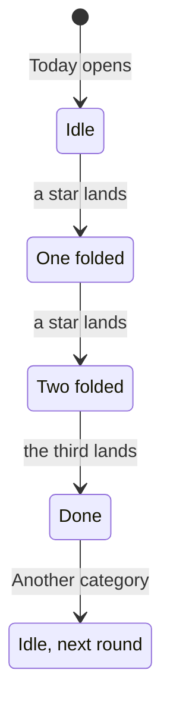
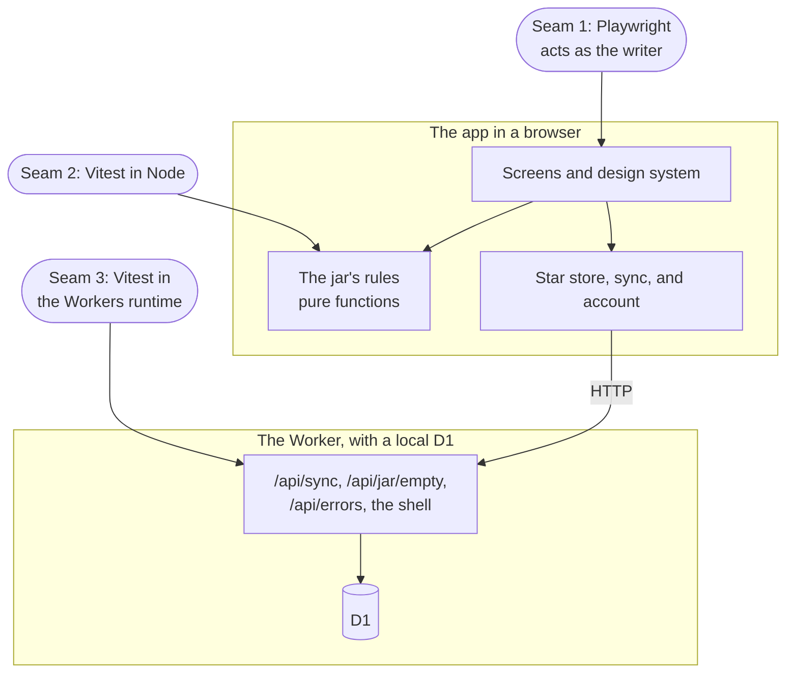

# Threefold PRD

This is the PRD for Threefold v1: the product spec that the system design refers to. It cites the requirement IDs (F-x for functional, N-x for non-functional) from the system design, `docs/SYSTEM_DESIGN.md`, and never defines its own. Where this PRD settles something the system design leaves open, it's marked "new", and it goes into the system design through that doc's section 10 once accepted.

## Problem Statement

Plenty of people want to notice a few good things each day, but most journaling apps make the habit hard to keep:

- A blank page asks too much at the end of a tired day, and filling it becomes a chore.
- Streaks, missed-day counts, and red marks turn a kind habit into a scorecard. One quiet week feels like failure, and people quit.
- Many apps want an email and a password before you've written a word, or they need a connection to save.
- Your words go to servers and third parties you can't see into, and the privacy claims often promise more than the design delivers.
- What you wrote disappears into a list you never reread.

## Solution

Threefold is a phone-first web app for a private gratitude journal, built as a small daily ritual.

- **Three lines a day.** Each day asks about one of eight categories: People, Home, Talents, Luck, Body, Work, Knowledge, and Abundance. They take turns in a continuous cycle. A prompt and three placeholders mean the page is never blank, and a line holds at most 120 characters.
- **Paper stars in a jar.** Enter folds a line into a paper star that flies into this month's jar, and the day's third star pops the lid. Each month has its own jar, and past jars stand on a shelf.
- **Around the daily loop:**
  - a weekly review that asks for all eight categories
  - "Pour it out," which spreads a month's stars over its calendar
  - "Shake for a memory," which tumbles out a past star, with a card from a year ago
  - Insights, which pour every star into sand art
- **Company, not a scorecard.** No streaks, no "missed," and no red. Quiet days are plain paper, and no number goes down because of one.
- **Local first.** A star is saved on the device before anything else happens, so the app is instant and works offline. After the first load, it opens with no connection and can live on the Home Screen.
- **One passkey, no email or password.**
  - Anyone can start a jar without an account.
  - Keeping the jar makes one passkey, and the jar then syncs across your devices.
  - "Open my jar" signs in on another device.
- **Private, and honest about it.** The server stores journal text only to sync it, and never reads, searches, logs, or analyzes it. Insights, shake, and "Save a copy" all run on the device. End-to-end encryption comes before Threefold is shared. Until then, the app says only what's true about privacy, and a test enforces it.
- **Free to run.** Everything fits Cloudflare's free Workers plan and D1's free allowance.

## User Stories

A **writer** is anyone using Threefold to write their lines. The app itself always says "you." The other actors are:

- a **new visitor**, opening Threefold on a device for the first time
- a **screen reader user**
- a **keyboard user**
- the **maintainer**, who runs Threefold

The IDs in parentheses point to the system design. "New" marks a clarification this PRD adds (see Further Notes).

Story 1 sets up the project before any product code, and every other story builds on it.

### Setup, before any product code

1. As the maintainer, I want the repository, its guardrails, its three test seams, the offline shell, and the deploy pipeline in place before any product code, so that every later story lands on the same tested, free, and private foundation. Its steps live in the setup checklist, which stays local until `/to-tickets` files it as this story's GitHub ticket. (N-4, N-5, N-6, N-11, N-12, §2, §5.10)

### First visit

2. As a new visitor, I want a hello screen with two choices, "Start a jar" and "Open my jar," so that I can begin right away or pick up a jar I keep on another device. (F-38)
3. As a new visitor, I want to start a jar with no account, email, or password, so that I can try Threefold before deciding anything. (F-23)
4. As a new visitor, I want the hello screen to say only what's true about privacy, so that I'm not misled about who can read my stars. (N-4)
5. As a new visitor who keeps a jar on another device, I want "Open my jar" to ask for my passkey and pour my stars in, so that I can carry on where I left off. (F-25)
6. As a new visitor whose passkey prompt fails or is canceled, I want a calm message that nothing is wrong with my jar, a way to try again, and a hint that my passkey may live on a device nearby, so that a failed prompt doesn't frighten me. (F-25)
7. As a new visitor opening my jar, I want to see how many stars and jars are pouring back in, so that I know everything arrived. (F-25)

### Today

8. As a writer, I want Today to show the date, the day's category with its prompt, and three lines with that category's placeholders, so that I know exactly what to write. (F-1)
9. As a writer, I want the day's category to come from a continuous eight-day cycle on my device's local date, so that every category comes around regularly and the order never jumps at New Year. (F-1)
10. As a writer, I want to see where today sits in the cycle, as eight small stars with today's drawn bigger, so that I get a feel for what's coming. (F-1)
11. As a writer, I want a plain line under the prompt that says what to write, so that a joke in the headline never hides the instruction. (F-1)
12. As a writer, I want Enter on a line with words to fold it into a paper star that flies into this month's jar, so that each line feels like a small, finished thing. (F-2)
13. As a writer, I want Enter on an empty line to only wiggle it, so that I can't fold an empty star by accident. (F-2)
14. As a writer, I want Tab to move to the next line without folding, and Shift+Tab to go back, so that I can move around freely. (F-2)
15. As a writer who types with an input method that composes characters, I want Enter during composition to finish the character and never fold the line, so that my words aren't cut off. (F-2)
16. As a writer, I want a line to hold at most 120 characters, trimmed, so that a line stays a line. (F-2)
17. As a writer, I want each star saved on my device the moment I press Enter, before any animation ends or any request starts, so that nothing I write is lost. (N-2, N-3)
18. As a writer, I want focus to move to the next empty line after a fold, and to the status after the third, so that I can keep typing and then hear that the day is done. (F-2, N-8)
19. As a writer, I want to press Enter again while a star is still flying, so that the app never makes me wait for an animation. (F-2)
20. As a writer, I want the status beside the jar to follow my progress ("One in the jar," "Two in the jar"), so that I have company while I write. (F-6)
21. As a writer, I want the day's third star to pop the jar's lid, and the status to say the day is done and what tomorrow asks, so that finishing feels like a small celebration. (F-3)
22. As a writer, I want the lid to pop only once a day, with bonus rounds finishing on a softer chord and glow, so that the day's moment stays special. (F-3, F-4)
23. As a writer, I want "Another category" to start a bonus round in the next category of the cycle, up to all eight in a day, so that I can keep going when I'm in the mood. (F-4, new for the limit)
24. As a writer, I want each round to finish with its own headline ("Six. Show-off."), so that extra effort earns a smile, not a score. (F-4)
25. As a writer who comes back later in the day, I want Today to show the round I stopped on, so that I pick up where I was. (F-4)
26. As a writer, I want to reopen and rewrite any of today's folded lines on Today, so that I can fix a typo or say it better. (F-5)
27. As a writer, I want a rewritten star to keep its day and category, so that it stays in its place in the jar and keeps its color. (F-5)
28. As a writer on my first day, I want a first-day status ("Your first three."), so that I'm welcomed rather than instructed. (F-6)
29. As a writer coming back after three or more quiet days, I want a welcome-back status that says there's no catching up, so that returning feels easy. (F-6)
30. As a writer at the start of a month, I want the status to say the new jar starts empty on purpose, so that an empty jar feels fresh rather than lost. (F-6)
31. As a writer, I want the status to never mention streaks or missed days, so that Threefold never keeps score. (F-6, N-9)
32. As a writer whose day is done, I want Today to link to the weekly review with the week's count ("Full review, 14 of 24"), so that I can do more if I feel like it. (F-7)
33. As a writer, I want dates in US format ("Wed, Sep 23") and based on my device's local date, so that "today" is my today and reads naturally. (N-10)
34. As a writer who flies across time zones, I want each star to keep the day it was folded on, so that my history never shifts. (N-10, §5.8)

### The jar

35. As a writer, I want one jar per calendar month, so that my stars are grouped in a way I understand. (F-8)
36. As a writer, I want the live jar to be one object that travels between screens, with its tape showing the month and the count, so that it feels like a real thing I'm filling. (F-8)
37. As a writer, I want the jar to change course smoothly if I switch screens while it's moving, so that getting around never waits for an animation. (F-8, §2.3)
38. As a writer on a screen with no place for the jar, I want it docked in the header with a small badge for what I've just added, so that I still see it fill. (F-8)
39. As a writer, I want the stars in a jar to sit in the same places every time I look, so that my jar looks like mine and never reshuffles. (F-8, §3.3)
40. As a writer, I want a star I take out to leave its spot empty rather than reshuffle the pile, so that the jar stays familiar. (F-17, §3.3)
41. As a writer opening Threefold for the first time in a new month, I want last month's jar corked, labeled, and slid onto the shelf while a new empty jar starts, so that each month gets its moment. (F-9, new for skipped months)
42. As a writer, I want that moment to play once per device, so that it never repeats. (F-9)
43. As a writer who writes a lot, I want a full jar (about 130 stars) to keep showing today's stars on the surface while its tape shows the true count, so that new stars are always visible. (F-10)
44. As a screen reader user, I want to hear "Star added. 97 in the jar." when a fold lands, so that the count isn't only visual. (N-8, §5.6)

### The weekly review

45. As a writer, I want a weekly review, Monday to Sunday, that asks for three stars in each of the eight categories, 24 in all, so that I touch every part of my life once a week. (F-11)
46. As a writer, I want every star I fold that week to count toward its category, up to three, whether it came from Today, a bonus round, or the review, so that nothing I write is wasted. (F-11)
47. As a writer, I want a fourth star in one category to still count as three, so that the tally measures breadth, not volume. (F-11, §3.3)
48. As a writer, I want the review to show the week's tally and eight category cards (not yet, n of 3, done), so that I see at a glance what's left. (F-12)
49. As a writer, I want to tap any card to write in it, so that I can start wherever I like. (F-12)
50. As a writer, I want the writing card to move on to the next category with room after its third line, so that I can go around all eight without lifting my hands. (F-12)
51. As a writer, I want stars folded in the review to fly into the same live jar, docked in the header, so that the review and Today fill one jar. (F-8, F-11)
52. As a writer, I want the review to say there's no rush and that the rest waits until Sunday night, so that it never feels like homework. (N-9)
53. As a writer opening Review for the first time in a new week, I want a card showing how last week went, then a fresh start, so that I can look back without being graded. (F-13)
54. As a writer, I want nothing in the review marked as missed, and no red anywhere, so that an unfinished week is just a week. (F-13, N-9)
55. As a writer who reaches 24 of 24, I want a small celebration, so that a full week feels good. (F-12)
56. As a writer, I want the review's dates in US format ("Sep 21–27"), so that the week reads naturally. (N-10)

### The shelf

57. As a writer, I want a shelf with one jar for each month that has stars, oldest first, with the live jar on it, so that I can see my history as a row of jars. (F-14)
58. As a writer, I want to move along the shelf by dragging, with the arrow keys, or with the previous and next buttons, so that I can browse however suits me. (F-14, N-8)
59. As a writer, I want each month to show its total, its days with a star, its quiet days, and its category mix, in words as well as color, so that I can see what that month was about. (F-15)
60. As a writer, I want quiet days counted only from my first star, and in the live month only up to yesterday, so that the days before I started, and today, never count as quiet. (F-15, new)
61. As a writer, I want "Pour it out" to tip a jar's stars into its month's calendar, each day's stars in its cell and quiet days as plain paper, so that I can see the month day by day. (F-16)
62. As a writer, I want to open a day and have its stars unfold one at a time, stepping through them with arrows, so that I can reread what I wrote. (F-17)
63. As a writer, I want to rewrite a past star from the shelf, as one line of at most 120 characters that keeps its day and color, so that I can correct it. (F-17, new)
64. As a writer, I want taking a star out to ask me first, say it can't be undone, and have "Keep it" focused, so that I never take one out by accident. (F-17)
65. As a writer, I want every count to drop by one the moment a star is taken out (the month, the jar's tape, the calendar cell, and Insights), so that the numbers stay true. (F-17)
66. As a writer, I want today's stars on the shelf to point me to Today instead, so that today's lines have one place to change. (F-17)
67. As a writer, I want "Put it back" to return a poured jar to the shelf, so that I can move on to another month. (F-16)
68. As a writer on a phone, I want a day's stars to open in a sheet that leaves the calendar usable behind it, so that I can tap another day without closing it. (F-17, N-1)

### Shake

69. As a writer, I want to shake my phone, drag side to side on a computer, or press "Shake the jar" to tumble out one random past star, so that old moments come back to me. (F-18)
70. As a writer, I want the shaken star to show which month's jar it came from, with a short line for its category ("Still got it."), so that the memory feels warm. (F-18)
71. As a writer, I want shake to pick from the stars before today and skip the last few shaken, with today's stars counting on my first day, so that I don't keep seeing the same one and my first day still works. (F-18, §3.3, new for "few")
72. As a writer, I want "Shake again" and "Fold it back," so that I can keep going or put the star away. (F-18)
73. As a writer, I want a card under the jar with a star from a year ago today, or from the nearest day before it, so that I can see how a year has gone. (F-19, new for which star)
74. As a writer whose jar is younger than a year, I want that card to show my first star instead, so that it's never empty. (F-19)
75. As a writer on February 29, I want the year card to look at February 28 a year ago, so that the card works every year. (F-19, §3.3)
76. As a writer on an iPhone, I want the motion permission asked only the first time I tap "Shake the jar," never on launch, so that Threefold asks only when I need it. (F-18, §6)

### Insights

77. As a writer, I want Insights to pour all my stars into the jar as sand art, one layer per category with the most-written at the bottom, each named with its count, so that I see what my jar says about me. (F-20, new for ties)
78. As a writer, I want three tiles, stars in all, days with a star, and jars on the shelf, so that I see numbers that only grow. (F-21, new for counting jars)
79. As a writer, I want no number on Insights to go down because of a quiet day, so that a break never costs me anything. (F-21, N-9)
80. As a writer, I want callouts that name my most-written and my quietest category kindly, with a number first and then something warm, so that insights read as encouragement. (F-22)
81. As a writer in my first two weeks, I want a callout saying it's early days, so that thin data doesn't lead to silly conclusions. (F-22)
82. As a writer, I want Insights to be silent, so that it stays the calmest screen. (F-20)
83. As a writer, I want every insight worked out on my device, so that no server needs to analyze my words. (N-4)
84. As a screen reader user, I want the sand jar described in one sentence with every layer's count, so that nothing lives only in the picture. (F-20, N-8)

### Keeping the jar

85. As a writer, I want the app to offer to keep my jar after my first three stars, so that I learn my jar lives on this device only. (F-24)
86. As a writer, I want keeping my jar to take one passkey, confirmed with Face ID, Touch ID, or my device's own unlock, and no email or password, so that there's nothing to remember. (F-24, N-5)
87. As a writer, I want "Not now" to leave my jar on this device with no penalty, so that I'm never pushed into an account. (F-24)
88. As a writer who said "Not now," I want the offer to come back only after a later done day, at most once a week, and to stay in Settings, so that I'm reminded without being nagged. (F-24, new reading)
89. As a writer who already keeps a jar on another device, I want the keep offer to point me to "Open my jar" instead, so that I don't end up with two jars. (F-24, F-25, new)
90. As a writer who cancels the passkey prompt, I want a calm "No key yet" and a way to try again, with my stars still here, so that canceling is safe. (F-24)
91. As a writer who keeps my jar, I want every star already on this device to go into it, so that nothing written before is left behind. (F-24, §5.1)
92. As a writer who has just kept my jar, I want to be told that the same passkey opens it on my other devices, and where the passkey is saved, so that I know how to get back in. (F-24)
93. As a writer opening my jar on a device that has a never-kept jar, I want those stars merged into mine, so that I lose neither. (F-25)
94. As a writer with a never-kept jar, I want Settings to offer both "Keep this jar" and "Open my jar," so that I can do either later. (F-24, F-25, new)

### Passkeys and sessions

95. As a writer with a kept jar, I want Settings to list my passkeys with the device, the provider where the browser reveals it, and since when, so that I know which passkeys open my jar. (F-26)
96. As a writer, I want to create another passkey, for example in another password manager, so that I have more than one way in. (F-26)
97. As a writer, I want to delete a passkey after a confirmation, so that a lost device's passkey stops working. (F-26)
98. As a writer, I want Threefold to refuse to delete my last passkey and suggest creating another first, so that I can never lock myself out. (F-26)
99. As a writer who deletes a passkey, I want my password manager told that it no longer works, where the browser supports that, so that it stops offering a dead passkey. (F-26, §4.1)
100. As a writer with a kept jar, I want to stay signed in for a year, renewed as I use the app, so that I rarely see the passkey prompt. (§2.5)
101. As a writer whose session has expired, I want my stars to stay and wait while the app asks me to open my jar again, so that an expired session never loses anything. (N-3, §3.6)
102. As a writer, I want my passkeys to work only on Threefold's own address, so that no other site or preview can use them. (N-5, §2.5)

### Signing out, emptying, and deleting

103. As a writer with a kept jar, I want signing out to make this device forget my stars only once everything waiting has reached my jar, so that signing out never loses a star. (F-27)
104. As a writer signing out while stars are still waiting, I want to be told how many and what happens if I go on, with a chance to save a copy, so that I decide knowingly. (F-27, new)
105. As a writer, I want "Empty the jar" to delete every star and jar on every device while my passkeys stay, so that I can start fresh without making new passkeys. (F-28)
106. As a writer, I want emptying the jar to need a deliberate hold, with "Keep my stars" focused and "Save a copy first" offered, so that it can't happen by accident. (F-28)
107. As a writer, I want "Delete everything" to delete my stars, jars, passkeys, and account on every device, with a hold to confirm, so that I can leave completely. (F-29)
108. As a writer whose session is more than a day old, I want "Delete everything" to ask for my passkey first, so that nobody else holding my device can delete my account. (F-29, §2.5)
109. As a writer, I want my other devices to wipe themselves the next time they connect after "Delete everything," so that no copy lingers. (F-29, §4.2)
110. As a writer whose other device was offline when I emptied the jar, I want that device to drop the old stars when it reconnects but keep anything written on it since, so that emptying is complete but fair. (F-28, §5.1)
111. As a writer with a never-kept jar, I want "Empty the jar" to clear this device, so that I can start over even without an account. (F-28, new)

### Sync and offline

112. As a writer, I want everything to work offline, so that I can write anywhere. (F-30)
113. As a writer, I want to see when I'm offline, how many stars are waiting, and when everything is saved, so that I trust where my stars are. (F-30)
114. As a writer with a phone and a laptop, I want stars folded on one to appear on the other, so that it's one jar everywhere. (F-31)
115. As a writer who edits the same star on two devices, I want the latest change to win, so that conflicts resolve without questions. (F-31)
116. As a writer, I want a crash, a reload, a sign-in, or a bad connection to never lose a star, so that I can trust Threefold with my words. (N-3)
117. As a writer coming back online, I want a short confirmation that my waiting stars reached my jar, so that I know they arrived. (F-30)
118. As a writer with Threefold open in two tabs, I want both tabs to show the same stars and only one of them to sync, so that nothing gets duplicated or confused. (§2.3, §5.1)
119. As a writer, I want the app, and a link to any of its screens, to open with no connection after the first load, so that it works like an app. (F-32)
120. As a writer, I want to add Threefold to my Home Screen and open it from there, so that it's one tap away and my stars aren't cleared after a week away. (F-32, §5.4)
121. As a writer, I want updates to download in the background and take effect the next time I open the app, so that nothing changes under me mid-sentence. (§2.6)
122. As a writer whose app is too old for the server, I want to be told that a new version is ready and switch when I tap, so that sync keeps working. (§5.3)
123. As a writer with a never-kept jar, I want Threefold to ask the browser to keep its storage after my first star, so that my only copy isn't cleared. (N-3, §5.4)

### Settings

124. As a writer, I want night to match my device or be set to day or night, switchable from the moon in the header too, and with no flash when the app loads, so that it's comfortable at any hour. (F-33)
125. As a writer, I want sound quiet by default and silent until I first touch the app, with an on/off switch (also in the header), a volume, and a preview, so that it never startles me. (F-34)
126. As a writer, I want Motion to match my device, or to be set to Calmer, which swaps flights and wobbles for quick fades while the jar still fills and the lid still pops, so that motion never bothers me. (F-35)
127. As a writer, I want "Save a copy" to download every star as one plain-text file, grouped by month and day, even if my jar isn't kept, so that my words are always mine. (F-36, new for the format)
128. As a writer with a kept jar, I want Settings to show whether everything is saved to my jar, or how many stars are waiting on this device, so that I know where things stand. (F-37)
129. As a writer with a never-kept jar, I want Settings to say plainly that my jar lives on this device only, so that I understand what losing the device would mean. (F-37, new)
130. As a writer, I want each setting to apply the moment I change it, with a short note of what's now true and no Save button, so that there's nothing to forget. (F-33, F-34, F-35)
131. As a writer, I want my night, sound, and motion choices remembered on each device, so that I set them once per device. (§3.1)

### Accessibility and devices

132. As a writer, I want layouts made for phones, upright and sideways tablets, and desktops, so that Threefold feels at home on every screen. (N-1)
133. As a writer, I want fold and drop, the traveling jar, and the shelf to run at 60 fps on my phone, so that they feel smooth. (N-7)
134. As a screen reader user, I want each fold, the jar's count, and the day's status announced once, politely, so that I can follow along without seeing the animation. (N-8)
135. As a screen reader user, I want focus to move to each screen's heading when I arrive, and a skip link at the top, so that I always know where I am. (N-8)
136. As a keyboard user, I want every action reachable by keyboard with a visible focus ring, including the shelf's arrows and the hold buttons (by holding Space or Enter), so that I never need a pointer. (N-8)
137. As a writer, I want everything I can press to be at least 44 × 44 px, so that I hit what I aim for. (N-8)
138. As a writer, I want every gesture to have a plain twin, like a button for shake and arrows and buttons for the shelf, so that nothing depends on a gesture. (N-8)
139. As a writer who can't tell some colors apart, I want every category named in words wherever its color appears, so that color is never the only signal. (N-8, §5.6)
140. As a writer who prefers reduced motion, I want the story to stay (the star lands, the lid pops, the count changes) while the travel goes and nothing loops, so that I get the meaning without the movement. (N-8)
141. As a writer with sound off, I want nothing to depend on sound, so that I miss nothing. (N-8)
142. As a writer, I want the five places, Today, Review, Shake, Shelf, and Insights, always labeled in words, so that I never have to guess what an icon means. (N-8)
143. As a writer, I want confirmations to be short messages with no buttons to catch before they disappear, so that nothing important hides in a passing message. (N-8)

### Privacy and security

144. As a writer, I want the server to store my text but never read, search, log, or analyze it, so that my words aren't mined. (N-4)
145. As a writer, I want nothing loaded from third parties while I use Threefold (no analytics, trackers, or outside scripts), so that nobody else sees me use it. (N-4)
146. As a writer, I want Threefold to store no IP addresses or browser details about me, so that the server knows as little as possible. (N-5)
147. As a writer, I want the app to make no privacy claim that isn't true yet, so that I can trust what it says. Until end-to-end encryption ships, that means never "not even us" and never "a jar only you can open." (N-4)
148. As a writer, I want error reports to never include anything I wrote, so that fixing a bug never exposes my words. (N-11)
149. As a writer, I want Threefold to use as few outside packages as possible, so that less third-party code runs where my words are. (N-12)

### Running Threefold

150. As the maintainer, I want Threefold to run entirely on free plans, so that it costs nothing while it has few users. (N-6)
151. As the maintainer, I want per-account caps on changes per request and per day, plus a burst limit where the plan offers one, so that one account or one bug can't use up the shared free allowance. (N-6, §5.2)
152. As the maintainer, I want sync to read only changed rows, through an index, so that it fits D1's free daily reads. (N-6, §5.2)
153. As the maintainer, I want client errors to reach Workers Logs with no text anyone wrote, so that I can fix problems without reading a journal. (N-11)
154. As the maintainer, I want a test that fails if the copy makes a strong privacy claim while encryption is off, so that no person or agent brings one back. (N-4, §5.7)
155. As the maintainer, I want a test that fails when the database gains a column that isn't on an allowlist, so that every new piece of stored data gets a review. (N-4, N-5, §5.7)
156. As the maintainer, I want the server to keep working for the previous app version, so that phones still running an older cached app don't break after a deploy. (§5.3)
157. As the maintainer, I want the encryption work to stay visible until it ships, through this PRD's Deferred entry, a pinned issue, and the wording test, so that it lands before Threefold is shared or a second account appears. (§7)
158. As the maintainer, I want a monthly check of usage against the free limits, so that I notice before anything fails. (§5.9)

## Implementation Decisions

> **In short:** the system design already settles the architecture, the data model, and the interfaces, and this PRD builds on it rather than repeating it. This section covers:
>
> - the vocabulary
> - the modules and their interfaces
> - the product rules, with worked examples
> - the voice rules
> - the few behaviors this PRD settles for the first time

### Vocabulary

These are the product's nouns. Code, copy, tests, and issues use them as written. When the first feature pins them down, `/domain-modeling` seeds `CONTEXT.md` from this table. The meaning of "kept" is a proposal to confirm (Further Notes, decision 1).

| Term | Meaning | Avoid |
|---|---|---|
| Line | One of a round's three writing slots, and the words in it before they're folded. At most 120 characters | entry, note, post, field |
| Fold | Turn a line into a star, with Enter | save, submit, post, add |
| Star | A folded line, and the unit of everything. Its day and category never change | entry, item, record |
| Category | One of the eight: People, Home, Talents, Luck, Body, Work, Knowledge, Abundance. Always named in words | topic, theme, tag |
| Prompt | The category's question on Today, with a plain line under it that says what to write | question, challenge |
| Cycle | The eight categories taking turns, one per day, with no break at New Year | rotation, schedule |
| Round | A category's three lines on Today. Round 0 is the day's category, and each "Another category" starts the next round in the cycle | set, level, session |
| Bonus round | Any round after round 0 | extra round, overtime |
| Done | Has its three stars. Applies to a round, to the day (when round 0 is done), and to a review category for the week | kept, full |
| Jar | All the stars of one calendar month | folder, collection |
| Live jar | The current month's jar, the one that travels between screens. It can be empty | current jar, active jar |
| Sealed jar | A past month's jar: corked, labeled, and on the shelf | closed jar, archived jar |
| Full jar | A jar whose pile has reached about 130 stars. New stars land on the surface, and the tape shows the true count | overflowing jar |
| Shelf | The row of jars, one per month with stars, oldest first, with the live jar on it | archive, history, library |
| Pour | Tip a jar's stars into its month's calendar | open, expand |
| Weekly review | Monday to Sunday: three stars for each of the eight categories, 24 in all | weekly goal, challenge, check-in |
| Tally | The week's count: each category's stars that week, capped at three, out of 24 | score, progress, streak |
| Shake | Tumble one random past star out of the jar | shuffle, random star |
| Year card | The card under the Shake jar: a star from a year ago today or the nearest day before, or the first star while the jar is younger than a year | flashback, "on this day" |
| Insights | What the stars say about you: the sand jar, three tiles, and two callouts | stats, analytics, report, dashboard |
| Quiet day | A day without stars, counted from the first star on. Never stored, and never held against anyone | missed day, gap, skipped day, broken streak |
| Take out | Remove one star. It leaves a tombstone the writer never sees | delete (for a star), remove |
| Passkey | The key pair that opens a kept jar. The private half stays in the password manager | password, login, account key. "Key" alone only in a warm headline right after a passkey is named, because encryption will add other keys |
| Kept jar | A jar with a passkey behind it. It syncs across the writer's devices | saved jar, synced jar, backed-up jar, account (in copy) |
| Never-kept jar | A jar without a passkey. It lives only on the device it started on | local jar, guest jar, unsaved jar |
| Keep the jar | Make a passkey for it, which creates the account | sign up, register, create an account (in copy) |
| Open my jar | Sign in with a passkey | log in |
| Sign out | Make this device forget the jar's stars. The kept jar is untouched | log out |
| Empty the jar | Delete every star and jar on every device. The passkeys stay | reset, clear, wipe (in copy) |
| Delete everything | Delete the stars, jars, passkeys, and account on every device | close account, deactivate |
| Save a copy | Download every star as one plain-text file | export (in copy), backup |

Deferred terms, for when their features come back:

| Term | Meaning | Avoid |
|---|---|---|
| Nudge | The once-a-day notification (deferred) | reminder, alert. Also avoid it for the empty-line animation, which is a wiggle |
| Privacy lock | Hides Threefold until you unlock it with Face ID or similar. Deferred until encryption | app lock, passcode |
| Spare-key card, data key, wrapped key | Added with end-to-end encryption (system design §7) | — |

### Architecture: settled in the system design

- **A local-first single-page app.** TanStack Start runs in SPA mode. One Worker serves the shell and three small APIs, and D1 stores accounts and stars (§2).
- **Client data:**
  - Stars live in IndexedDB, and screens read them through Dexie's live queries.
  - There's no separate store for stars, and no TanStack Query.
  - Sync is our own, latest-change-wins, with a server-stamped `seq` and tombstones (§2.3, §4.2, §5.1; ADR 0003).
- **Better Auth with passkey-only sign-up** (§2.5; ADR 0001). **Cloudflare Workers Free with D1** (§5.2; ADR 0002).
- **The design system:**
  - It's shadcn/ui on Base UI (ADR 0004).
  - It stays independent of the app, behind a lint rule, and is documented in its own Storybook (§2.9).
- **Our own small service worker and a manifest** (§2.6). Stable API routes instead of server functions (§2.4). No scheduled handler in v1.

### Modules and their interfaces

The modules follow the system design's layers (§2.3).

1. **The jar's rules (the domain layer).** A pure module. Its interface is one view per screen, so tests and screens cross the same small surface.
   - **Inputs:**
     - the writer's stars as plain data, tombstones included
     - today's local day key, plus the local time where a rule needs it
     - where a rule needs them: this device's seen flags, the recently shaken star ids, and a random source
   - **What it never touches:** it never reads the clock, the time zone, storage, or the network.
   - **Outputs:**
     - **Today:** the day and its formatted date, and the day's category and prompt. The round on screen: its number, its category, whether it's a bonus round, and its folded stars. The status (state, headline, and line), tomorrow's category, the week's count for the review link, and the live jar's count.
     - **The review:** the week and its formatted range, each category's count (0 to 3), the total out of 24, and each card's state. Also the next category with room after a given one, and last week's summary when its card is due.
     - **The shelf:** one entry per month with stars, plus the live month, oldest first. Each entry has its tape label, total, days with a star, quiet days, and category mix. For one month, the calendar: each day's stars in folded order, with quiet days marked.
     - **A jar's pile:** where each star sits, seeded by the month key.
     - **Shake:** the pick, and the year card (kicker, date, star, and headline pair).
     - **Insights:** the layers, the three tiles, and the callouts.
     - **Save a copy:** the file's name and text.
     - **What's due on this device:** the seal (and for which month), the last-week card, and the keep offer.
   - The system design's smaller domain functions (day keys, the cycle, weeks, rounds, and the tally) become internal to this module.
2. **The copy.**
   - Every sentence the app says, in US English, with templates that fill in counts, days, and category names with correct plurals.
   - It belongs to the jar's rules, so views return finished sentences.
   - A constant, `ENCRYPTED`, is false in v1. The honest-wording test reads the copy against it.
3. **The star store (the data layer).**
   - It's the Dexie database of stars, the outbox, and sync state (§3.4).
   - Its interface is fold, rewrite, and take out, plus live reads of all stars or of a range of days.
   - Each write saves the star and its outbox entry in one transaction.
   - Rewriting and taking out keep a star's day and category. Taking out also clears the text and marks the star as a tombstone.
   - Screens pass what they read to the jar's rules.
4. **Sync and account.**
   - **The sync engine** is the state machine in §5.1: debounce, one syncing tab through a Web Lock, backoff, reset, and wipe.
   - **The account actions** run through Better Auth's client (§4.1).
   - **Its interface** is as §4.4 lists it: sync status (offline, waiting with a count, saving, or saved), sync now, keep the jar, open my jar, sign out, empty the jar, and delete everything. It also lists, adds, and deletes passkeys.
5. **Platform.**
   - sound: Web Audio, with one context started on the first touch
   - shake detection: device motion, or drag reversals on a computer
   - the theme: an inline script reads the saved choice before the first paint
   - the motion preference: Calmer, or the device's setting
   - the service worker, and its "new version" prompt
   - the persistent-storage request
6. **The design system.**
   - It's shadcn/ui on Base UI, plus Threefold's own components from the cleaned-up draft, minus the deferred ones.
   - Data comes in as props, and links come in through Base UI's `render` prop.
   - Storybook documents its interfaces (§2.9).
7. **Screens and the layout.**
   - The screens are Hello, Today, Review, Shake, Shelf, Insights, and Settings.
   - They sit under one layout with the header, the nav, the traveling jar, and the toaster.
   - Screens call the modules above, never Dexie or the network directly.
8. **The Worker.**
   - It serves the shell, with security headers (§5.7), and Better Auth at `/api/auth/*`, plus `/api/sync`, `/api/jar/empty`, and `/api/errors`.
   - Every request body is checked against a zod schema.
   - D1 holds Better Auth's tables plus `star`, `sync_state`, and `deleted_account` (§3.5).

### Contracts, unchanged from the system design

- **Sync:** `POST /api/sync`, protocol 1. The request, the response, and the status codes are exactly as §4.2 has them. A push carries up to 100 changes, and a pull page holds up to 500.
- **Emptying the jar:** `POST /api/jar/empty` (§4.2).
- **Error reports:** `POST /api/errors`, with the report shape in §4.3. At most five per page load, and quoted text becomes "…".
- **Accounts:** Better Auth's client calls, as §4.1 lists them.
  - Passkeys request PRF when they're created.
  - The RP ID and origin come from each environment's config.
  - IP tracking is off, and no user agent is stored.
  - A session lasts a year and renews at most daily. Deleting a user needs a session younger than a day.
- **Data:**
  - a star, as in §3.2
  - device storage, as in §3.1, plus the recently shaken star ids (see Shake below)

### Product rules, with worked examples

**The cycle.** The order is People, Home, Talents, Luck, Body, Work, Knowledge, Abundance.

- A day's category is that order's entry at position (days since December 31, 2025) mod 8, on the device's local date.
- Worked example: September 23, 2026 is 266 days after the start. 266 mod 8 is 2, so it's Talents.
- Tomorrow's category is the next day's category, not the next round's.

**Rounds.** Round 0 is the day's category, and each round after it takes the next category in the cycle. A round exists once its category has a star today and the round before it exists. Today shows the last round that exists.

Worked example, Wednesday, September 23:

| Round | Category | Stars today | What Today shows |
|---|---|---|---|
| 0 | Talents | 3 | done |
| 1 | Luck | 2 | in progress: this round is on screen |
| 2 | Body | 0 | doesn't exist yet |

- "Another category" shows the next round at once, but that round only exists once its first star lands. A reload before then goes back to the done round.
- New: once all eight rounds are done in one day, Today stops offering "Another category." F-4 says there's no limit, but a ninth round would repeat the day's category.
- Each round's done headline counts its stars: "Three for three.", "Six. Show-off.", "Nine! The jar is blushing.", "Twelve. Okay, legend." Rounds 5 to 8 need headlines in the copy cleanup.

**Today's status.** The status follows stars as they land, so it trails a flying star by a moment.



| State | When | Headline (draft copy) | Line (draft copy) |
|---|---|---|---|
| Idle, first day | No stars before today, and none yet today | Your first three. | One line each is plenty. |
| Idle, welcome back | Three or more quiet days right before today, and none yet today | Welcome back. | The jar held your place. Just today's three, no catching up. |
| Idle, new month | The live jar is empty | A new jar. | October starts empty, on purpose. First star? |
| Idle | Anything else, including the next round before its first star | Three small things. | Big days, dull days, both count. Nothing's graded. |
| One folded | The round's first star has landed | One in the jar. | Two more and the lid pops. |
| Two folded | The round's second star has landed | Two in the jar. | One more and the lid pops. |
| Two folded, third in flight | The round's third star is on its way to the jar | Folding the last one… | Listen for it. |
| Done, round 0 | The day's three have landed | Three for three. | Wednesday's folded. Tomorrow asks about Luck. |
| Done, bonus round | A bonus round's three have landed | Six. Show-off. (and so on) | Luck is in the jar too. Body is next if you want it. |

New: when more than one idle state applies, first day wins, then welcome back, then new month. The draft cleanup owns the final words.

**The week and the tally.** A week runs Monday through Sunday. The tally caps each category at three, out of 24.

| People | Home | Talents | Luck | Body | Work | Knowledge | Abundance | Total |
|---|---|---|---|---|---|---|---|---|
| 3 | 2 | 3 | 1 | 3 | 2 | 0 | 0 | **14 of 24** |

- The writing card's "next category with room" is the next category in cycle order, after the current card, that has fewer than three stars that week. It wraps around. When all eight are done, there's none.
- The last-week card shows once per device, the first time Review opens in a new week.

**Months, quiet days, and the seal.**

- The shelf holds one jar per month with a star, plus the live month's jar even while it's empty.
- A month's stats are its total stars, days with a star, quiet days, and category mix.
- New: quiet days count only from the day of the first star. In the live month, they count only up to yesterday.
  - Worked example: your first star is on September 23. On September 26, with stars on the 23rd, 24th, and 26th, September has 3 days with a star and 1 quiet day (the 25th).
- New: on the first open in a new month, the seal plays if this device hasn't sealed the most recent earlier month with stars. It corks, labels, and slides that jar onto the shelf, once. If no earlier month has stars, nothing plays.

**The pile and the full jar.**

- The pile is a seeded drop, keyed by the month, and stars are placed in `createdAt` order. So the same stars always land in the same places.
- Taken-out stars keep their spots, so the pile never reshuffles.
- A jar's capacity is about 130. Past that, new stars reuse surface positions, newest on top, and the tape shows the true count (F-10).
- A star that arrives late from another device can shift the pile once.

**Shake and the year card.**

- **The pick** is uniformly random among the stars from before today. On the first day, today's stars count.
- New: the pick skips the last five stars shaken. That list stays on the device and is never synced. If every eligible star was shaken recently, the pick avoids only the previous one.
- **The year card:**
  - "A year ago today" when that date has stars.
  - "About a year ago" when it falls back to the nearest earlier day with stars.
  - "Your first star" while the jar is younger than a year.
  - February 29 looks at February 28.
  - New: the card shows the first star folded on the day it picks.
  - Its headline pair comes from the draft's copy, chosen by how old the jar was on that day.

**Insights.**

- **Layers** are ordered by count, with the most-written at the bottom. New: ties go to the category that comes first in the cycle.
- **The sand** is one grain per N stars, with N chosen so the jar holds about 250 grains.
- **The tiles:**
  - "stars in all": every star not taken out
  - "days with a star"
  - "jars on the shelf". New: this counts months with at least one star, so the live jar joins the count only once it has a star.
- **The callouts** name the most-written and the quietest category, each with the category's own warm line. In the first two weeks (fewer than 14 days since the first star), a single "Early days" callout names the leader so far instead.
- No tile can go down because of a quiet day. Taking stars out, or emptying the jar, can lower them.

**The keep offer (F-24, new reading).** The offer shows when a star lands and all of these hold:

- The jar is never kept.
- The jar holds at least three stars.
- Either the offer has never shown on this device, or the day is now done and the offer last showed at least seven days ago.

Settings offers it at any time. Worked example:

| Day | What happens | Does the offer show? |
|---|---|---|
| Mon, Sep 21 | You fold your first three | Yes. You tap "Not now" |
| Tue, Sep 22 | Your day is done | No: it showed a day ago |
| Mon, Sep 28 | Your day is done | Yes: seven days have passed |
| Tue, Sep 29 | You fold two, then stop | No: the day isn't done |

**Save a copy (F-36, new format).** The file is plain UTF-8 text, oldest first, named with the date, such as `threefold-2026-09-26.txt`.

- The first line gives the count and the date.
- Then each month gets a heading, each day a date line, and each star a line: its category name, a colon, and its text.
- Stars that were taken out are left out.

```text
Threefold: 1,482 stars, saved Sep 26, 2026

September 2026

Wed, Sep 23
Talents: A compliment I believed
Talents: Fixed the bike myself
```

**Dates and formats (N-10, §5.8).**

- All formatting uses `Intl` with `en-US`: "Wed, Sep 23," "Sep 21–27," "9:30 PM," and "Sep 23, 2025." The tape says "SEP · 96."
- Formatting treats day keys as calendar dates and never shifts them through a time zone.

### Voice and copy rules

- **No scorekeeping.** No streaks, no "missed," and no red. Quiet days are plain paper, and no number goes down because of one (N-9).
- **Jokes go in headlines, never in the line that says what to do.**
- **A category is always named in words** wherever its color appears.
- **Messages:** a short message says what's now true, in one sentence, with no exclamation marks and no actions. Anything that matters is a button on the screen.
- **US English and US formats** everywhere (N-10).
- **"Kept" describes only a jar with a passkey** (proposal, Further Notes decision 1). Everyday "keep" in buttons that mean "don't delete," such as "Keep it" and "Keep my stars," stays.
- **Honest privacy wording** (N-4):
  - Until `ENCRYPTED` is true, no copy may say or imply that only the writer can read the stars.
  - The test blocks "not even us," "only you can open," "only you can read," "nobody else reads," "can't read your," "zero-knowledge," and any form of "encrypt."
  - The draft had two such claims. The Privacy card went with the deferred lock. The hello screen's lead waits on decision 4, whose wording options are in Further Notes.

### Account and device behavior this PRD settles (new)

- **A never-kept jar's Settings:**
  - It says the jar lives on this device only.
  - It offers "Keep this jar" and "Open my jar," "Save a copy," and "Empty the jar," which clears this device.
  - It shows no passkey list, no "Sign out," and no "Delete everything," because there's no account.
- **The waiting count:** stars count as waiting only in a kept jar. A never-kept jar shows "Offline" when it's offline, with no count, because nothing is headed anywhere.
- **The keep offer's sheet** has a line for writers who already keep a jar elsewhere. It leads to "Open my jar," so nobody makes a second account by mistake.
- **Signing out with stars still waiting:**
  - Signing out syncs first.
  - If stars still can't reach the jar, the dialog says how many haven't, and that signing out now loses them.
  - It offers "Save a copy first" and "Stay signed in."
- **Rewriting keeps a star to one line** of at most 120 characters. The draft's strip allowed 140 characters and line breaks.
- **When a session expires,** a quiet prompt asks you to open your jar again. Everything else keeps working on the device.

### Security and privacy, unchanged from the system design

- A Content-Security-Policy and the other security headers apply from the first deploy (§5.7).
- No third-party origins.
- No IP addresses, user agents, or request bodies stored or logged.
- The RP ID is exactly the production hostname.
- Per-account caps (§5.2).
- The schema allowlist.
- The honest-wording test.

## Testing Decisions

> **In short:** there are three seams, each at the highest point that can see what it tests. A seam is the point where a test plugs in and can swap out what's underneath. Nearly every user story is checked end to end in a real browser. Two lower seams cover what the browser can't reach cheaply: the rules that depend on dates, and the sync protocol's edge cases.



### What makes a good test here

- **It tests only external behavior, through a seam's interface:**
  - what a writer sees and does
  - what a view returns for given stars and a given day
  - what the server answers for a request

  It never reaches into Dexie's tables, private functions, or a component's internals.
- **It survives a refactor.** If a test has to change when the code changes but the behavior didn't, it's testing past the interface.
- **It's deterministic.** It uses a fixed clock and time zone, seeded randomness, and fixed fixtures. The worked examples in the system design and in this PRD become test cases.
- **It uses the vocabulary above** in its name, such as "a quiet day never lowers a tile."
- **It stays on the three seams.** An implementer can add cases, but not a new seam without asking.

### Seam 1: the app, end to end (Playwright)

This is the acceptance check for every user story. The setup:

- **The server:** the production build, served locally by the Workers runtime with a local D1 and the migrations applied.
- **Passkeys:** Chromium with a virtual authenticator, with resident keys and user verification. A second device is a second browser context. It gets a copy of the first device's passkey, the way a synced password manager would.
- **WebKit,** the iPhone's engine, runs every journey that needs no passkey. That's a never-kept jar from Hello through Settings, offline included.
- **Dates:** Playwright's clock sets and moves the date, and each context sets its own time zone.
- **The network:** tests go offline, and they fake server answers (401, 410, 413, 426, 429, and 5xx) by intercepting requests.
- **Reduced motion:** a second project reruns everything with reduced motion.
- **Guards on every test:** it fails on any request to another origin, and on any CSP violation.

The journeys:

1. **A first visit with a never-kept jar:**
   - Hello, then "Start a jar."
   - Fold three: Enter, Enter on an empty line, Tab, and composition input.
   - The lid pops, the status changes, and "Another category" starts a bonus round.
   - Rewrite a star, then reload: nothing is lost.
2. **Today's status across days:** the first day, welcome back after three quiet days, and a new month.
3. **The week:**
   - The tally counts stars from Today and from bonus rounds.
   - The writing card moves on after its third line.
   - Last week's card shows once, on the first open of a new week.
4. **The month:**
   - The first open in a new month plays the seal once.
   - Move along the shelf by drag, arrows, and buttons, then pour a jar.
   - Open a day, rewrite a star, and take one out after the confirmation. The counts drop by one.
   - Today's stars point to Today.
5. **Shake:** the button, a synthetic device-motion shake, and a drag. The year card before and after the jar turns one.
6. **Insights:** the tiles, the layers, the callouts, and early days. After quiet days, nothing drops.
7. **Keeping the jar:**
   - The offer appears after three stars, and "Not now" dismisses it.
   - It comes back after a done day a week later.
   - Keeping the jar with a passkey starts syncing.
8. **Two devices:**
   - Open the jar in a second context, and the stars appear.
   - A never-kept jar there merges in.
   - The same star is rewritten on both, and the later change wins.
   - A star taken out on one device disappears on the other.
9. **Passkeys:** list them, add another, and delete one. Deleting the last is refused, both in the UI and by the server.
10. **Leaving:**
    - Signing out drains the outbox first. When offline, it warns with a count.
    - Empty the jar by holding, with a pointer and with Space, while the second device is offline. When it reconnects, it keeps only what it wrote since.
    - After "Delete everything," the second device wipes itself on its next sync.
11. **Faults:**
    - 401 keeps the outbox and asks you to open your jar again.
    - 426 offers the new version.
    - 5xx and 429 back off, then succeed.
    - 413 splits the push.
    - A star changed during a push stays waiting.
12. **Offline:**
    - The offline indicator and the waiting count show.
    - The app, and a link to one of its screens, open with no connection. This runs in Chromium, where Playwright can observe the service worker.
    - Back online, a message confirms it, and the status says "In your jar."
13. **Settings:**
    - Night (with no flash on reload), sound, and motion apply at once and stay after a reload.
    - Calmer works.
    - "Save a copy" downloads the expected text.
14. **Error reports:** throw an error in the page, with quoted text in its message. It reaches `/api/errors` scrubbed, with the route pattern and no search params. At most five go out per page load.
15. **Keyboard only:** a whole day, the review, and the shelf, with no pointer.

### Seam 2: the jar's rules (Vitest in Node)

This seam covers the rules with too many dates to check through the UI. Its interface is the one view per screen above: stars and a day in, plain data out. The cases:

- **The cycle:** the worked example, every day for ten years advancing one step, and no jump at New Year.
- **Day keys:** arithmetic across daylight saving changes.
- **Rounds:** the worked example, the eighth round, and a reload before a round's first star.
- **Today's status:** each state, and the order of the idle states.
- **The week:** the worked tally, the fourth star, and the next card with room.
- **Months:** month stats, quiet days in the first month and in the live month, and the seal after skipped months.
- **The pile:** the same seed gives the same places, taken-out stars keep their spots, and past capacity the newest land on the surface.
- **The year card:** the exact day, the nearest earlier day, the first star, and February 29.
- **The shake pick:** never today except on the first day, skips the last five, with the randomness passed in.
- **Insights:** ordering and ties, the tiles, the callouts, and early days. Plus a property check that adding quiet days never lowers a tile.
- **The keep offer:** its worked example.
- **Save a copy:** the text.
- **US formatting.**
- **The copy:** every template fills with nothing left over, and plurals read correctly.

The guardrail runs in the same runner: the honest-wording test checks the copy, the manifest, and the shell's text while `ENCRYPTED` is false.

### Seam 3: the server's API (Vitest in the Workers runtime, with a local D1)

- **The interface is HTTP:** the sync contract (§4.2), emptying the jar, error reports, and the shell's headers.
- **Signing in:** a fixture signs a user in through Better Auth's own server-side API. No test-only route ever ships.
- **The cases:**
  - **The seq:** the two-device worked example in §4.2, covering the seq and the cursors.
  - **Latest change wins:** an older push gets the newer version back in `current`, and a device never gets its own changes back.
  - **Pages** of 500, with `more`, never split inside one request's seq.
  - **Tombstones.**
  - **Emptying the jar:**
    - `reset` for an older generation.
    - Writes check the generation, so an empty that lands mid-request isn't undone.
    - `/api/jar/empty` deletes the stars, bumps the generation, and sets `emptied_at`.
  - **Status codes:**
    - 413 over 100 changes
    - 429 at the daily cap, and at the burst limit where it's available
    - 401 without a session
    - 410 after the account is deleted
    - 426 for protocols older than the previous one
  - **Accounts:** deleting a user needs a session younger than a day.
  - **Error reports:** answer 204, write one log line, and never touch D1. Malformed bodies are rejected on every route.
  - **Free limits:** `EXPLAIN QUERY PLAN` shows the pull using the `(user_id, seq)` index.
  - **Guardrails:** the schema allowlist covers every table, Better Auth's included. The shell's CSP has hashes that match its inline scripts, and the other headers are present.

### Also checked, as decided in the system design

- **Storybook stories:** every component's states in day and night, run as tests by Storybook's Vitest addon. Accessibility errors fail them (§2.9).
- **By hand, on the test devices:** the platform spikes (§6), then, on the iPhone:
  - passkeys
  - 60 fps motion
  - sound, and the shake permission
  - persistent storage
  - opening from the Home Screen in airplane mode

### What changed from the first test plan

The system design's §5.10 now describes these three seams. Compared with its first version:

- The browser tier is dropped: Vitest browser mode for Dexie and the sync engine. Its cases move to Seam 1.
- Seam 1 gains a WebKit project for the journeys that need no passkey.
- Error scrubbing moves from unit tests to Seam 1.
- The trade-off: sync's push and pull are automated in Chromium only. On the iPhone, the passkey spike and daily use check them.

### Prior art

There's none in the repo yet. Story 1 sets up the tools, with one real test at each seam, and later stories follow those tests' patterns:

- Vitest in Node
- the Workers pool
- Playwright, with a virtual authenticator, a WebKit project, and a reduced-motion project
- Storybook's Vitest addon

## Out of Scope

Not planned for v1 (system design §1.4):

- server rendering, for content or SEO
- real-time features, sharing, or more than one person per jar
- server-side search or analysis of any kind, and analytics or tracking
- email

Deferred items, each with its product reason and what brings it back:

| Item | Why it waits | Comes back |
|---|---|---|
| End-to-end encryption and the spare-key card | While the maintainer is the only person with an account, privacy rests on the server never reading text. Encryption matters the moment anyone else trusts Threefold with their words. v1 keeps the door open: passkeys request PRF, and the server treats text as opaque | Before Threefold is shared anywhere, or when a second account appears, whichever comes first |
| Custom domain | It's the only thing in the stack that costs money, and nobody else needs a memorable address yet | Before Threefold is shared, because passkeys are bound to the hostname and a later move strands them |
| Android and Windows Hello testing | Nobody uses those platforms with Threefold yet | Before Threefold is shared |
| The daily nudge (Web Push) | The habit works without notifications, and the nudge is the biggest piece to add: push, a scheduler, a Web Push library that runs on Workers, and new data on the server | After v1 (system design §8) |
| Privacy lock | Without encryption, it only hides the screen, and calling that privacy would overstate it | With end-to-end encryption |
| Names on Insights ("Names that keep showing up") | It needs name detection on the device, and a way to correct its mistakes | After v1 |
| TanStack DB | It isn't stable yet (0.9) | At its 1.0, when it could replace Dexie and the hand-written sync |

v1 leaves out these parts of the draft design:

- NudgeBanner, PrivacyLock, TimeChips, TimeStepper, and NameBars
- the nudge and privacy cards in Settings
- the "Wrong time for a nudge?" sheet
- the nudge lines in Today's status

Insights' "days running" tile and its "napping" lines aren't deferred. "Jars on the shelf" replaces them (F-21).

## Further Notes

### Sources

- **The system design,** `docs/SYSTEM_DESIGN.md`, is the design of record. It holds the requirement IDs, the architecture, the data, the interfaces, and the deep dives.
- **The draft design spec** holds the voice, the copy, the categories' prompts, placeholders, and quips, and the components. It's a draft, not a source of truth, and it gets cleaned up into the design system's docs.

### Decisions to confirm in review

Four product questions are still open. Each comes with a recommendation.

**1. What "kept" means (recommended: a jar with a passkey).** It's the meaning that carries the most weight: the jar's two states, the offer ("Keep this jar?"), and "Open my jar" all rest on it. The other two meanings get plain words:

- **A finished day or round is "done,"** the word the system design already uses for rounds (§3.3). The draft's done line loses "and kept": "Wednesday's folded. Tomorrow asks about Luck."
- **A review category with its three is "done" too.** The stamp reads "done," and "All eight. Kept." needs a new headline.
- **"The jar kept your place"** becomes "The jar held your place."

The alternatives are weaker:

- "Kept" could mean a done day, with the account meaning becoming "save" ("Save this jar?"). But "saved" already means synced ("Saved to your jar") and appears in "Save a copy."
- "Kept" could mean a done review category, but that meaning is only ever a stamp.

**2. What success looks like, without analytics (recommended measures):**

- **The habit sticks for its maker.** You fold on most days of the first month, on the iPhone, from the Home Screen. Your own Shelf and Insights show it, and nothing is tracked.
- **No star is ever lost.** Every Seam 1 journey passes, and in daily use no star ever goes missing between devices.
- **It stays free.** The monthly usage check shows every free limit well inside its allowance.
- **The logs stay quiet.** After each release, error reports in Workers Logs fall back to near zero.
- **It's smooth and reachable.** Fold and drop, the traveling jar, and the shelf hold 60 fps on the iPhone. A day, a review, and the shelf all work with VoiceOver and with only a keyboard.
- **It's honest.** The wording test stays green, and no screen claims more privacy than the design delivers.
- **Once shared,** the first invited people are asked directly how it's going, rather than measured.

**3. Who it's for once shared (recommended):**

- **The people:** anyone who wants a small, private gratitude habit without an audience or a scorecard. That means no feed, no followers, no streaks, and lines short enough for a tired evening.
- **Their setup:** they write in English, mostly on a phone, and US formats suit them.
- **The first group:** a few people the maintainer invites directly, after encryption ships. That's also when Android and Windows Hello testing happens.

**4. Honest privacy wording until encryption ships (options).**

The hello screen's lead replaces "…in a jar only you can open":

- (a) Recommended: "Three a day, folded into paper stars, in a jar of your own."
- (b) "Three a day, folded into paper stars. No feed, no followers, no ads."
- (c) "Three small things a day, folded into paper stars."

Where the app explains where stars go, such as the keep sheet or Settings' "Your jar" card:

- (a) Recommended: "A kept jar syncs through Threefold's server, which stores your stars and never reads, searches, or shares them."
- (b) More candid: the same, plus "They're stored as plain text until end-to-end encryption arrives."
- (c) Say nothing about the server until encryption ships.

Deletion claims need the same care. The server's database keeps seven days of history (D1's Time Travel), so these overstate things:

- "no one can bring them back," in the "Delete everything" dialog
- "go for good," in the "Empty the jar" dialog

"There's no undo" is true, and enough.

### Clarifications this PRD adds

Once they're accepted, these go into the system design through §10:

1. Today's idle states win in this order: first day, then welcome back, then new month (stories 28 to 30).
2. "Another category" stops after eight rounds in a day (story 23).
3. The keep offer's "comes back after a full day" means after a later done day (story 88).
4. The keep offer points writers who already keep a jar elsewhere to "Open my jar" (story 89).
5. A never-kept jar's Settings and status offer keep and open, show no waiting count, and "Empty the jar" clears the device (stories 94, 111, and 129).
6. Quiet days count from the first star, and only up to yesterday in the live month (story 60).
7. The first open after skipped months seals the most recent earlier month with stars (story 41).
8. Shake skips the last five stars shaken, remembered on the device (story 71).
9. The year card shows the first star folded on the day it picks (story 73).
10. Insights' ties go to the category first in the cycle, and "jars on the shelf" counts months with a star (stories 77 and 78).
11. Signing out with stars still waiting counts them and offers to save a copy first (story 104).
12. A rewritten star stays one line of at most 120 characters (story 63).
13. The format of "Save a copy" (story 127).

### Draft copy still to fix

The draft cleanup, now in `docs/design-system/`, fixed most of the copy on 2026-09-27:

- The Privacy card and the nudge lines are gone.
- "Jars on the shelf" replaced "days running".
- Spellings and formats are US.
- The password-manager line names no provider.

What's left waits on the decisions above, or on new copy. The design system's overview lists the same items:

- **Honest wording** (decision 4): the hello lead ("in a jar only you can open").
- **"Kept" for other meanings** (decision 1): "{Weekday}'s folded and kept," the "kept" stamp, "All eight. Kept.", and "The jar kept your place."
- **Lock metaphors that suggest encryption** (decision 4): "locked, for your passkey" after signing out, and "Unlocked" when a jar opens.
- **Deletion wording** (decision 4): "no one can bring them back" and "go for good."
- **Bonus rounds** (new copy):
  - Rounds 5 to 8 need done headlines, if clarification 2 is accepted.
  - Their folding lines shouldn't promise that the lid pops.

### Follow-ups in other documents

- **The system design:** the clarifications above, once they're accepted. Its test plan (§5.10), F-2's wording ("wiggles"), and the domain's views (§4.4) were updated on 2026-09-27.
- **The setup checklist,** story 1's steps: it stays local and uncommitted until `/to-tickets` files it as story 1's GitHub ticket. It already carries the changes this PRD implies:
  - the three test seams
  - the offline shell
  - no cron
  - `/api/errors` and the honest-wording test
  - the pinned encryption issue
  - the four ADRs and the draft cleanup
- **`CONTEXT.md`:** `/domain-modeling` seeds it from the vocabulary above when the first feature starts.

### Changing the design

The system design's section 10 applies to everyone, human or agent:

- A pull request that makes the design untrue updates it in the same PR.
- Reversing a decision starts with a docs-first PR and a new ADR.
- Changing a requirement retires its ID and adds a new one. IDs are never renumbered.
