# Threefold system design

Status: draft for review, 2026-09-26.

Threefold is a phone-first web app for a private gratitude journal. Each day you write three short lines about a category that rotates through eight. Each line folds into a paper star that drops into this month's jar. Around that loop are a weekly review, a shelf of past jars, "shake for a memory," and insights.

This doc explains how v1 is built, and why it's built that way.

## How to read this doc

- **Anyone building Threefold can read it**, including an engineer who's new to this stack.
  - You don't need to know Cloudflare, passkeys, or service workers beforehand.
  - Each term is explained where it first appears, and [Appendix A](#appendix-a-glossary) collects them all.
- **Each section opens with "In short":** a few plain sentences. Read those first for the big picture, then the details when you need them.
- **Diagrams are written in [Mermaid](https://mermaid.js.org/)**, which GitHub draws for you. To see them in VS Code, install a Mermaid preview extension.
- **In the requirements, "you" is the person using Threefold.**
- **Requirement IDs:** F-x for functional requirements (what the app does), and N-x for non-functional ones (qualities like speed, privacy, and cost).
  - The PRD, the ADRs, and issues cite them.
  - They're stable: never renumber or reuse one. Retire it with a note instead (section 10).

The doc follows GreatFrontEnd's RADIO framework for front-end system design:

| Letter | Section | The question it answers |
|---|---|---|
| R | [1. Requirements](#1-requirements) | What must v1 do, and how well? |
| A | [2. Architecture](#2-architecture) | What are the pieces, and how do they fit together? |
| D | [3. Data model](#3-data-model) | What data is there, where does it live, and what shape is it? |
| I | [4. Interface](#4-interface) | How do the pieces talk to each other? |
| O | [5. Optimizations and deep dives](#5-optimizations-and-deep-dives) | What's tricky, and how is it handled? |

Sections 6 to 10 cover the open questions, two designs saved for later, where decisions are recorded, and how this doc changes.

Related docs:

- **The PRD**, for the product side: voice, terminology, flows, and scope. It cites this doc's requirement IDs.
- **The ADRs**, in `docs/adr/`: one short record per big decision.
- **The design system's Storybook**: every component, token, and animation, shown live in each of its states. It's built from `src/components/` and deployed as its own site (2.9). Until every component is built, `docs/design-system/` also holds the draft spec for the rest.

## Contents

- [The whole app in one minute](#the-whole-app-in-one-minute)
- [1. Requirements](#1-requirements)
- [2. Architecture](#2-architecture)
- [3. Data model](#3-data-model)
- [4. Interface](#4-interface)
- [5. Optimizations and deep dives](#5-optimizations-and-deep-dives)
- [6. Open technical questions](#6-open-technical-questions)
- [7. Deferred: end-to-end encryption](#7-deferred-end-to-end-encryption)
- [8. Deferred: the daily nudge](#8-deferred-the-daily-nudge)
- [9. Decisions](#9-decisions)
- [10. Changing this design](#10-changing-this-design)
- [Appendix A. Glossary](#appendix-a-glossary)
- [Appendix B. Further reading](#appendix-b-further-reading)

## The whole app in one minute

One idea explains most of this design: **local-first**.

- Your stars live in a database inside your browser, on your own device.
- The app reads and writes only that local copy, so it's instant and works offline.
- The server has two jobs: copying stars between your devices (**sync**), and knowing it's you (**passkeys**).

Here's a star's journey:

1. **You open Threefold.** The first time, the browser downloads the app from our server, a Cloudflare Worker. From then on, a *service worker* keeps a copy on your device, so the app opens even with no connection.
2. **Today appears.** It works out today's category from the date, and reads today's stars from the database in your browser, called *IndexedDB*.
3. **You type a line and press Enter.**
   - The app saves the star to IndexedDB right away.
   - It also saves a note in the *outbox* that says "the server hasn't seen this yet."
   - The star flies into the jar. No network is involved.
4. **A moment later, the star syncs**, if you've kept your jar (made an account with a passkey).
   - The *sync engine* sends what's in the outbox to the server.
   - The server stores it in its own database, *D1*, and answers with anything your other devices sent.
5. **Your laptop catches up.** The next time the app runs there, its sync engine asks what's new, and the star appears.

If you never keep your jar, steps 4 and 5 never happen: the jar lives only on that one device.

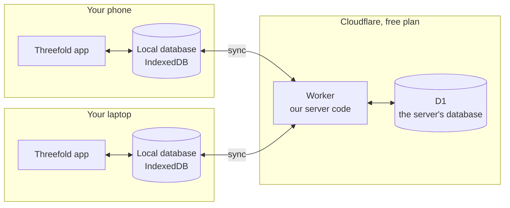

## 1. Requirements

> **In short:** what v1 must do (the F-x requirements), the qualities it must have (the N-x requirements), and what it leaves out. Everything later in this doc traces back to this section.

### 1.1 Context and constraints

- **Who:** you first, on an iPhone 17 Pro and a MacBook, developing mostly in Chrome. Sign-ups are open, but Threefold isn't shared anywhere until end-to-end encryption ships (section 7).
- **Scale:** a person folds 3 to 12 stars a day, about 1,500 a year, and each star is at most 120 characters. Ten years of one person's stars is a few megabytes of text, which is small enough to keep all of it on the device.
- **Cost:** nothing may cost money while there are few users.
  - The server runs on Cloudflare's free Workers plan, and its database, D1, is free too.
  - The free plan can't bill you: past a daily limit, requests fail until the limits reset (5.2).
  - Those daily limits are shared with the other Workers on the same Cloudflare account.
  - The GitHub repo is public, which keeps GitHub's security features free.
- **Hosting:** production is `threefold.davidinoa.workers.dev` until there's a custom domain (deferred). That's a free address Cloudflare gives each Worker.
- **Privacy:** the server stores journal text but never reads it.

### 1.2 Functional requirements

The screens at a glance:

| Screen | What it's for |
|---|---|
| Hello | The first visit: start a jar, or open one you keep on another device |
| Today | Write the day's three lines |
| Review | The weekly review: three lines for each of the eight categories |
| Shake | Shake the jar for a random past star |
| Shelf | Past months' jars, and each month's calendar |
| Insights | What your jar says about you: totals and the sand jar |
| Settings | Night mode, sound, motion, passkeys, and your jar |

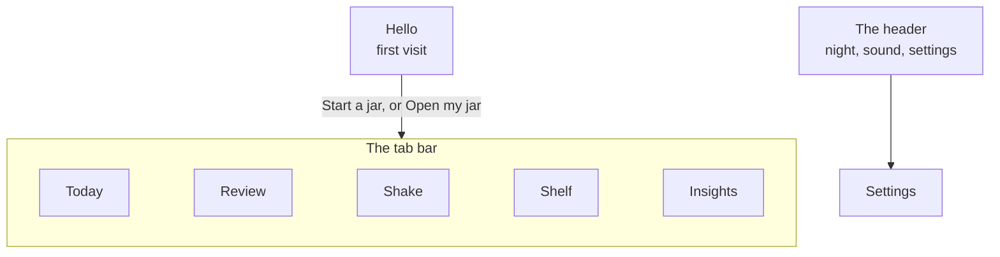

**Today**

- **F-1** Today shows the date, the day's category with its prompt, and three lines with that category's placeholders. The category comes from a continuous eight-day cycle on the device's local date (3.3).
- **F-2** Enter on a line with words folds it into a paper star that flies into this month's jar. Enter on an empty line only wiggles it, and Tab moves on without folding.
- **F-3** The day's third star pops the jar's lid, and the status says the day is kept and what tomorrow asks.
- **F-4** After the day's three, "Another category" starts a bonus round in the next category of the cycle. There's no limit on rounds, and each has its own headline ("Six. Show-off.").
- **F-5** Today's folded lines can be reopened and rewritten on Today.
- **F-6** Today's status keeps you company without keeping score. It covers your first day, a welcome back after three or more quiet days, a new month, progress while folding, and done. It never mentions streaks or missed days.
- **F-7** Once the day is kept, Today links to the weekly review with the week's count ("Full review, 14 of 24").

**The jar**

- **F-8** Each calendar month has one jar. The live jar is a single object that travels between screens, and its tape shows the month and the count.
- **F-9** The first time the app opens in a new month, last month's jar is corked, labeled, and slides onto the shelf, and a new empty jar starts. This plays once per device.
- **F-10** A jar's pile stops growing when it's full (about 130 stars). New stars land on the surface in place of older ones underneath, so today's stars are always visible, and the tape shows the true count.

**Weekly review**

- **F-11** The review covers Monday through Sunday: three stars for each of the eight categories, 24 in all. Every star folded that week counts toward its category, up to three, whether it came from Today, a bonus round, or the review.
- **F-12** The review shows the week's tally and a spread of eight category cards (not yet, n of 3, kept). A writing card moves on to the next category with room after its third line.
- **F-13** The first time Review opens in a new week, a card shows how last week went, then the review starts fresh. Nothing is ever marked as missed.

**Shelf**

- **F-14** The shelf shows one jar per month that has stars, oldest first, with the live jar on it. You move along it by dragging, with the arrow keys, or with the previous and next buttons.
- **F-15** Each month shows its total, days with a star, quiet days, and its category mix.
- **F-16** "Pour it out" tips a jar's stars into that month's calendar: each day's stars in its cell, and quiet days as plain paper.
- **F-17** Opening a day unfolds its stars one at a time. You can rewrite a star, or take it out after a confirmation that says it can't be undone. Today's stars point you to Today instead.

**Shake**

- **F-18** Shaking the phone, dragging side to side on desktop, or pressing "Shake the jar" tumbles out one random past star, with a line for its category.
- **F-19** Under the jar, a card shows a star from a year ago today, or from the nearest day before it. While the jar is younger than a year, the card shows your first star.

**Insights**

- **F-20** Insights pours all your stars into the jar as sand art. Each category is a layer, the most-written at the bottom, with its name and count.
- **F-21** Three tiles show stars in all, days with a star, and jars on the shelf. No number on Insights goes down because of a quiet day.
- **F-22** Callouts kindly name the most-written and the quietest category. In the first two weeks, a callout says it's early days.

**Accounts and devices**

- **F-23** Anyone can start a jar without an account. It lives only on that device.
- **F-24** After the first three stars, the app offers to keep the jar.
  - One passkey, with no email or password, creates the account and starts syncing.
  - "Not now" keeps the jar on the device.
  - The offer stays in Settings, and it comes back after a full day, at most once a week.
- **F-25** "Open my jar" signs in with a passkey on another device and pours your stars back in. If that device had a jar that was never kept, its stars merge into yours.
- **F-26** Settings lists your passkeys: the device, the provider where the browser reveals it, and since when. You can create another, or delete one, but never the last.
- **F-27** Signing out makes the device forget your stars once everything waiting has reached your jar. If stars are still waiting, it says so first.
- **F-28** "Empty the jar" deletes every star and jar, on every device, and keeps your passkeys. You hold a button to confirm.
- **F-29** "Delete everything" deletes your stars, jars, passkeys, and account, on every device. You hold a button to confirm.

**Sync and offline**

- **F-30** Everything works offline, and changes sync when you're back. The app shows when it's offline, how many stars are waiting, and when everything is saved.
- **F-31** Your stars sync across your devices. When a star was changed in two places, the latest change wins.
- **F-32** After its first load, the app opens with no connection, and it can live on the Home Screen.

**Settings**

- **F-33** Night: match the device, day, or night. The moon in the header switches it too, and nothing flashes on load.
- **F-34** Sound has an on/off switch (also in the header), a volume, and a preview. It's quiet by default and silent until you first touch the app.
- **F-35** Motion: match the device, or Calmer, which swaps flights and wobbles for quick fades.
- **F-36** "Save a copy" downloads every star as one plain-text file, grouped by month and day.
- **F-37** Settings shows whether everything is saved to your jar, or how many stars are waiting on this device.

**First run**

- **F-38** The first visit shows a hello screen with two choices: start a jar, or open one you keep on another device.

### 1.3 Non-functional requirements

- **N-1 Phone first.**
  - Layouts: phones (under 768 px), upright tablets (768 px), sideways tablets (1024 px), and desktops (1280 px).
  - Test devices: the iPhone 17 Pro, in the browser and from the Home Screen, and a MacBook, mostly in Chrome.
  - Android and Windows Hello testing waits until Threefold is shared.
- **N-2 Local first.** Every write lands on the device first and never waits for the network. The server is a sync target, not the source of what's on screen.
  - In practice, pressing Enter saves the star before any network request starts.
- **N-3 No lost stars.** A crash, a reload, a sign-in, or a bad connection never loses a star.
  - A star and its outbox entry are saved together.
  - An entry leaves the outbox only when the server confirms it.
- **N-4 Private.**
  - The server stores journal text but never reads, searches, logs, or analyzes it.
  - Insights, shake, and export run on the device.
  - Nothing loads from third parties at runtime.
  - Until end-to-end encryption ships, the app says only what's true about privacy, and a test enforces it.
- **N-5 Secure.**
  - Passkeys only: no passwords, no email.
  - A strict Content-Security-Policy and security headers from the first deploy (5.7).
  - No IP addresses or user agents stored, and no request bodies logged.
- **N-6 Free.** The design fits Workers Free and D1's free allowance (5.2), which the account's other Workers share. Per-account caps keep one account from using it up.
- **N-7 Smooth.** Fold and drop, the traveling jar, and the shelf run at 60 fps on the iPhone 17 Pro.
  - 60 fps means drawing a new frame every 16.7 ms.
- **N-8 Accessible.**
  - WCAG 2.2 AA, the usual accessibility standard.
  - Everything you can press is at least 44 × 44 px, which is stricter than AA's 24 × 24 minimum.
  - Every gesture has a plain twin, like a button that does the same thing.
  - Sound is never the only signal.
  - With reduced motion, whether set on the device or through Calmer, the story stays and the travel goes.
- **N-9 Kind.** No streaks, no "missed," no red. Quiet days are plain paper, and no number goes down because of one.
- **N-10 US English.**
  - US spelling and US formats everywhere ("Sep 23," "9:30 PM").
  - Weeks run Monday to Sunday.
  - "Today" is the device's local date.
- **N-11 Observable without reading.** Client errors reach the server without any text you wrote, and server logs carry no request bodies.
- **N-12 Few dependencies.** Every package in the client bundle can read what people write, so each one has to earn its place.

### 1.4 Out of scope and deferred

"Out of scope" means not planned. "Deferred" means planned for later, with a clear trigger that brings it back.

Out of scope for v1:

- server rendering, for content or SEO
- real-time features, sharing, or more than one person per jar
- server-side search or analysis of any kind
- email

Deferred items, with what brings each one back. The PRD gives the product reasons.

| Item | Comes back | Notes |
|---|---|---|
| End-to-end encryption and the spare-key card | Before Threefold is shared anywhere, or when a second account appears, whichever comes first | A pinned issue and a wording test keep it visible (section 7) |
| Custom domain | Before Threefold is shared | Passkeys are bound to the hostname, so a later move strands them |
| Android and Windows Hello testing | Before Threefold is shared | Repeat the passkey and motion spikes there |
| Daily nudge (Web Push) | After v1 | Section 8 |
| Privacy lock | With end-to-end encryption | Without encryption it only hides the screen |
| Names on Insights ("Names that keep showing up") | After v1 | Needs name detection on the device, and a way to correct it |
| TanStack DB | At its 1.0 | Could replace Dexie and the hand-written sync (ADR 0003) |

## 2. Architecture

> **In short:** Threefold is a single-page app. The server sends one small page, and JavaScript draws every screen after that. All your stars live in a database inside your browser, and the screens read from it directly. The server is a small Cloudflare Worker with three jobs: sending the app's files, handling passkeys, and syncing stars. It keeps its data in D1, a SQLite database.

### 2.1 The pieces

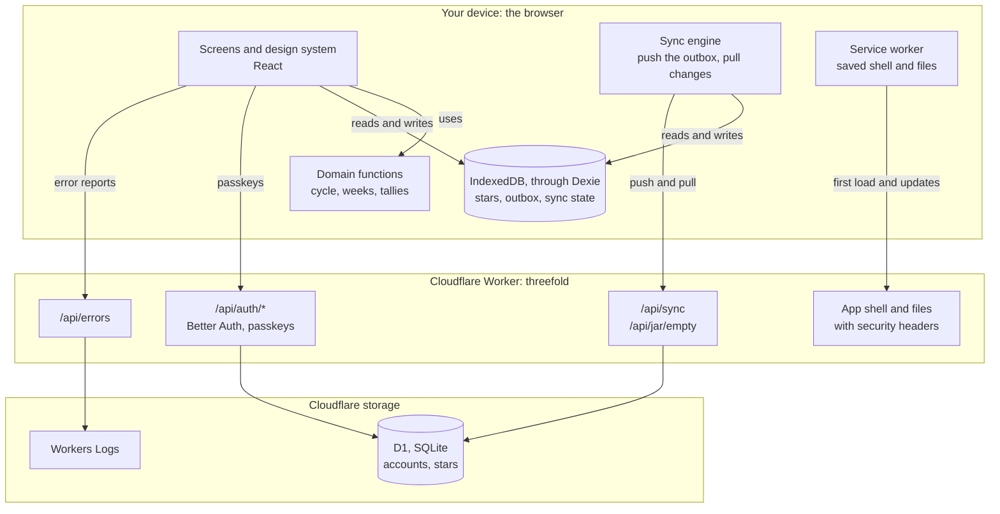

| Piece | What it is | Why it's here |
|---|---|---|
| Screens and design system | The React components you see: Today, the jar, the shelf, and the rest | Draw everything from the data on the device |
| Domain functions | Plain functions that work things out, such as today's category or the week's count | They hold the app's rules, and they're easy to test |
| Dexie over IndexedDB | IndexedDB is a database built into every browser. Dexie is a small library that makes it pleasant to use | The device's copy of your stars |
| Sync engine | Code that sends changed stars to the server and fetches changes from your other devices | Keeps your devices in step |
| Service worker | A script the browser keeps running for a site, which can answer the site's requests from a cache | Lets the app open with no connection |
| Cloudflare Worker | Our server code. Cloudflare runs it on demand, close to you, for each request | Sends the app, handles passkeys and sync |
| Better Auth | A sign-in library that runs inside the Worker | Passkeys and sessions |
| D1 | Cloudflare's database, built on SQLite | The server's copy of accounts and stars |
| Workers Logs | Cloudflare's log viewer for a Worker | Where error reports land |

The browser holds a full copy of your stars in IndexedDB. Screens read it through live queries (2.3), so a fold updates Today, the jar, and the review in the same frame, online or not. The sync engine pushes changed stars from the outbox and pulls changes made on your other devices.

The Worker serves a static app shell and three small APIs, and D1 stores accounts and stars. There's no server rendering, and no scheduled job in v1.

### 2.2 Rendering: a single-page app

There are two common ways to get a web app's screens onto the screen:

| | Server rendering (SSR) | Single-page app (SPA) |
|---|---|---|
| What the server sends | The finished HTML for each page | One small "shell" page. JavaScript then draws each screen in the browser |
| Good for | Public pages that search engines should read, and a fast first paint of content | Apps behind a sign-in that work with data on the device |
| Threefold | Not used | Used |

Threefold is an SPA, for four reasons:

- The content is private and behind a passkey.
- There's nothing for search engines to index.
- The first screen depends on IndexedDB, which the server can't see.
- A static shell is easy to save on the device for offline use (2.6).

What loading looks like:

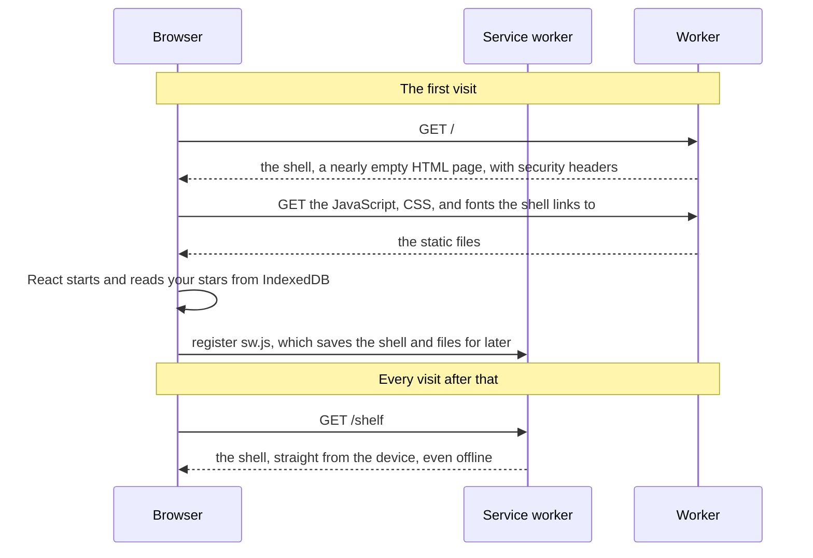

Details:

- TanStack Start runs in SPA mode (`tanstackStart({ spa: { enabled: true } })`). The build emits the shell as `/_shell.html`, plus JavaScript and CSS files whose names include a hash of their contents.
- The Worker answers every app route with `/_shell.html`, byte for byte, through Cloudflare's assets binding, and Start handles `/api/*` and `/_serverFn/*` (section 6, question 4).
- The shell's inline scripts (Start's own, plus the script that sets night mode before anything paints) run under CSP hashes (5.7).
- The app's content renders only once the shell has hydrated, through the router's `ClientOnly` in the root route. The shell leaves the page area empty, and wherever a route's code is already loaded, the client would fill that area on its first pass, which fails hydration with React error #418 (TanStack/router#8473). Nothing is server-rendered anyway.

### 2.3 The client

The code in the browser is split into layers. Each layer uses only the layers below it, so, for example, the domain functions never touch the database or the screen.

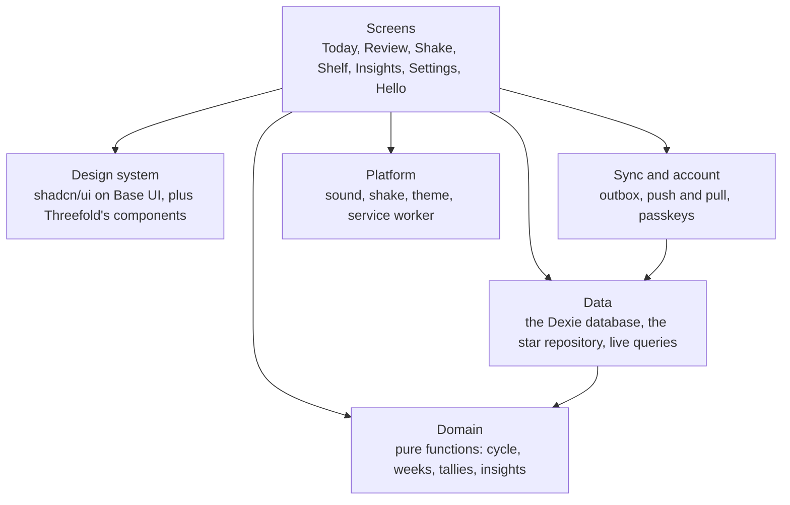

| Layer | What it holds | Where (indicative) |
|---|---|---|
| Screens | Today, Review, Shake, Shelf, Insights, Settings, and Hello, under one layout with the header, the nav, and the traveling jar | `src/routes/`, `src/screens/` |
| Design system | shadcn/ui on Base UI, restyled, plus Threefold's own components (PaperStar, Jar, EntryLine, …) | `src/components/ui/`, `src/components/threefold/`, documented in Storybook (2.9) |
| Domain | Pure functions over plain data: day keys, the cycle, weeks, months, rounds, the review tally, insights, the year card, the shake pick, export, and copy | `src/lib/domain/`, `src/lib/copy/` |
| Data | The Dexie database, the star repository (fold, rewrite, take out), and live-query hooks | `src/lib/data/` |
| Sync and account | The outbox, push and pull, triggers, resets, and passkey flows through Better Auth's client | `src/lib/sync/`, `src/lib/account/` |
| Platform | Sound (Web Audio), shake (device motion), the theme, and the service worker | `src/lib/`, `src/sw.ts` |

Decisions:

- **The client's state lives in IndexedDB, read through live queries.** A live query is a database read that runs again whenever the data it read changes, and re-renders its component. It even notices changes made in another tab. There's no separate store for stars.

  ```tsx
  // Re-renders by itself when any of today's stars changes, in this tab or another.
  const stars = useLiveQuery(() => db.stars.where("day").equals(today).toArray(), [today])
  ```

  UI-only state, like which card is open or which jar the shelf is on, stays in React state or the URL (ADR 0003).
- **No TanStack Query.** TanStack Query is a popular library for fetching and caching data from a server. Its docs call it a server-state library, for data that lives on a server and can go out of date.
  - Stars are local-first: Dexie's live queries, with our own sync. That covers what TanStack Query would add for them (caching, updates from other tabs, offline writes), and the outbox commits in the same transaction as the star.
  - The only server state is the session and the passkey list. Better Auth's client already runs its own small query layer for both:
    - `useSession()` refetches on focus and shares the session across tabs.
    - `useListPasskeys()` refreshes itself after a passkey is added, updated, or deleted, and after sign-out.
  - Account actions get their pending and error states from React 19's `useTransition`.
  - What's given up is TanStack Query's devtools. The browser's IndexedDB panel shows the stars.
  - If server state grows later (the nudge's settings, say), adding TanStack Query then changes nothing else.
- **The design system stays independent of the app.**
  - Nothing in `src/components/` imports TanStack Router, the data layer, or sync.
  - Links come in from the screens through Base UI's `render` prop, and data comes in as props.
  - A lint rule enforces this.
  - It's what lets Storybook show every component on its own (2.9). If another app ever needs the design system, it can move into its own package unchanged.
- **Domain logic is pure.** A pure function's result depends only on its inputs, and it changes nothing else. For example, `categoryOf("2026-09-23")` is always `"talents"`. That makes the app's rules easy to unit-test in Node, without a browser.
- **One traveling jar.**
  - The layout renders a single `Jar` above the routes.
  - Each screen marks a slot where the jar should sit.
  - When you switch screens, the one jar flies to the new slot on a spring, and it can change course mid-flight if you switch again.
  - Screens never draw their own live jar.
- **Motion:** `motion/react` drives the springs and flights, and CSS keyframes cover the simple animations.
  - A spring animation moves like a real spring instead of on a fixed timer, which is why it can be retargeted mid-flight.
  - `MotionConfig` follows the device's reduced-motion setting, or forces reduced motion with Calmer.
- **Sound** is synthesized with Web Audio, the browser's audio API, without any audio files. There's one `AudioContext`, and it starts on the first touch, because browsers don't let pages play sound before that.

### 2.4 The server

One Worker, named `threefold`, handles every request. It has a custom entry file, `src/server.ts`, that wraps Start's request handler to add security headers to the shell. It has no scheduled handler (code Cloudflare runs on a timer) in v1.

| Route | What it does | Needs sign-in |
|---|---|---|
| `/api/auth/*` | Better Auth's handler: passkey sign-up and sign-in, sessions, passkey management, and account deletion (4.1) | depends on the call |
| `/api/sync` | Pushes changed stars and pulls changes (4.2) | yes |
| `/api/jar/empty` | Deletes every star (4.2) | yes |
| `/api/errors` | Writes client error reports to Workers Logs (4.3) | no |
| everything else | The app shell and static files | no |

- **Stable routes, not server functions.**
  - TanStack Start's server functions let the browser call server code as if it were a normal function. Behind the scenes, each one becomes a URL like `/_serverFn/<id>`, and that id changes between builds.
  - An app one version behind, still running from the device's cache, would call URLs that no longer exist (5.3).
  - So every API is a plain server route with plain JSON.
- **Every route checks its request body** against a zod schema before using it. zod is a library that checks that data has the expected shape. Better Auth already depends on zod 4, so it isn't a new dependency.

### 2.5 Accounts and passkeys

**What's a passkey?** A passkey replaces a password with a pair of keys.

- The **private key** stays in your password manager, such as iCloud Keychain, and never leaves it.
- Our server stores only the **public key**, which is safe to store: it can check a signature, but it can't make one.
- To sign in, the server sends a one-time challenge. Your device signs it with the private key after Face ID or Touch ID, and the server checks the signature with the public key.

The browser API behind this is called WebAuthn (`navigator.credentials.create` to make a passkey, `navigator.credentials.get` to use one).

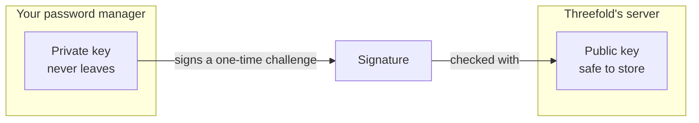

Keeping a jar (signing up):

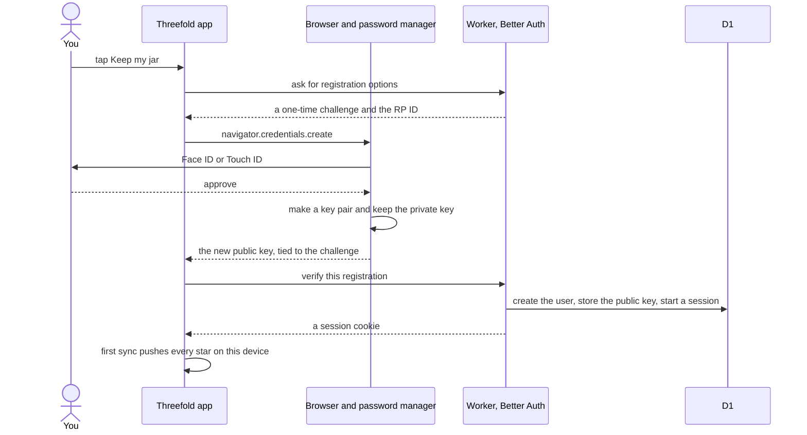

Opening a jar on another device (signing in):

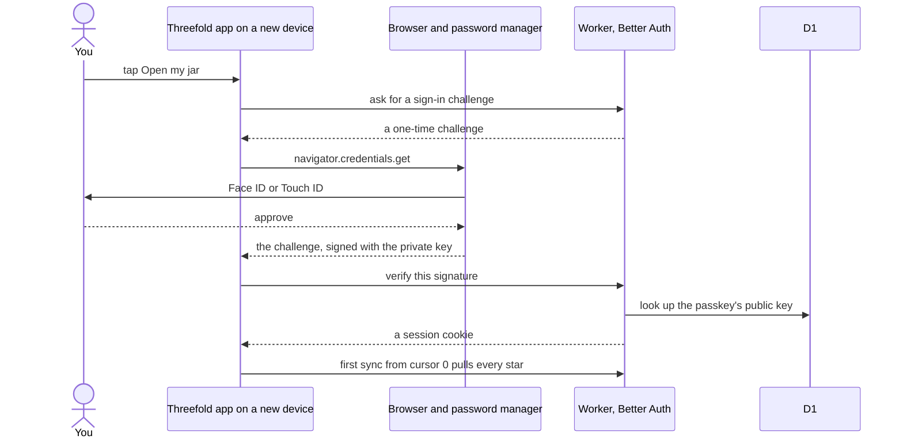

Details:

- **Better Auth with `@better-auth/passkey`**, mounted at `/api/auth/$` (ADR 0001).
  - Sign-up is passkey-only: `registration.requireSession: false`, with `resolveUser` and `afterVerification` creating the user. The account exists only once its passkey checks out.
  - Better Auth requires an email and a name on every user, so each user gets placeholders: `<id>@users.invalid`, and the name "Threefold", which is also what the password manager shows for the passkey.
  - Passkeys are discoverable (`residentKey: "required"`), so opening a jar needs no username.
  - The options live in `src/lib/auth/options.ts`, shared by the Worker, the migration script, and the tests, so the tables and the behavior can't drift apart.
- **The RP ID** ("relying party" ID) is the domain a passkey belongs to. The browser only offers a passkey on that domain.
  - The RP ID and origin come from each environment's config (`AUTH_RP_ID` and `AUTH_ORIGINS`), never from request headers, with one checked exception for previews below.
  - In production, the RP ID is exactly `threefold.davidinoa.workers.dev`.
  - It's never `davidinoa.workers.dev`, which every Worker and preview on the account could use.
  - A preview can't name its own: Cloudflare doesn't tell a preview its URL. So a preview's config holds a pattern, `*-threefold.davidinoa.workers.dev`, and the preview uses the hostname it's served on only when that matches. Cloudflare sends a preview only its own hostnames, so a request can't claim another one.
  - On any other hostname, `/api/auth/*` answers `404`.
- **Every new passkey asks for PRF.** PRF is a WebAuthn extension that lets a passkey produce a secret for encryption. Asking for it now means today's passkeys can carry end-to-end encryption later (section 7). The server puts `prf: {}` in its registration options, so no client call can leave it out.
- **Sessions:** after sign-in, the server remembers you through a session, tied to a cookie in your browser.
  - The cookie is HttpOnly, which means JavaScript can't read it.
  - Better Auth's default session lasts 7 days. Threefold sets `expiresIn` to a year, renewed as you use the app (`updateAge`, at most daily).
  - Chrome caps cookie lifetimes at 400 days, so a year fits.
- **Nothing identifying is stored.**
  - IP tracking is off, and sessions keep no user agent (the string that names your browser and device).
  - Each passkey is named with a coarse device label when it's created, such as "iPhone" or "Mac".
  - The provider comes from the passkey's AAGUID, an id that says which password manager made it, where the browser passes one.
  - Apple devices send zeros under the default `attestation: "none"`, so there the passkey shows only its device label (section 6, question 1).
- **"Delete everything" asks for your passkey again** when the session is more than a day old. Better Auth deletes a user only while the session is younger than `freshAge` (a day by default), so the app signs you in with your passkey first.
- **A jar that was never kept has no account.** Its stars live only in that device's IndexedDB, and nothing reaches the server.

### 2.6 The offline shell

**What's a service worker?**

- It's a script the browser keeps running for a site, even between visits.
- It sits between the app and the network, and it can answer requests from a cache on the device.
- Threefold's service worker saves the shell and the app's files ahead of time, which is called precaching. With those saved, the app opens with no connection.

Every request from the app goes through it like this:

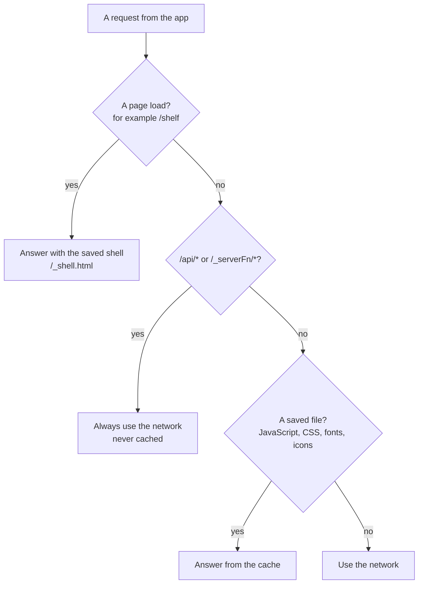

Details:

- **It's our own small service worker, with no plugin.** The usual plugins, vite-plugin-pwa and Serwist, both silently skip generating the worker in Start builds (TanStack/router#4988). Its source is `src/sw.ts`.
- **The build writes the precache list in.** After Start's prerender, a Vite plugin (`serviceWorker` in `vite.config.ts`) lists `dist/client`, then compiles `src/sw.ts` into `/sw.js`, a classic script, with the list written in. The list covers:
  - the shell, precached from `/`, which the Worker answers with `_shell.html`. Cloudflare redirects a direct request for `/_shell.html` to `/_shell`, and a service worker can't answer a page load with a redirected response.
  - JavaScript, CSS, fonts, icons, and the manifest. The fonts are Latin only: the files Fontsource adds for other scripts, such as Cyrillic or Latin Extended, are left out (5.5).
- **Each build is a version.** `sw.js` carries a hash of every saved file, the shell included. A change to any of them makes a new `sw.js`, which the browser installs as a new version with a cache of its own.
- **The app registers it in the build only.** In development, Vite serves every file fresh. The first visit installs it without taking over the open page, and the next page load comes from it.
- **Caching rules**, as in the chart above:
  - Page loads get the saved shell.
  - Saved files are served cache-first: from the cache when it has them.
  - `/api/*` and `/_serverFn/*` always go to the network and are never cached. The Worker and the service worker share this rule, in `src/lib/server-paths.ts`.
- **The web app manifest**, `/manifest.webmanifest`, is a small JSON file that lets the app live on the Home Screen.
  - It sets `id`, `start_url`, `scope`, `display: standalone`, and icons including a maskable one. The icons are placeholders until the app icon is designed.
  - Its theme color is Day's paper. The theme script sets the page's `theme-color` to Day's or Night's, whichever is showing, so the browser's bars match the page.
  - On the iPhone, being on the Home Screen also keeps the app's storage from being cleared after a week without visits (5.4).
- The push handlers join this worker with the nudge (section 8).

**Updates.** When a new version deploys, the browser finds a new `sw.js`:

- It installs in the background and waits until every tab using the old version has closed.
- Then it takes over on the next launch and deletes the old caches.
- Section 5.3 covers an app that's still a version behind.

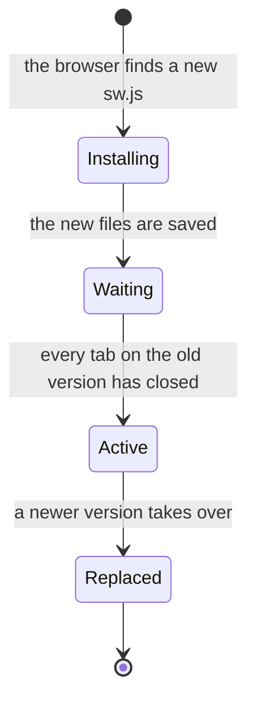

### 2.7 Environments

The same code runs in three places:

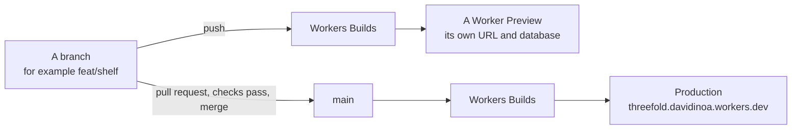

| | Local | Preview | Production |
|---|---|---|---|
| Where | `localhost` on the Mac, or a stable tunnel hostname for the phone | a Worker Preview URL per branch | `threefold.davidinoa.workers.dev` |
| Database | a local D1, run by the Vite plugin | its own D1 | the production D1 |
| RP ID | the hostname in use | the preview's hostname, when it matches the pattern in its config | `threefold.davidinoa.workers.dev` |
| Config and secret | `.dev.vars`, written by `pnpm dev-vars` and ignored by git | `previews.vars` in `wrangler.jsonc`, and the Previews Base's secret | `vars` in `wrangler.jsonc`, and a Worker secret |
| Deploys | — | Workers Builds, on each push to a branch | Workers Builds, on merge to `main` |

Workers Builds is Cloudflare's service that builds and deploys the Worker from the GitHub repo. A passkey works only on the hostname it was made on, so test passkeys don't carry over between previews.

What Workers Builds runs, after it installs the dependencies with pnpm 11.27.1 (its `PNPM_VERSION` build variable):

| | On `main` | On other branches |
|---|---|---|
| Build | `pnpm build` | `pnpm build` |
| Deploy | `pnpm run release`: the migrations to the production database, then `wrangler deploy` | `pnpm run release:preview`: the migrations to the previews' database, then `wrangler preview` |

- Each Worker has a connection of its own. In Workers Builds, Wrangler deploys to the connected Worker whatever name its config gives (`WRANGLER_CI_OVERRIDE_NAME`), so one connection can't deploy two Workers.
- Migrations run before the new code, so the code never meets an older schema.
- The previews' migrations use `wrangler.previews-db.jsonc`, a config that names only that database, because `wrangler d1` commands don't look under `previews`.
- The build's API token needs D1 edit access for the migrations, which the token Workers Builds creates by default doesn't have.
- GitHub Actions still only checks. It never deploys, and it holds no credentials.

The design system's Storybook deploys the same way, as a second Worker with its own previews (2.9).

### 2.8 Stack

| Piece | Choice | What it is | Recorded in |
|---|---|---|---|
| Framework | TanStack Start in SPA mode, React 19, TypeScript 7, Vite 8 | The app framework, the UI library, the language, and the build tool | this doc |
| Host and database | Cloudflare Workers Free with D1 | Where the server code runs, and its database | ADR 0002 |
| Auth | Better Auth with `@better-auth/passkey` | Sign-in with passkeys | ADR 0001 |
| Client data and sync | Dexie 4, with our own sync | The device's database, and how it syncs | ADR 0003 |
| UI primitives | shadcn/ui on Base UI | Accessible building blocks (buttons, dialogs, sheets) that we restyle | ADR 0004 |
| Styling | Tailwind v4, with tokens in `src/styles.css` | Utility CSS classes, and the design's colors and sizes | the Storybook (2.9) |
| Motion | `motion` | Springs and animations | the Storybook (2.9) |
| Fonts | Kalnia, Figtree, and Shantell Sans, self-hosted through Fontsource | The three typefaces, served from our own server | the Storybook (2.9) |
| Design system docs | Storybook 10, on React and Vite | A site that shows each component on its own, in every state, with its docs | 2.9 |
| Tooling | pnpm, Oxc (oxlint and oxfmt), Vitest, Playwright | Packages, linting and formatting, and tests | the setup checklist |

### 2.9 The design system and its Storybook

**What's Storybook?** A small app, separate from Threefold itself, that shows each component on its own, with its docs beside it: every state and variant, in day and in night. Components get built and reviewed there before any screen uses them, and it's the design system's documentation.

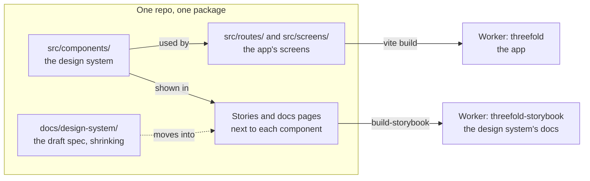

| | The app | The Storybook |
|---|---|---|
| Built from | The screens and the design system | The stories and docs pages, and the design system |
| Build | `vite build`, with Start's and Cloudflare's plugins | `build-storybook`, with its own small Vite config: React and Tailwind only |
| Deployed to | The `threefold` Worker | A second Worker, `threefold-storybook`, that serves static files only |
| Address | `threefold.davidinoa.workers.dev` | `threefold-storybook.davidinoa.workers.dev` |

- **Stories:** a story is one example of a component in one state, written as code in a `*.stories.tsx` file next to the component.
  - Each component gets a story for every state in its spec, plus a docs page built from its description and props.
  - The foundations (color, type, motion, sound, and icons) get docs pages of their own.
- **The toolbar** switches every story between day, night, and both side by side, and turns reduced motion on and off.
- **Its own Vite config:** Storybook uses `@storybook/react-vite`, with a small config of its own (set through the builder's `viteConfigPath`) that loads only React and Tailwind.
  - Start's and Cloudflare's build plugins never load there.
  - The design system doesn't use TanStack Router (2.3), so stories don't need a router either, and TanStack Router can stay on its latest version.
- **Stories are tests too:** Storybook's Vitest addon runs every story as a test, and accessibility errors fail it (5.10).
- **Hosting:** Workers Builds deploys the static build to its own Worker, with a preview URL for each branch, like the app. Requests for static files are free and don't count toward the daily request limit (5.2).
  - `wrangler.storybook.jsonc` configures that Worker: assets only, from `storybook-static`, with no code.
  - A Workers Builds connection of its own runs `pnpm build-storybook`, then `pnpm run release:storybook` on `main`, or `pnpm run release:storybook:preview` on other branches (2.7).
- **The draft spec is temporary.**
  - `docs/design-system/` holds the cleaned-up draft: one file per component, plus the foundations and exact data.
  - The PR that lands a component's stories and docs page also deletes that component's spec file, so each component has one source of truth at a time.
  - When the folder is empty, it's deleted, and the Storybook is the only documentation.

## 3. Data model

> **In short:** one kind of data matters: the star. Every star lives on the device, and if the jar is kept, on the server too. Everything else you see, such as today's category, the week's count, the jars, and the insights, is computed from stars when it's needed and never stored.

### 3.1 Where data lives

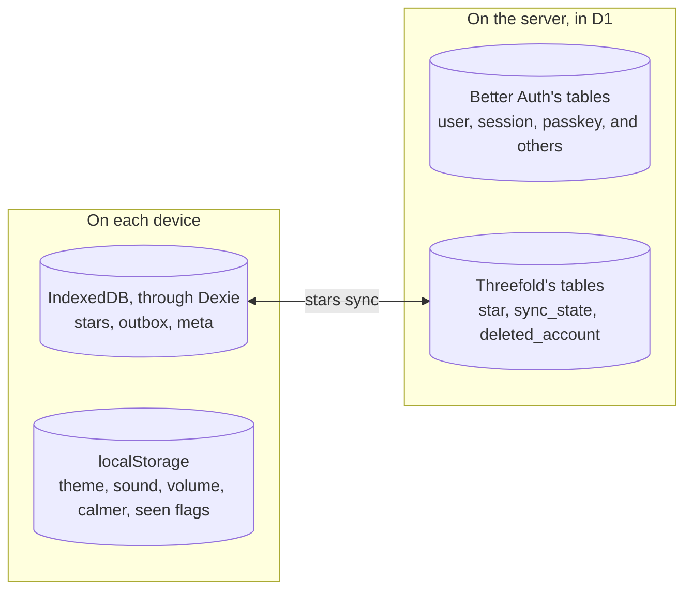

| Entity | Source | Synced | Fields |
|---|---|---|---|
| Star | device (Dexie) and server (D1) | yes | `id`, `day`, `category`, `text`, `createdAt`, `updatedAt`, `deleted`, and `seq` on the server |
| Outbox entry | device | no | the `id` of a star with a change the server hasn't confirmed |
| Sync state | device | no | `userId`, `cursor`, `generation` |
| Device settings | device (`localStorage`) | no | `theme`, `sound`, `volume`, `calmer` |
| Seen flags | device (`localStorage`) | no | the last month sealed, the last week shown, and when the keep offer last showed |
| User, session, passkey | server (Better Auth's tables) | no | Better Auth's columns, with placeholders for email and name |
| Sync counter | server | no | `userId`, `seq`, `generation`, `emptiedAt`, and the cap's daily count |
| Deleted account | server | no | `userId`, `deletedAt` |

`localStorage` is a simple key-value store in the browser, and it can be read instantly. That's why it holds the settings the page needs before anything else.

### 3.2 A star

```ts
type CategoryKey =
  | "people" | "home" | "talents" | "luck"
  | "body" | "work" | "knowledge" | "abundance"

type Star = {
  id: string
  day: string
  category: CategoryKey
  text: string
  createdAt: number
  updatedAt: number
  deleted: boolean
}
```

| Field | Example | What it means |
|---|---|---|
| `id` | `"9b1deb4d-…"` | A random id made on the device with `crypto.randomUUID()`, so a star has an id before any server sees it |
| `day` | `"2026-09-23"` | The device's local date when the star was folded. Never changes |
| `category` | `"talents"` | One of the eight. Never changes |
| `text` | `"A compliment I believed"` | 1 to 120 characters, trimmed. Empty once the star is taken out |
| `createdAt` | `1790150400000` | When it was folded, in milliseconds since 1970, by the device's clock. Orders a day's stars |
| `updatedAt` | the same, or later | When it last changed, by the device's clock. The latest change wins (5.1) |
| `deleted` | `false` | `true` once the star is taken out, which makes it a tombstone |

A **tombstone** is a record that says "this was deleted." Without one, a device that was offline during the delete would never find out, and could even send the star back.

A star's life:

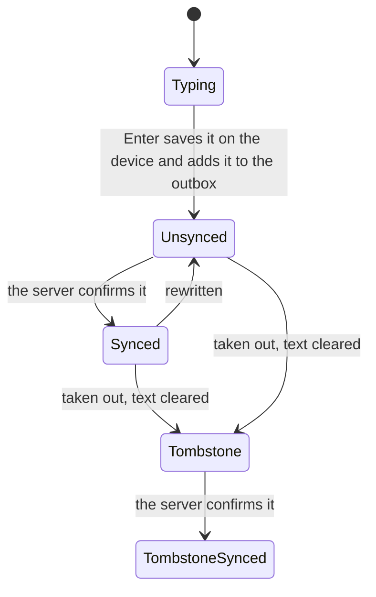

In a jar that was never kept, stars stay Unsynced: the outbox fills, but nothing is sent until the jar is kept.

Rules:

- `day` and `category` never change. Rewriting a star changes only `text` and `updatedAt`, so a star keeps its date and color.
- A star's week and month come from `day`, so a star never moves to another jar, even after a flight across time zones.
- Taking a star out clears its text and sets `deleted`. That happens on the device right away, and on the server at the next sync. The tombstone holds no text and stays, so a device that was offline still learns the star is gone.

### 3.3 Computed from stars

Derived data is anything worked out from stars when it's needed. None of it is stored, so it can never disagree with the stars. All of it comes from pure functions on the device.

**Day key.** The device's local date as `YYYY-MM-DD`, such as `"2026-09-23"`. Date arithmetic runs on day keys, not on timestamps. That's because a day with a daylight saving change is 23 or 25 hours long, which would throw off timestamp math.

**The day's category.** The eight categories take turns, one per day, forever:

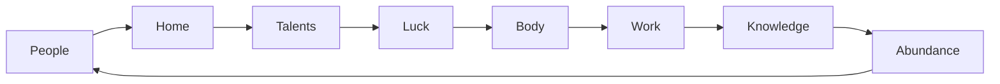

- The formula is `ORDER[daysBetween("2025-12-31", day) mod 8]`, where `ORDER` is the list above.
- Worked example: September 23, 2026 is 266 days after December 31, 2025. 266 mod 8 is 2, and `ORDER[2]` is Talents.
- December 31, 2025 was picked as the start so that 2026 matches the draft design. The cycle never jumps at New Year.

A week of the cycle:

| Mon Sep 21 | Tue Sep 22 | Wed Sep 23 | Thu Sep 24 | Fri Sep 25 | Sat Sep 26 | Sun Sep 27 |
|---|---|---|---|---|---|---|
| People | Home | Talents | Luck | Body | Work | Knowledge |

A week has seven days and there are eight categories, so one category (Abundance, this week) never gets a day of its own. That's what the weekly review is for: it asks for all eight.

**Today's rounds.**

- Round 0 is the day's category, and each "Another category" moves one step further along the cycle.
- A round exists if its category has a star today and the round before it exists.
- Today shows the last round that exists. It's in progress while it has fewer than three stars, and done at three, with "Another category."

Example for Wednesday, September 23: you fold three Talents lines, tap "Another category," and fold two Luck lines.

| Round | Category | Stars today | What Today shows |
|---|---|---|---|
| 0 | Talents | 3 | done |
| 1 | Luck | 2 | **in progress: this round is on screen** |
| 2 | Body | 0 | not started, so it doesn't exist yet |

**Week and tally.** A week runs Monday through Sunday. The tally counts each category's stars that week, capped at 3, out of 24.

| People | Home | Talents | Luck | Body | Work | Knowledge | Abundance | Total |
|---|---|---|---|---|---|---|---|---|
| 3 | 2 | 3 | 1 | 3 | 2 | 0 | 0 | **14 of 24** |

A fourth People star that week still counts as 3: the tally measures how many categories you touched, not how much you wrote.

**Jars and months.**

- There's one jar per month with at least one star, plus the live month's jar, even while it's empty. The live month is the device's current month.
- Month stats are total stars, days with a star, quiet days (for the live month, counted only up to today), and the category mix.

**The pile inside a jar.**

- Stars are placed by a "seeded" drop: a layout that looks random but comes out the same every time, because it starts from the same seed, the month key.
- Stars are placed in `createdAt` order, so the same stars always land in the same places.
- Positions count taken-out stars too, so taking one out leaves its spot empty instead of reshuffling the jar.
- Past the jar's capacity, new stars reuse surface positions, newest on top (F-10).
- A star that arrives late from another device can shift the pile once.

**Insights.** Totals per category, over all your stars since the first. The sand jar draws one grain per N stars, so it holds about 250 grains.

**Year card.**

- Once the jar is a year old, the card shows the star from a year ago today, or from the nearest earlier day. February 29 falls back to the 28th.
- Before then, it shows your first star.

**Shake pick.** A uniformly random star from before today, skipping the last few shaken. On your first day, today's stars count.

**Status states.**

- "First day" means there are no stars before today.
- "Welcome back" means three or more quiet days right before today, and nothing folded yet today.
- "New month" means the live jar is empty.

**Quiet days** are never stored and never counted against you. They're just days without stars.

What each screen reads:

| Screen | Reads | Writes |
|---|---|---|
| Today | the day's stars, the week's tally count, the live jar's count | fold, rewrite |
| Review | the week's stars | fold |
| Shelf | month summaries, then one month's stars | rewrite, take out |
| Shake | all stars | none |
| Insights | all stars | none |
| Settings | sync state, passkeys (from the server), totals | settings, account actions |

"All stars" is small: about 1,500 rows a year.

### 3.4 On the device: Dexie

IndexedDB is the database built into every browser. Each website gets its own, and it survives reloads and restarts. Its raw API is awkward, so Threefold uses Dexie, a small library on top of it.

```ts
const db = new Dexie("threefold") as Dexie & {
  stars: EntityTable<Star, "id">
  outbox: EntityTable<{ id: string }, "id">
  meta: EntityTable<{ key: string; value: unknown }, "key">
}

db.version(1).stores({
  stars: "id, day", // the primary key is id, and there's an index on day
  outbox: "id", // stars with a change the server hasn't confirmed
  meta: "key", // sync state: userId, cursor, generation
})
```

- In each schema string, the first name is the primary key and the rest are indexes.
- An index works like the index at the back of a book: the `day` index lets Today find one day's stars without reading every star.
- Weeks and months use it too, as a range of days.

Folding a star writes the star and its outbox entry in one transaction:

```ts
async function fold({ category, text }: { category: CategoryKey; text: string }) {
  const now = Date.now()
  const star: Star = {
    id: crypto.randomUUID(),
    day: dayKey(),
    category,
    text: text.trim(),
    createdAt: now,
    updatedAt: now,
    deleted: false,
  }
  // All or nothing: never a star without its outbox entry, or the other way around.
  await db.transaction("rw", db.stars, db.outbox, async () => {
    await db.stars.add(star)
    await db.outbox.put({ id: star.id })
  })
  return star
}
```

- A transaction is a group of writes that either all happen or none do. Rewriting and taking out a star work the same way.
- The outbox holds ids, not a log of edits.
  - The latest change wins, so only each star's current row matters.
  - That also makes pushing the same star twice harmless: it's idempotent.
- Device settings and seen flags live in `localStorage`, because the script that sets night mode has to read the theme before React starts.
- Schema changes go through Dexie's `version(n).upgrade()`, which moves existing data to the new shape.

### 3.5 On the server: D1

D1 is Cloudflare's database, built on SQLite. The Worker reaches it through a binding (`env.DB`), so there's no connection string or password.

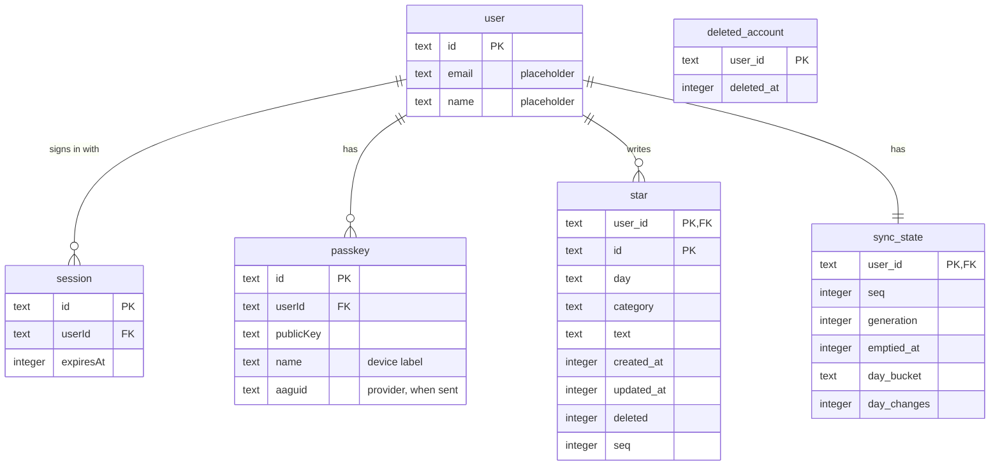

Better Auth's tables use its own camelCase column names, and the diagram shows only some of their columns. Better Auth can't open a D1 binding from Node, so `pnpm auth:migration` works out its tables' SQL against SQLite in memory, after replaying the migrations already committed, and writes what's missing as the next D1 migration: a versioned script that changes the database's structure. The first is `migrations/0001_better_auth.sql`.

Threefold adds three tables:

```sql
create table star (
  user_id    text    not null references user (id) on delete cascade,
  id         text    not null,
  day        text    not null,              -- YYYY-MM-DD
  category   text    not null,
  text       text    not null,              -- '' once taken out
  created_at integer not null,
  updated_at integer not null,
  deleted    integer not null default 0,
  seq        integer not null,              -- stamped by the server, per user
  primary key (user_id, id)
) without rowid;

create index star_by_seq on star (user_id, seq);

create table sync_state (
  user_id     text    primary key references user (id) on delete cascade,
  seq         integer not null default 0,   -- the last seq handed out
  generation  integer not null default 0,   -- bumped when the jar is emptied
  emptied_at  integer,                       -- server time of the last empty
  day_bucket  text,                          -- the UTC date day_changes counts
  day_changes integer not null default 0     -- star changes accepted that day, for the cap
);

create table deleted_account (
  user_id    text    primary key,           -- a random id, nothing personal
  deleted_at integer not null
);
```

What the less obvious parts do:

| Part | What it's for |
|---|---|
| `primary key (user_id, id)` | Each star is found by its owner and its id together |
| `without rowid` | Stores the table by that two-part key directly, which suits this kind of key in SQLite |
| `star_by_seq` | An index that lets a pull find "this user's changes after n" without scanning every star (4.2) |
| `seq` | A number the server stamps on each change, counting up per account (4.2) |
| `generation`, `emptied_at` | Let other devices find out that the jar was emptied (5.1) |
| `day_bucket`, `day_changes` | Count a day's accepted changes for the per-account cap (5.2) |
| `deleted_account` | Remembers the random ids of deleted accounts, so their other devices get told to wipe (4.2) |

- `on delete cascade` means deleting a user also deletes their stars and sync state.
- D1 always enforces these foreign keys, so a migration that rebuilds a table defers them with `PRAGMA defer_foreign_keys = true`.
- The schema allowlist test (checklist §8) lists every column here and in Better Auth's tables. A new column fails the test until it's reviewed.

### 3.6 A device's jar over time

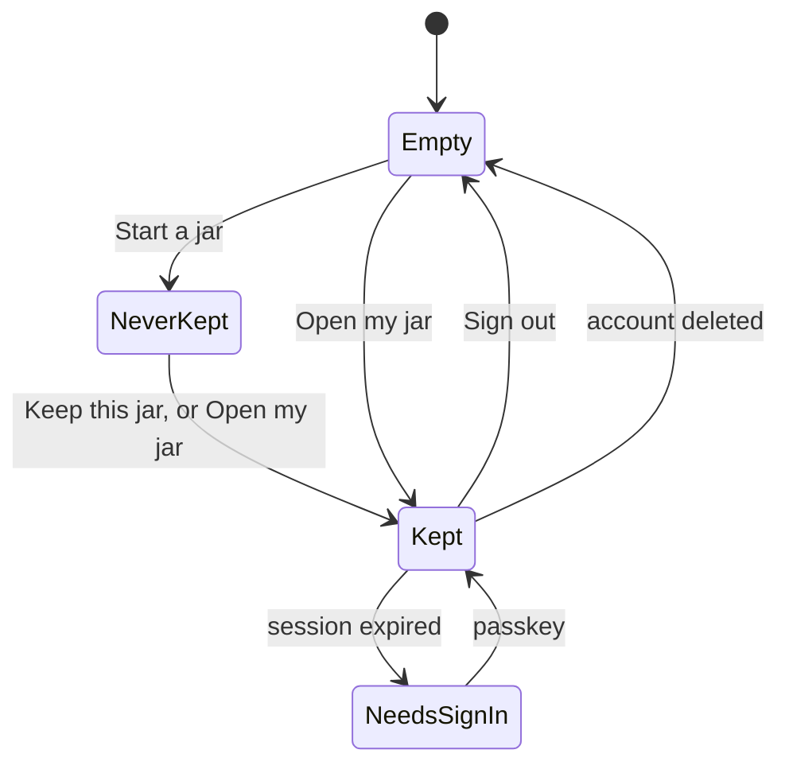

| State | What it means |
|---|---|
| Empty | No jar on this device yet: the hello screen |
| Never kept | A jar without an account. There's no `userId`, and the outbox fills but nothing is sent |
| Kept | Signed in and syncing |
| Needs sign-in | The session expired. Stars stay, the outbox waits, and the app asks you to open your jar again |

- **Keeping or opening a jar** merges the device's stars with the account's. Once the session starts, every local star goes into the outbox and is pushed, and the account's stars are pulled.
- **Signing out** waits until the outbox has drained, or until you confirm (F-27). Then it deletes the local database and flags, which is also what happens when the account is deleted on any device.

## 4. Interface

> **In short:** the app talks to the server through three small HTTP APIs: Better Auth's (accounts), `/api/sync` (stars), and `/api/errors` (error reports). Inside the app, screens call a handful of functions, the "seams" in 4.4, rather than touching the database or the network directly.

### 4.1 Accounts, through Better Auth's client

Checked against `better-auth` and `@better-auth/passkey` 1.7.6.

| Action | Call |
|---|---|
| Keep this jar (sign up) | `authClient.passkey.addPasskey({ createSession: true })`, with the session created on verification. The server's registration options ask for PRF, so no call can leave it out |
| Open my jar (sign in) | `authClient.signIn.passkey()` |
| List passkeys | `authClient.useListPasskeys()`, which refreshes itself after a passkey is added, updated, or deleted, and after sign-out |
| Add and delete passkeys | `authClient.passkey.addPasskey()`, `.deletePasskey({ id })` |
| Sign out | `authClient.signOut()`, after the outbox drains |
| Delete everything | `authClient.deleteUser()`, enabled on the server with `user.deleteUser.enabled` (without it, the endpoint returns `404`). An `afterDelete` hook records the id in `deleted_account`. |
| Session | `authClient.useSession()` |

- The server blocks deleting the last passkey, and so does the UI.
- After a passkey or the whole account is deleted, the app tells the password manager through the WebAuthn Signal API (`signalUnknownCredential`, `signalAllAcceptedCredentials`), so it stops offering a passkey that no longer works.
  - This happens only where the browser supports the API (Chrome 132+, iOS and macOS 26).
  - The password manager may hide the passkey, or delete it.

### 4.2 Sync

**The idea.**

- The server numbers every change to an account's stars: 1, 2, 3, and so on. That number is the change's `seq`.
- Each device remembers its **cursor**: the highest `seq` it has pulled.
- To sync, a device sends its own unsent changes, and asks for everything after its cursor.

One sync, start to finish:

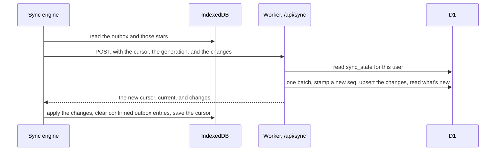

`POST /api/sync` needs a session.

```ts
type SyncRequest = {
  protocol: 1 // bumped on breaking changes (5.3)
  cursor: number // the highest seq this device has pulled; 0 at first
  generation: number // the jar generation this device knows
  changes: Star[] // up to 100 changed stars from the outbox, tombstones included
}

type SyncResponse =
  | {
      cursor: number
      generation: number
      current: Star[] // pushed stars the server had a newer version of: take these
      changes: Star[] // changes from other devices past the cursor, up to 500, in seq order
      more: boolean // more to pull: call again right away
    }
  | { reset: { generation: number; emptiedAt: number } } // the jar was emptied elsewhere
```

A worked example with two kept devices. The account's `seq` starts at 0.

| # | What happens | Server `seq` | Phone cursor | Laptop cursor |
|---|---|---|---|---|
| 1 | The phone folds star A and syncs. Its request gets seq 1, so A is stored with seq 1 | 1 | 1 | 0 |
| 2 | The laptop folds B and syncs. Its request gets seq 2, and it pulls what's between its cursor and 2: star A | 2 | 1 | 2 |
| 3 | The phone syncs with nothing to push. It pulls what's after its cursor, 1: star B | 2 | 2 | 2 |
| 4 | The phone rewrites A and syncs. Its request gets seq 3, and A's row now has seq 3 | 3 | 3 | 2 |
| 5 | The laptop syncs and pulls A's new version | 3 | 3 | 3 |

How the server handles a request:

1. It reads the user's `sync_state`.
   - If the request's `generation` is older than the account's, it answers `reset` and stops (5.1).
   - If the day's cap is reached, it answers `429`.
2. Everything else runs in one D1 batch: several SQL statements sent together, run as one transaction.
3. If the request has changes, the batch bumps the user's `seq` once, and every star this request writes gets that value.
4. It upserts each change, but only where the change is newer: `insert … on conflict (user_id, id) do update … where excluded.updated_at > star.updated_at`.
   - An upsert inserts a row, or updates it if a row with the same key already exists.
   - Rows go in multi-row statements, sized to D1's limit of 100 bound parameters per statement. A bound parameter is a value passed separately from the SQL text (a `?`), which keeps data from being read as SQL.
   - The writes also check the generation, so an empty that lands mid-request can't be undone by this request.
5. It selects the pushed stars where the server kept a newer version, for `current`.
6. It selects `changes`: rows with a `seq` above the request's cursor and below this request's own `seq`.
   - A device never gets its own changes back.
   - Pages break only between two requests' `seq` values, never inside one.
   - The new cursor is the highest `seq` the device now has.

Status codes, and what the app does with each:

| Code | Meaning | What the app does |
|---|---|---|
| `200` | Synced | Applies the response |
| `401` | The session expired | Keeps the outbox, and asks you to open your jar again |
| `410` | The account was deleted (its id is in `deleted_account`) | Wipes the device |
| `413` | Too many changes in one request | Splits the push and tries again |
| `426` | The app is too old for the server's protocol (5.3) | Offers to reload into the new version |
| `429` | Too many requests, or the day's cap is reached (5.2) | Backs off and tries later |

`POST /api/jar/empty` also needs a session. In one batch, it deletes the user's stars, bumps `generation`, and sets `emptied_at`. Other devices learn about it through `reset` (5.1).

### 4.3 Errors

`POST /api/errors` needs no session, because errors can happen before sign-in.

```ts
type ErrorReport = {
  name: string // "TypeError"
  message: string // at most 200 characters, with quoted text replaced by "…"
  stack: string // at most 2,000 characters
  route: string // the route pattern, such as "/shelf"; never search params
  version: string // the build id
  browser: string // coarse, worked out on the device: "Chrome 141, macOS"
}
```

- The Worker writes each report to Workers Logs as one JSON line and answers `204` (success, no content). Nothing goes into D1.
- Anything that isn't exactly a report gets `400`, such as an extra field, a field that's too long, or a route with search params. A body over 8 KB gets `413`. Neither is logged, because its body could hold anything.
- The client sends at most five reports per page load. It never sends input values, page text, or IndexedDB contents.
- It reports uncaught errors, unhandled rejections, and errors that a route's error boundary catches. A thrown value that isn't an `Error` could be anything, so only its type is sent.
- Quoted text is replaced because error messages sometimes quote the data that caused them, which could be a line you wrote. The Worker replaces it again before logging, so a client that missed some still can't put it in the logs.

### 4.4 Client seams

A seam is a small, stable set of functions that the rest of the code calls instead of reaching into the details. Screens call these, never Dexie or `fetch` directly, which keeps screens simple and lets tests swap the parts underneath. The signatures are indicative.

```ts
// domain: pure. One view per screen: stars and today's day key in, plain data out
todayView(stars: Star[], today: DayKey): TodayView
reviewView(stars: Star[], today: DayKey): ReviewView
shelfView(stars: Star[], today: DayKey): ShelfView
shakeView(stars: Star[], today: DayKey, recent: string[], random: () => number): ShakeView
insightsView(stars: Star[], today: DayKey): InsightsView
savedCopy(stars: Star[], today: DayKey): { name: string; text: string }
due(stars: Star[], today: DayKey, seen: SeenFlags): { seal?: MonthKey; lastWeek: boolean; keepOffer: boolean }

// data: Dexie
fold(input: { category: CategoryKey; text: string }): Promise<Star>
rewrite(id: string, text: string): Promise<void>
takeOut(id: string): Promise<void>
useDay(day: DayKey): Star[] | undefined
useWeek(day: DayKey): Star[] | undefined
useMonths(): MonthSummary[] | undefined

// sync and account
useSyncStatus(): { state: "offline" | "waiting" | "saving" | "saved"; waiting: number }
syncNow(): Promise<void>
keepJar(): Promise<void>
openJar(): Promise<void>
signOut(): Promise<void>
emptyJar(): Promise<void>
deleteEverything(): Promise<void>
```

Inside the domain, smaller functions do the day-key arithmetic, the cycle, weeks, rounds, and the tally, as in `categoryOf("2026-09-23")` (2.3). Screens and tests reach them only through the views.

The domain never reads the clock or the time zone. The screen turns the device's clock into today's day key and passes it in. `fold` stamps each star's day at that same edge (3.4).

The design system's own APIs are documented in its Storybook (2.9). The ones that cross layers are:

- `useJar()`, whose `fold` flies a star and resolves when it lands
- `useJarSlot()`
- `useSound()`
- `useTheme()`

## 5. Optimizations and deep dives

> **In short:** the parts that need the most care.
>
> - **Sync:** keeping devices in step without ever losing a star.
> - **Free limits:** staying inside the free plan.
> - **Updates:** handling an app that's a version behind.
> - **Storage:** keeping stars on the device.
> - **Performance and accessibility:** 60 fps motion, and working for everyone.
> - **Security, dates, and testing.**

### 5.1 Sync, in depth

The sync engine is a small loop with a few states:

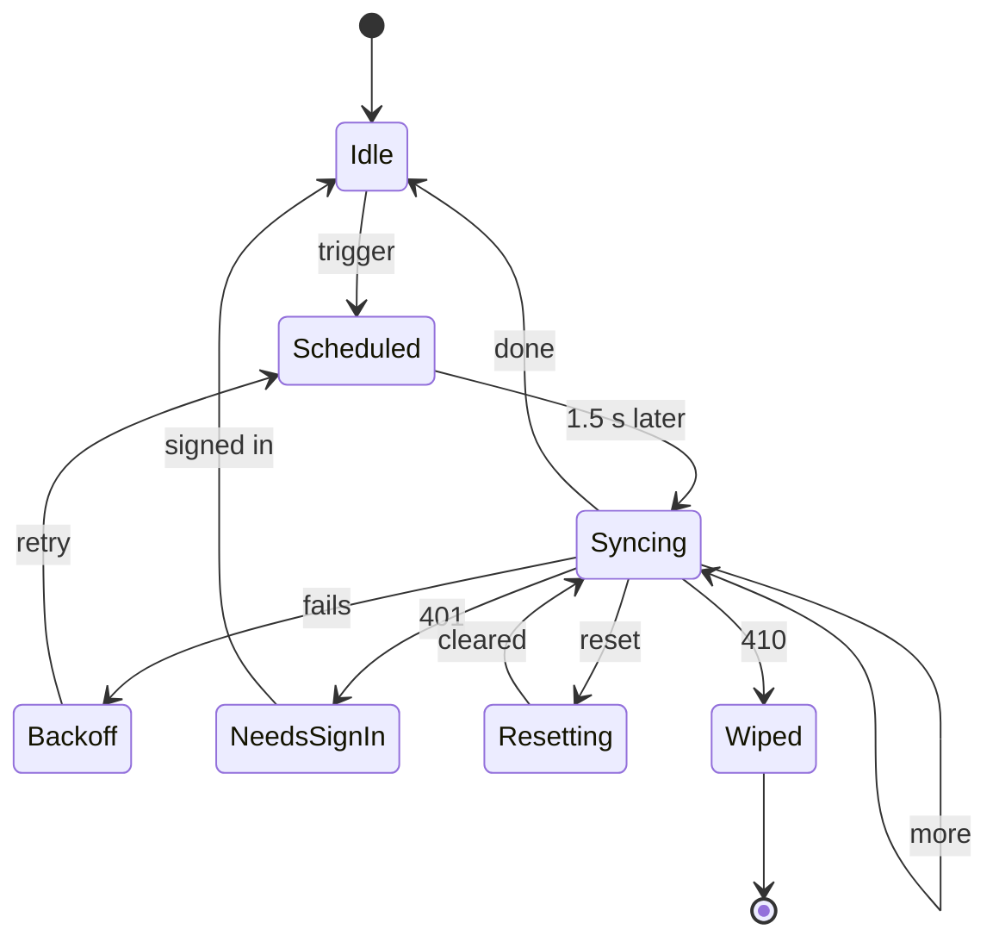

| From | When | To | What happens |
|---|---|---|---|
| Idle | a trigger: a change, the app back in front, or the connection back | Scheduled | Wait for things to settle |
| Scheduled | about 1.5 s pass | Syncing | Push the outbox and pull what's new |
| Syncing | the response says `more: true` | Syncing | Pull the next page |
| Syncing | the response is complete | Idle | Nothing left to do |
| Syncing | a network error or a `5xx` | Backoff | Wait 1 s, then 2 s, 4 s, and so on, up to 60 s |
| Backoff | the wait is over | Scheduled | Try again |
| Syncing | `401` | NeedsSignIn | Keep the outbox, and ask you to open your jar again |
| Syncing | `reset` | Resetting | Delete stars from before the empty, then sync again |
| Syncing | `410` | Wiped | Delete this device's copy of the jar |

- **When it runs:** on start, after each change, when the app comes back to the foreground, and when the connection returns.
  - After a change, it waits about 1.5 s for things to settle. That's a debounce: three quick folds cause one sync, not three.
  - There's no polling.
  - Background sync isn't available in every browser, so a star written offline goes up the next time the app is open with a connection.
- **One tab at a time:** a Web Lock (`navigator.locks.request("sync", …)`) makes one tab the syncer. A Web Lock is a browser feature that lets only one tab hold a named lock at a time. Other tabs see its results through live queries.
- **Retries:** network errors and `5xx` responses retry with backoff, from 1 s to 60 s. Backoff means waiting longer after each failure, so a struggling server isn't hammered.
  - An outbox entry leaves only when a response confirms it, never because a request failed.
  - TanStack DB's outbox, by contrast, drops a write on any `401` by default, which would lose stars written before sign-in.
- **A star that changes during a push** keeps its outbox entry. The client compares `updatedAt` before clearing it.
- **Pulls** come in pages of up to 500 rows, in `seq` order. `more: true` means call again.

**When two devices change the same star.** The latest change wins, judged by `updatedAt`:

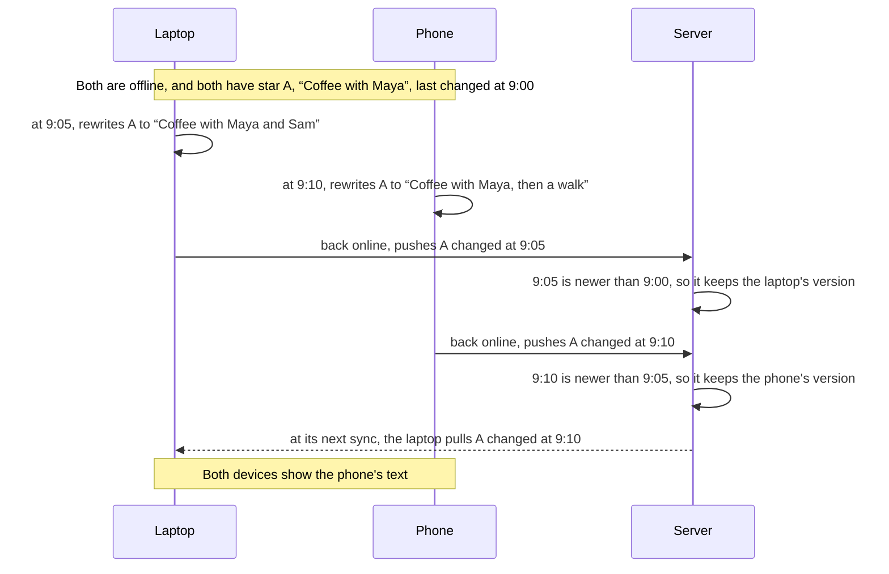

If the phone had pushed first, the server would reject the laptop's older version and send its own back in `current`, and the ending would be the same. The 9:05 edit is lost either way. That's rare with one person's devices, and it keeps the design simple.

**Clock skew.** `updatedAt` comes from device clocks, so a device whose clock runs slow can lose an edit to an older one. Across one person's devices that's rare, and `current` keeps every device in step.

**Emptying the jar.** Other devices might be offline when you empty the jar, so the server keeps a `generation` number that goes up with each empty:

```mermaid
sequenceDiagram
  participant P as Phone
  participant S as Server
  participant L as Laptop, offline
  P->>S: POST /api/jar/empty
  S->>S: delete every star, generation 0 becomes 1, note the time
  S-->>P: done
  P->>P: delete local stars, generation 1, cursor 0
  L->>L: still offline, folds a new star C
  L->>S: back online, sync with generation 0
  S-->>L: reset, generation 1, emptiedAt
  L->>L: delete stars changed before emptiedAt, keep C
  L->>S: sync again with generation 1, pushing C
```

The laptop keeps star C because it was written after the jar was emptied.

**The first sync** after keeping or opening a jar pushes every local star, then pulls. That's how a jar that was never kept merges into an account (3.6).

### 5.2 Free limits

On Workers Free, going past a limit never costs money. Instead, requests or queries fail until the limit resets, so the design has to stay well inside them. These limits are shared with the other Workers on the account.

| Limit (Free) | Allowance | Threefold's use |
|---|---|---|
| Requests | 100,000 a day, shared with the account's other Workers | About 20 to 40 per active person per day. Static files don't count, and after the first load the service worker serves the shell |
| CPU | 10 ms per request | A sync is JSON plus one D1 batch. Passkey verification is the heaviest, and the passkey spike measures it |
| Subrequests | 50 external, 1,000 to Cloudflare services | None external |
| D1 queries | 50 per request, per D1's limits page (the Workers page says 1,000, so plan for 50) | A 100-change sync runs about 15 statements, so it fits even if each statement in a batch counts |
| D1 bound parameters | 100 per statement | Upserts go 14 rows per statement |
| Rows read | 5 million a day, reset at 00:00 UTC | Pulls read only changed rows, through `(user_id, seq)`, and a test asserts it with `EXPLAIN QUERY PLAN` |
| Rows written | 100,000 a day, reset at 00:00 UTC | About one per star change, plus one counter row per sync |
| Storage | 500 MB per database, 5 GB in all | Ten years of one person's stars is a few megabytes |
| Time Travel (point-in-time restore) | 7 days | Export before any risky migration |
| Workers Logs | 200,000 events a day, kept 3 days | Error reports only |

A rough budget for one active person on one day:

- Opening the app five times makes no requests for the app itself, because the service worker serves the shell and files.
- Better Auth checks the session when the app comes to the front: about 5 to 10 requests.
- Syncs, one per opening and one per burst of folds: about 10 to 20.
- In all, about 20 to 40 requests. So 100,000 a day covers a few thousand active people, minus what the account's other Workers use.

Per-account caps stop one account, or one bug, from using up everyone's allowance. The starting values will be tuned in tests:

- 100 changes per sync request.
- 300 star changes per day, counted in `sync_state`.
- A burst limit on requests per minute, through Workers' rate-limiting binding (periods of 10 or 60 seconds, counted per location). Its docs don't say whether the Free plan includes it. If it doesn't, the daily count carries the cap alone.

### 5.3 Updates, and apps a version behind

The service worker keeps the app on the device, so after a deploy a phone can run the old version until its next launch. This is called version skew. The server has to keep working for the previous version.

```mermaid
sequenceDiagram
  participant P as Phone
  participant W as Worker
  Note over P: runs v1 from its cache
  Note over W: v2 deploys, and accepts protocols 1 and 2
  P->>W: sync with protocol 1
  W-->>P: 200, as before
  P->>W: fetch the new sw.js in the background
  Note over P: at its next launch, the phone runs v2
  Note over P,W: Another case. A phone that wasn't opened for weeks still runs v1 when v3 is out, and v3 accepts only protocols 2 and 3
  P->>W: sync with protocol 1
  W-->>P: 426
  P->>P: say a new version is ready, and switch to it when you tap
```

- Every sync request carries `protocol`. The server accepts the current and the previous protocol, and answers anything older with `426`.
- A plain reload doesn't switch versions, because the old service worker keeps control while any tab uses it. Tapping "reload" tells the waiting worker to take over (`skipWaiting()`), then reloads the page when it has.
- Database migrations stay backward compatible for one release, through "expand, then contract":
  - One release adds the new shape alongside the old.
  - A later release removes the old shape, once nothing uses it.
- Nothing the offline app calls uses server functions, because their URLs change with each build (2.4).

### 5.4 Keeping stars on the device

IndexedDB is the only copy of a jar that was never kept, and browsers can clear a site's storage. Four things protect it:

- **Persistent storage.** The app asks for it (`navigator.storage.persist()`) after the first star lands.
  - Browsers grant it by their own rules, for example when the app is on the Home Screen or used often.
  - Once granted, it protects the jar when the device runs short of space.
- **The Home Screen.** On the iPhone, a website's storage is cleared after seven days without a visit, even when persistent storage is granted. Apps on the Home Screen, and web apps in the Mac's Dock, are exempt.
- **"Keep this jar,"** offered after the first three stars (F-24).
- **"Save a copy,"** which works without an account (F-36).

Signing out and deleting wipe the device only after the server has everything, or after you confirm.

### 5.5 Rendering and motion

At 60 fps, the browser has 16.7 ms to draw each frame. If a frame takes longer, the animation stutters.

- **Only `transform` and `opacity` animate.** The browser can move and fade an element on the graphics chip without recalculating the page's layout, which keeps each frame cheap.
- **The traveling jar is one element on a retargetable spring,** and the pile's physics loop sleeps when everything is still.
- **The pile is SVG.** It uses `<use>`, which draws many copies of one star shape cheaply, and it never draws more than about 130 stars (F-10). The sand jar draws about 250 grains.
- **Screens are code-split by route.** Each screen's code downloads only when it's first needed, and the sand packing loads with Insights.
- **The three fonts** are variable (one file covers every weight), self-hosted, subset to Latin, and precached. Shantell Sans ships every axis, so check its weight in the first build.
- **Live queries read through the `day` index**, for a day, a week, or a month. Insights and Shake read everything, which is small.
- **The motion spike** measures fold and drop and the traveling jar on the iPhone before the jar is built (section 6).

### 5.6 Accessibility

- Everything you can press is at least 44 × 44 px, with the design system's focus ring and a real label.
- **Live regions.** Some changes are announced aloud to screen reader users.
  - A live region is a part of the page whose updates screen readers read out.
  - Each fold announces itself once, politely ("Two in the jar."). The live jar's count and the day's status are live regions too.
- Every gesture has a plain twin: a button for shake, and arrows and buttons for the shelf.
- **Reduced motion** comes from the device's setting, or from Calmer.
  - The story stays: the star lands, the lid pops, the count changes.
  - The travel goes, and nothing loops.
- Sound is optional and never the only signal.
- A category is always named in words, never shown by color alone.
- Storybook's accessibility checks fail on errors, and Playwright runs a second project with reduced motion.

### 5.7 Security and privacy

A Content-Security-Policy (CSP) is a response header that tells the browser what a page may load and run. If an attacker managed to inject a script, the browser would refuse to run it. Threefold's CSP applies from the first deploy:

| Directive | What it allows | Why |
|---|---|---|
| `default-src 'self'` | Anything the other directives don't name, such as fonts and media, only from our own site | Closes the gaps between the other directives |
| `script-src 'self'` plus hashes | Scripts from our own site, plus the shell's few inline scripts, each listed by the hash of its exact contents | An injected script can't run |
| `style-src 'self' 'unsafe-inline'` | Our styles, plus styles that libraries insert at runtime | Needed by the UI libraries |
| `connect-src 'self'` | Network requests only to our own server | Nothing can send data elsewhere |
| `img-src 'self' data:` | Images from our site, or inlined | No third-party images |
| `worker-src 'self'`, `manifest-src 'self'` | Our service worker and manifest | — |
| `form-action 'self'` | Forms submit only to our own site | No form can send data elsewhere |
| `object-src 'none'`, `base-uri 'none'`, `frame-ancestors 'none'` | No plugins, no base-URL tricks, and no embedding in other sites | Closes old attack routes |

There are no third-party origins anywhere.

How the hashes are made:

- **From the finished shell.** The router's state script changes with every build, and Start prerenders the shell after it builds the Worker. So a Vite plugin hashes the shell's inline scripts at the end of the build and writes the hashes into the built Worker.
- **As the browser reads them.** The HTML parser turns a NUL character into U+FFFD before the browser hashes a script, and the router's state script contains NULs. The plugin makes the same change before hashing.
- **On every path to the shell.** Cloudflare serves static files before the Worker runs, so the shell's own paths, `/_shell` and `/_shell.html`, are set to run the Worker first. Otherwise they'd come without the CSP.

Other headers:

| Header | What it does |
|---|---|
| HSTS (`Strict-Transport-Security`) | Tells browsers to only ever use HTTPS for this site, for a year: `max-age=31536000; includeSubDomains` |
| `X-Content-Type-Options: nosniff` | Stops the browser from guessing a file's type |
| `Referrer-Policy: no-referrer` | Doesn't tell other sites which page a visitor came from |
| `Permissions-Policy` | Allows only `publickey-credentials-create`, `publickey-credentials-get`, and, for shake, `accelerometer` and `gyroscope`. It turns off device features the app doesn't use, such as the camera, the microphone, and location |

The Worker sends these on everything it answers. Static files come straight from Cloudflare, without them.

And:

- **The server never reads text.** No route searches, filters, or logs star text, and request bodies stay out of logs. A test sends bodies to each kind of route and checks that none reach the logs.
- **Workers Logs keeps only what the Worker logs.** Invocation logs are off, because they'd record each request's details (N-5).
- **Schema allowlist:** a test fails if D1 gains a column that isn't on the list.
- **Honest wording:** a test fails if the copy says "not even us," "only you can open," or anything like them while `ENCRYPTED` is false. It runs until encryption ships.
- **Passkeys** are bound to the exact production hostname, and previews stay on their own hostnames.
- **Per-account caps** (5.2).

### 5.8 Dates and time zones

- A star's `day` is the local date when it was folded, and it's never recomputed.
  - Example: you fold a star at 11 PM on September 23 in New York, then fly to London, where it's already September 24. The star stays on September 23.
  - A flight across the date line can repeat or skip a category. Every star keeps its day.
- Weeks run Monday through Sunday, and months are calendar months, all in local time.
- Formatting always uses `Intl.DateTimeFormat("en-US", …)`, not the device's locale. That gives "Wed, Sep 23," "Sep 21–27" (with `formatRange`), and "9:30 PM."

### 5.9 Observability

Observability is being able to see what's going wrong in production.

- Client errors go through `/api/errors` (4.3), and server errors through Workers Logs. There are no analytics and no third parties.
- Logs are read by hand, with `wrangler tail` or in Cloudflare's dashboard.
- A monthly check of usage against the free limits is part of the pinned encryption issue (section 7).

### 5.10 Testing

Tests plug in at three seams. Each seam is the highest point that can see what it tests, and the PRD's Testing Decisions list the cases at each one.

| Seam | Tool | Runs in | Covers |
|---|---|---|---|
| The app, end to end: the main seam | Playwright, with a virtual authenticator (a fake passkey device for tests) | Chromium, plus WebKit for the journeys that need no passkey | Every user story's journey, against the production build with a local D1. See below |
| The jar's rules | Vitest | Node | The views in 4.4, built from stars and today's day key: the cycle and day keys, rounds, Today's status, the week tally, month stats, the pile, insights, the year card, the shake pick, the keep offer, and the saved copy's text |
| The server's API | `@cloudflare/vitest-plugin`, the renamed `@cloudflare/vitest-pool-workers` | The Workers runtime, with a local D1, against the built Worker | `/api/sync` (the merge, `seq`, pages, `reset`, and caps), `/api/jar/empty`, `/api/errors`, the shell's headers, `EXPLAIN QUERY PLAN` checks, and the schema allowlist |

The server's tests run against the Worker as `vite build` makes it, because Start's server code only exists after the build, and that's also what ships. So `pnpm test` builds first.

They sign in through a test-only Better Auth: the Worker's own options plus Better Auth's `testUtils` plugin, on the same D1 and secret. The Worker accepts the session it makes, so no test-only route ships. The end-to-end tests make real passkeys in Chromium's virtual authenticator, and copy them to a second browser context to open the jar on another device.

What the end-to-end tests can control:

- **Time:** Playwright's clock moves the date, and each browser context sets its own time zone.
- **The network:** requests can go offline, or get faked server errors.
- **Devices:** two browser contexts act as two devices.
- **Motion:** a second project repeats everything with reduced motion.

They also check that error reports reach `/api/errors` scrubbed.

Alongside the three seams:

- **Components:** Storybook's Vitest addon renders every story in Chromium, and accessibility errors fail (2.9).
- **The honest-wording guardrail** runs with the jar's rules, in Node.

There's no separate browser tier for Dexie and the sync engine, because the end-to-end tests cover them. As a result, sync's push and pull are automated in Chromium only, and the iPhone checks them by hand.

## 6. Open technical questions

> **In short:** a few things can only be settled by trying them on real devices. Each gets a spike, a short experiment that's often thrown away, before the feature that depends on it is built.

1. **Passkeys** (before accounts). *Why it matters:* sign-in is the front door, and phones and password managers differ.
   - Register and sign in through Better Auth on the production hostname, on the iPhone and the MacBook.
   - Note which platforms report PRF.
   - Check sign-in's CPU time against 10 ms.
   - Check whether asking for `attestation: "indirect"` gets Apple devices to reveal the passkey's provider (AAGUID) without an extra prompt. If it doesn't, those passkeys show only a device label.
2. **Motion** (before the jar). *Why it matters:* the fold and the traveling jar are the heart of the app, and they have to be smooth on a real phone.
   - Fold and drop and the traveling jar run at 60 fps on the iPhone, measured in the phone's own performance timeline through remote inspection from the Mac.
   - So do the reduced-motion versions.
3. **Sound and shake** (before building them). *Why it matters:* phones restrict sound and motion sensors until you interact. On the iPhone, check that:
   - the `AudioContext` resumes after a tap
   - `DeviceMotionEvent.requestPermission()` is granted
   - `navigator.audioSession.type = "ambient"` respects the silent switch
4. **The shell with the Cloudflare plugin** (before the service worker). *Why it matters:* the offline app depends on a clean shell.
   - TanStack/router#7740 has been open since July 3 with no maintainer reply. With `@cloudflare/vite-plugin`, `_shell.html` includes the `/` route's content and loader data, so it isn't a neutral fallback page.
   - Check what that does to other routes' first paint, to the CSP hashes, and to the service worker's fallback.
   - A commenter's workaround defines `TSS_PRERENDERING` and `TSS_SHELL`. It's untested, and `TSS_SHELL` may turn every render in the deployed Worker into a shell.
   - Today reads only from IndexedDB, so the prerendered `/` should be close to empty. It could also be emptied on purpose.
   - **Answered on 2026-09-27, in the shell spike, run early with the Cloudflare config:**
     - **The cause:** Start honors the prerender's shell header only when `process.env.TSS_PRERENDERING` is `"true"`, and inside the Workers runtime `process.env` holds the Worker's bindings, not the build's environment. So the shell held `/`'s content, and the Worker server-rendered every route that exists.
     - **The fix:** the build defines `process.env.TSS_SHELL` as `"true"`, as Start already does in dev with SPA mode on. Every server render is a shell, and `_shell.html` holds only the root route.
     - **Serving it:** `src/server.ts` answers every page request with `_shell.html`, byte for byte, through the assets binding (2.2). `/api/*` and `/_serverFn/*` go to Start, and so do pages while the file doesn't exist yet, in dev and during the prerender. An unknown path gets the shell too, and the client router shows its not-found page.
     - **What it settles:** the CSP hashes come from `dist/client/_shell.html` at build time, and the headers go on the Worker's responses (5.7). No page is server-rendered, so page loads cost no rendering CPU.
     - **For the service worker:** Cloudflare redirects a direct request for `/_shell.html` to `/_shell`, so it precaches `/` instead (2.6).
5. **Storybook's own build** (at setup). *Why it matters:* the Storybook is the design system's documentation, and it has to build without the app's plugins.
   - Check that `build-storybook` works with a Vite config of its own (`viteConfigPath`) that loads only React and Tailwind v4.
   - Check that Storybook's Vitest addon runs the stories as tests, and that accessibility errors fail them.
   - The draft setup pinned TanStack Router for `@storybook/tanstack-react` (storybookjs/storybook#36330). That pin no longer applies, because the stories don't use TanStack Router (2.9).
   - **Answered at setup, on 2026-09-27: yes to both.**
     - `build-storybook` loads only `.storybook/vite.config.ts`, never the app's `vite.config.ts`, and `viteConfigPath` resolves from the project root.
     - The Vitest addon runs every story as a test in Chromium, and an accessibility violation fails its story.
     - The addon supports Vitest 3 and 4 only, so the app stays on Vitest 4 until it supports 5.
6. **Persistent storage** (with the service worker). *Why it matters:* a jar that was never kept has no other copy. Check whether `persist()` is granted on both test devices, in the browser and from the Home Screen.
7. **Sync against D1's limits** (before sync). *Why it matters:* a sync that goes over a limit fails.
   - Confirm how batch statements count toward the 50-query limit, and size the push to fit. D1's docs don't say.
   - Confirm whether the rate-limiting binding works on Workers Free.

## 7. Deferred: end-to-end encryption

> **In short:**
>
> - **What it means:** with end-to-end encryption, your stars are encrypted on your device before they're sent. The server stores only scrambled text it can't read, and only your passkeys can unlock it.
> - **Status:** it isn't in v1, so this section records why it waits, what v1 does to make it easy later, and the design to pick up.

### Why it waits, and what keeps it from being forgotten

Sign-ups are open in v1 without encryption, so stars sit on the server as plain text. That's acceptable only while you're the only person with an account. Three things keep it visible:

- The PRD's Deferred entry names the trigger: before Threefold is shared anywhere, or when a second account appears, whichever comes first.
- A pinned GitHub issue, filed when the repo is created, carries the same trigger. It also carries a monthly check of Workers and D1 usage against the free limits.
- The honest-wording test (5.7) blocks the strong privacy claims until `ENCRYPTED` is true.

### What v1 does to keep the door open

- The server never reads text, so encryption only changes what's stored.
- Sync treats `text` as opaque. Ciphertext (the encrypted form) is longer than 120 characters, though, so the server's length check has to allow for it.
- Passkeys are created with `prf: {}`, because some authenticators turn PRF on only when it's requested at creation.
- **Migration:** every star synced before encryption sits on the server in plain text.
  - Turning encryption on means each device re-encrypts and re-uploads what it holds.
  - D1's Time Travel keeps the old plain text for another 7 days after that.

### The design to pick up

How the keys fit together:

```mermaid
flowchart TD
  PK["Your passkey"] -->|"PRF, with a fixed salt"| Secret["A secret only this passkey can produce"]
  Secret -->|"HKDF"| Pair["A key pair for this passkey<br/>X25519"]
  DK["The data key<br/>one random AES-256 key"] -->|"HPKE, to the passkey's public key"| Wrapped["A wrapped copy of the data key<br/>stored on the server, one per passkey"]
  Pair -.->|"its private key unwraps it"| Wrapped
  DK -->|"AES-256-GCM"| Cipher["Each star's text, encrypted<br/>stored on the server"]
```

- **Encryption:** each star is encrypted with AES-256-GCM, under one random data key.
- **Wrapping the data key:** each passkey gets its own copy of the data key, encrypted so only that passkey can open it.
  - The passkey's PRF output goes through HKDF, a function that turns a secret into keys, to an X25519 key pair.
  - The data key is HPKE-encrypted to that public key. That way a new data key can be wrapped even for passkeys that live only on other devices.
  - HPKE runs on WebCrypto, the browser's built-in crypto API, where the browser supports X25519. Otherwise it runs on a small audited library.
- **PRF through Better Auth:**
  - Pass `extensions: { prf: { eval: { first: salt } } }` and `returnWebAuthnResponse: true` to `addPasskey` and `signIn.passkey`.
  - The 1.7.6 client strips the results before posting to the server.
  - Add a test that no request body contains PRF output. `PublicKeyCredential.toJSON()` includes it, and the WebAuthn spec warns against sending it.
- **Browsers:** PRF raises the floor to iCloud Keychain on iOS 18.4+ and macOS 15+, Google Password Manager, 1Password, and Windows Hello since its February 2026 update.
  - An authenticator without PRF needs the recovery key once on that device, then a device key there that can't be exported.
  - Test with one password manager that doesn't return PRF.
- **One Face ID or two:** a platform that reports PRF at registration but returns no output needs a second prompt to keep the jar. The passkey spike records which platforms do this.
- **The privacy lock as real encryption:**
  - With the lock on, the device doesn't keep the data key.
  - Unlocking calls `navigator.credentials.get` with a random local challenge. PRF output doesn't depend on the challenge, so the lock works offline.
- **The spare-key card (the recovery key):**
  - It's generated and printed on the device.
  - Signing in with it goes through a small Better Auth plugin, which checks the card's sign-in key against a stored hash.
  - Scanning the card on iPhone needs a WASM QR decoder, so the CSP needs `'wasm-unsafe-eval'` and the Permissions-Policy needs the camera.
  - The printable card needs `img-src blob:`.
- **A threat-model ADR:**
  - List what the server still sees: ciphertext, wrapped keys, passkey public keys, the card's sign-in hash, each star's day and category, the lock flag, and Better Auth's tables.
  - Say what no web encryption can stop: whoever controls the server ships the JavaScript.
- **Tests:**
  - known-answer vectors from RFC 5869 (HKDF), RFC 3394 (AES-KW), and RFC 9180 (HPKE), in Node and both browsers
  - `hasPrf: true` on the virtual authenticator
- **Spikes:**
  - a PRF round trip and an HPKE wrap on each device on the floor
  - a card scan on the iPhone, with the CSP enforced
- **Terms** to add to the PRD's terminology: spare-key card, data key, and wrapped key.

## 8. Deferred: the daily nudge

> **In short:** a once-a-day notification that reminds you to write. It needs push notifications, which v1 leaves out, so this section records what it will add.

The draft specifies one push a day, at a time you choose. It:

- skips days you've already folded
- has special days: the jar's birthday, a new month, the first evening, back after quiet days, Sunday, and partly folded
- rests after seven quiet days
- asks "Wrong time for a nudge?" when nudges keep going unanswered

How a nudge would reach you:

```mermaid
sequenceDiagram
  participant C as Cron, say every 15 minutes
  participant W as Worker
  participant PS as Push service, run by Apple or Google
  participant SW as Service worker on your phone
  actor You
  C->>W: a scheduled run
  W->>W: find nudges due now, and apply the special-day rules
  W->>PS: send an encrypted push, signed with the VAPID key
  PS->>SW: deliver it
  SW->>You: show the notification
  You->>SW: tap it
  SW->>SW: open Today
```

It adds these to this design:

- `push` and `notificationclick` handlers in the service worker. On iPhone, push reaches only apps on the Home Screen, which v1's manifest already allows.
- A VAPID key pair, stored like `BETTER_AUTH_SECRET`. VAPID keys prove to the push service that the push came from our server.
- A Web Push library that runs on Workers, chosen in an ADR after the push spike. The common `web-push` package is written for Node.
- A `push_subscription` table, plus the nudge time and time zone on the server. That's new data the server holds, so it goes through the schema allowlist.
- A scheduled handler, on a cron, that finds due nudges through an index on the next nudge time. The rules for special days are pure functions, tested in Node.
- **Free limits:** a cron run gets 10 ms of CPU and 50 subrequests, and each push costs a subrequest plus encryption work. If the busiest minute's nudges don't fit, fan them out through a Queue, which is free up to 10,000 operations a day.
- **With the privacy lock on**, nudges stop naming the category.

## 9. Decisions

> **In short:** the big decisions each get an ADR (architecture decision record): a short doc that records one decision, its context, and its trade-offs, so nobody has to rediscover why. Smaller ones are recorded in this doc.

The ADRs, in `docs/adr/`:

| ADR | Decision |
|---|---|
| 0001 | Auth: Better Auth with passkeys, and passkey-only sign-up |
| 0002 | Host and database: Cloudflare Workers Free with D1, and the free limits |
| 0003 | Client data and sync: Dexie, with our own latest-change-wins sync |
| 0004 | UI primitives: shadcn/ui on Base UI |

These are recorded here rather than in ADRs:

- SPA mode (2.2)
- the design system in the app, behind a lint-enforced boundary, documented in its own Storybook (2.3, 2.9)
- our own service worker (2.6)
- stable API routes instead of server functions (2.4)
- no TanStack Query (2.3)
- `/api/errors` (4.3)
- US formats with Monday weeks (5.8)
- the cycle's start date (3.3)
- the full-jar rule (3.3)

Terminology is the PRD's to settle. It has one overload to resolve: "kept" currently means three things:

- a finished day ("Wednesday's folded and kept")
- a finished category in the review (the stamp)
- a jar with a passkey ("Keep this jar")

Section 10 covers how a decision gets changed.

## 10. Changing this design

> **In short:** this doc is the design of record. It describes the system as it's built, or as it's about to be. When the code needs to differ, the doc changes too, through pull requests, just like code. The size of the change decides the path.

**The rule:** a pull request that makes this doc untrue updates it in the same PR. Nobody, human or agent, builds around a design they know is wrong. Either fix the design, or file it as an issue.

Which path to take:

```mermaid
flowchart TD
  Start["Part of the design is wrong,<br/>missing, or should change"] --> Q1{"Reverses a<br/>decision?"}
  Q1 -->|"yes: an ADR,<br/>or section 9"| ADR["A docs-first PR<br/>with a new ADR"]
  Q1 -->|no| Q2{"Changes a<br/>requirement?"}
  Q2 -->|"yes: an F-x<br/>or an N-x"| Req["Retire the old ID,<br/>add a new one"]
  Q2 -->|no| Q3{"Fixing it<br/>in this PR?"}
  Q3 -->|yes| Same["Update this doc<br/>in the same PR"]
  Q3 -->|no| Issue["File an issue<br/>labeled needs-triage"]
```

| What you found | Example | What to do |
|---|---|---|
| A wrong detail, or a small adjustment that doesn't reverse a decision | Pull pages of 200 instead of 500, a new index, a new status code | Update this doc in the same PR as the code, and say what changed and why in the PR description. |
| A decision that turns out wrong | Anything with an ADR or listed in section 9: Dexie, the sync model, SPA mode | Docs first. Open a docs-only PR with a new ADR that supersedes the old one, plus this doc's edits. Merge it, then build. |
| A requirement that should change | Insights' tiles (F-21) | Never renumber. Retire the ID with a dated note naming its replacement, add new IDs at the end, and update the PRD's citations in the same PR. |
| A problem you won't fix right now | A design flaw you spot while building something else | File an issue labeled `needs-triage`, and keep it out of the current PR. If it needs an experiment, add it to section 6. |
| A confusing term | "kept" | Settle it with `/domain-modeling`, which updates `CONTEXT.md`. That file is a glossary only. |

**Mid-feature:** if the flaw blocks what you're building, stop and take the matching path before going on. A small fix goes in the same PR, and a reversed decision gets a docs-first PR. If it doesn't block you, file the issue and carry on.

How changes are recorded:

- **ADRs are never rewritten.** A new ADR supersedes an old one, and the old one keeps its text. Only its status line changes, to "superseded by ADR-000N", so the history of why stays readable.
- **A retired requirement keeps its ID**, crossed out in place with the date, the reason, and its replacement. Nothing else ever reuses that ID.
- **Every PR has a "Design impact" line** in its description, filled in from the PR template: none, this doc updated (which sections), a new ADR, or an issue filed.
- **Agents follow the same rule.** `AGENTS.md` points them here. A change that contradicts this doc says so in its PR ("Contradicts ADR-0003 because…"), and reversing a decision waits for your approval.
- **Commits:** a docs-only design PR uses `docs(design): …`. A code PR keeps its own type and describes the design change in its body.
- **The revision history below** lists design changes, not typo fixes, so a newcomer can see how the design evolved without digging through git.

### Revision history

| Date | Sections | Change | Link |
|---|---|---|---|
| 2026-09-26 | all | First version | — |
| 2026-09-27 | 1.2 (F-2), 4.4, 5.10 | The empty-line animation is a wiggle, so "nudge" means only the deferred notification. The domain's seam is one view per screen. Testing uses three seams: end to end, the jar's rules, and the server's API | — |
| 2026-09-27 | 6 (question 5) | The Storybook spike ran at setup: Storybook builds on a Vite config of its own, and its Vitest addon runs the stories as tests that accessibility errors fail. Vitest stays on 4 until the addon supports 5 | — |
| 2026-09-27 | 2.2, 2.6, 6 (question 4) | The shell spike ran with the Cloudflare config: the build defines `TSS_SHELL`, so the shell holds only the root route, and the Worker answers every page with it, byte for byte. The service worker precaches it from `/` | — |
| 2026-09-27 | 4.3, 5.7 | The security baseline: the CSP adds `default-src` and `form-action`, the build hashes the shell's scripts the way the browser reads them, and the shell's own paths run the Worker first. `/api/errors` turns away anything but an exact report, without logging it. Workers Logs keeps no invocation logs | — |
| 2026-09-27 | 2.2 | The app's content renders only once the shell has hydrated, which avoids React error #418 wherever a route's code is already loaded (TanStack/router#8473) | — |
| 2026-09-27 | 2.5, 2.7, 3.5, 4.1, 5.10 | Better Auth is set up. Previews take their RP ID from the hostname they're served on, checked against a pattern in their config, because Cloudflare doesn't tell a preview its URL. The server asks every new passkey for PRF. `pnpm auth:migration` writes Better Auth's tables as D1 migrations | — |
| 2026-09-27 | 2.7, 2.9 | The deploy pipeline: Workers Builds applies the migrations, then deploys or previews the app, with a build token that can edit D1. The Storybook deploys from `wrangler.storybook.jsonc` through a connection of its own, because Workers Builds deploys every `wrangler deploy` in a build to the connected Worker | — |
| 2026-09-28 | 2.6 | The offline shell: a build plugin compiles `src/sw.ts` to `/sw.js`, with the precache list and a version hashed from every saved file, and leaves out the fonts for other scripts. The app registers it in the build only, and the Worker and the service worker share the rule for the server's own paths. The manifest is `/manifest.webmanifest`, with placeholder icons, and the theme script sets the bars' color for Day or Night | — |

## Appendix A. Glossary

| Term | Meaning |
|---|---|
| AAGUID | An id that says which kind of authenticator or password manager made a passkey. Some devices send zeros instead |
| ADR | Architecture decision record: a short doc recording one decision and its trade-offs. In `docs/adr/` |
| Backoff | Waiting longer after each failed retry (1 s, 2 s, 4 s, …), so a struggling server isn't hammered |
| Batch (D1) | Several SQL statements sent together and run as one transaction |
| Better Auth | The sign-in library that runs inside the Worker. It handles passkeys and sessions |
| Bound parameter | A value passed separately from a SQL statement (the `?` in `where id = ?`), so data is never read as SQL. D1 allows 100 per statement |
| Cache-first | Answering a request from the cache when possible, and using the network only if the cache doesn't have it |
| Content-Security-Policy (CSP) | A response header that tells the browser what a page may load and run, so injected code can't run |
| Cursor | The highest `seq` a device has pulled. Its next pull asks for everything after it |
| D1 | Cloudflare's database, built on SQLite |
| Debounce | Waiting until changes stop for a moment before acting, so a burst of edits causes one sync |
| Derived data | Values computed from stored data when needed, like today's category, and never stored themselves |
| Design of record | The docs that say how the system is built: this doc, the ADRs, the PRD, and the design system's Storybook, plus the draft spec while it lasts. Code and these docs are kept in agreement (section 10) |
| Dexie | A small library that makes IndexedDB easy to use, with live queries |
| Domain logic | The app's own rules (the cycle, rounds, tallies), kept apart from the UI, storage, and network |
| Generation | A counter the server bumps when the jar is emptied, so devices can tell which stars are from before the empty |
| HSTS | A header that tells browsers to only ever use HTTPS for this site |
| Idempotent | Safe to do twice: doing it again changes nothing. Pushing the same star twice is idempotent |
| IndexedDB | The database built into every browser, private to each website |
| Latest change wins | When a star was changed in two places, the version with the later `updatedAt` is kept. Also called last write wins |
| Live query | A database read that re-runs, and re-renders its component, whenever the data it read changes |
| Local-first | An approach where the app reads and writes a copy of the data on the device, and syncs with a server in the background |
| Migration | A versioned script that changes a database's structure, such as adding a table or column |
| Outbox | The device's list of stars with changes the server hasn't confirmed yet |
| Passkey | A sign-in credential made of a key pair. The private key stays with your device or password manager, and the server stores only the public key |
| Password manager | Where passkeys live, such as iCloud Keychain, Google Password Manager, or 1Password |
| Precache | Files a service worker saves ahead of time, so the app can load without a network |
| PRF | A WebAuthn extension that lets a passkey produce a secret for encryption. Asked for now, used later (section 7) |
| Pure function | A function whose result depends only on its inputs and that changes nothing else, so it's easy to test |
| RADIO | This doc's format: Requirements, Architecture, Data model, Interface, Optimizations |
| RP ID | Relying party ID: the domain a passkey belongs to. The browser only offers a passkey on that domain |
| Seq | A number the server stamps on each change, counting up per account, so devices can ask for "everything after n" |
| Service worker | A script the browser keeps running for a site. It can answer the site's requests from a cache |
| Session | The server's record that you're signed in, tied to a cookie in your browser |
| Shell | The small HTML page a single-page app loads first. The JavaScript then draws each screen |
| SPA | Single-page app: an app that loads one page, then draws every screen with JavaScript |
| Spike | A short experiment, often thrown away, that answers one technical question before real work starts |
| SSR | Server rendering: the server builds each page's HTML before sending it |
| Story | One example of a component in one state, written as code in a `*.stories.tsx` file next to the component |
| Storybook | A small app that shows each component on its own, in every state, with its docs. Threefold's is the design system's documentation (2.9) |
| Supersede | To replace an earlier decision with a new one. The old ADR stays, marked "superseded by ADR-000N" |
| Tombstone | A record that says a star was taken out, kept so offline devices learn about the delete |
| Transaction | A group of database writes that either all happen or none do |
| Upsert | Inserting a row, or updating it if a row with the same key already exists |
| Version skew | When the app on a device is a version behind the server |
| Web Lock | A browser feature that lets only one tab hold a named lock, so only one tab syncs at a time |
| WebAuthn | The browser API behind passkeys: `navigator.credentials.create` and `navigator.credentials.get` |
| Worker | Our server code. Cloudflare runs it on demand for each request |
| Worker Preview | A temporary copy of the app, with its own URL and database, built from a branch |
| Workers Builds | Cloudflare's service that builds and deploys the Worker from the GitHub repo |

## Appendix B. Further reading

Official docs for the pieces in this design:

- GreatFrontEnd, [the RADIO framework](https://www.greatfrontend.com/front-end-system-design-playbook/framework)
- TanStack Start, [SPA mode](https://tanstack.com/start/latest/docs/framework/react/guide/spa-mode)
- TanStack Router, [data loading](https://tanstack.com/router/latest/docs/framework/react/guide/data-loading)
- Dexie, [`useLiveQuery()`](https://dexie.org/docs/dexie-react-hooks/useLiveQuery())
- Storybook, [docs](https://storybook.js.org/docs) and [the Vite builder](https://storybook.js.org/docs/builders/vite)
- Better Auth, [the passkey plugin](https://www.better-auth.com/docs/plugins/passkey) and [the client](https://www.better-auth.com/docs/concepts/client)
- Cloudflare, [Workers limits](https://developers.cloudflare.com/workers/platform/limits/), [D1](https://developers.cloudflare.com/d1/), and [D1 limits](https://developers.cloudflare.com/d1/platform/limits/)
- MDN:
  - [Service Worker API](https://developer.mozilla.org/en-US/docs/Web/API/Service_Worker_API)
  - [IndexedDB API](https://developer.mozilla.org/en-US/docs/Web/API/IndexedDB_API)
  - [Web Authentication API](https://developer.mozilla.org/en-US/docs/Web/API/Web_Authentication_API)
  - [Content-Security-Policy](https://developer.mozilla.org/en-US/docs/Web/HTTP/Headers/Content-Security-Policy)
- [passkeys.dev](https://passkeys.dev/), a developer guide to passkeys
