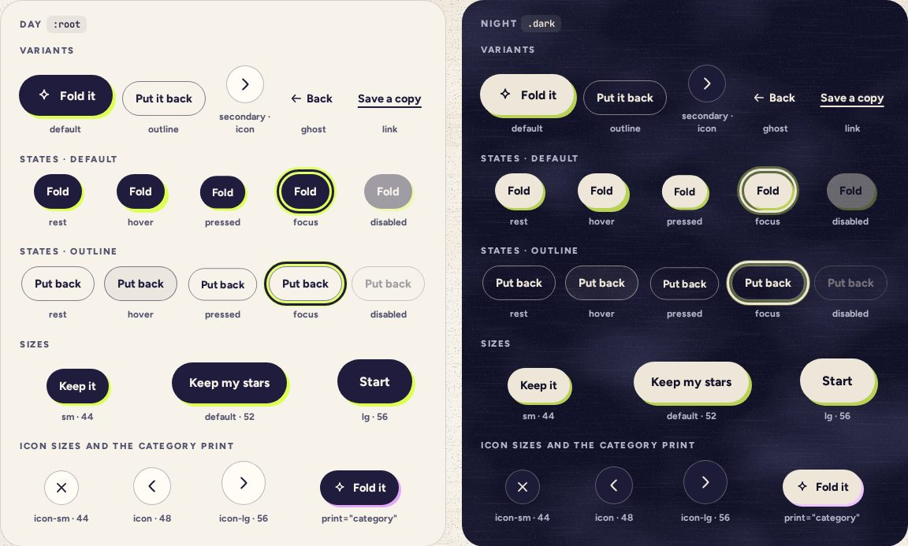

# Button

> 05 · Actions · shadcn/ui · Button · `src/components/ui/button.tsx`

Install the primitive: `pnpm dlx shadcn@latest add button`

The ink pill. One `default` per screen carries the printed highlighter shadow and squishes when pressed; its partners are `outline`, round `secondary` chips, the header’s `ghost` Back and plain underlined `link`s. Keeps shadcn’s variant names, so AlertDialog, Carousel and Calendar, which use `Button` or call `buttonVariants()` themselves, come out in Threefold’s look.

**Used on:** Today, Review, Shake, Shelf, Settings, Hello

**Built from:** `@base-ui/react (Button)`, `class-variance-authority`, `tailwind-merge · cn()`, `@/components/threefold/icon`

## States (Day and Night)



## API

### `<Button>`

| Prop | Type | Default | Notes |
|---|---|---|---|
| `variant` | `"default" \| "outline" \| "secondary" \| "ghost" \| "link" \| "destructive"` | `"default"` | `default` is the one main action on a screen (Fold it, Shake the jar, Pour it out). `outline` is its partner (Put it back, Fold it back). `secondary` is the round card chip for arrows and tools, `ghost` the header’s Back, `link` the quiet ones (Save a copy first). `destructive` draws as a solid-ink outline: taking things out never turns red. |
| `size` | `"sm" \| "default" \| "lg" \| "icon" \| "icon-sm" \| "icon-lg"` | `"default"` | Heights 44, 52 and 56 px; icons 48, 44 and 56 px square. Nothing tappable is under 44 px, `link` included. |
| `print` | `"highlight" \| "category"` | `"highlight"` | The offset shadow on `default`. `category` takes the nearest `data-cat` ink. |
| `render` | `React.ReactElement \| ((props, state) => React.ReactElement)` |  | Base UI’s replacement for `asChild`: draws that element with the button’s classes and behavior. Never a link, which would get `role="button"`: a link wears `buttonVariants()` instead (see Usage). |
| `nativeButton` | `boolean` | `true` | `false` when `render` draws something other than a `<button>`. |
| `disabled` | `boolean` | `false` | 40% and inert. Add `focusableWhenDisabled` when it should stay focusable, like the star arrows at either end: Base UI then sets `aria-disabled` in place of `disabled`. |
| `…props` | `ButtonPrimitive.Props` |  | Everything Base UI’s Button takes, which is everything a button takes; `data-slot="button"` is set for you. |

## Usage

`src/screens/today/fold-actions.tsx · src/components/threefold/day-status.tsx`

```tsx
// src/screens/today/fold-actions.tsx
import { Button } from "@/components/ui/button"
import { Icon } from "@/components/threefold/icon"

<Button onClick={fold}>
  <Icon name="sparkle" /> Fold it
</Button>

<Button variant="outline" size="sm" onClick={putBack}>
  Put it back
</Button>

<Button variant="secondary" size="icon" aria-label="Next month">
  <Icon name="right" />
</Button>

// src/components/threefold/day-status.tsx: a link that looks like a button wears buttonVariants() itself, through useRender.
// Rendered through Button, it would get role="button" and be announced as a button.
import { useRender } from "@base-ui/react/use-render"
import { buttonVariants } from "@/components/ui/button"

const review = useRender({
  render: reviewLink,   // the screen's <Link to="/review" />, passed in as a prop
  props: { className: buttonVariants({ variant: "link", size: "sm" }), children: "Full review, 14 of 24" },
})
```

## Implementation

Only the variants change, and the body passes the new `print` to `buttonVariants()` with `variant` and `size`. The rest stays as `shadcn add` wrote it: Base UI’s Button, its `render` prop, and `data-slot`.

A sketch, correct in intent but not compiled: check it against the current library APIs.

`src/components/ui/button.tsx`

```tsx
// src/components/ui/button.tsx: keep the generated Button, swap buttonVariants
const buttonVariants = cva(
  "squish inline-flex shrink-0 items-center justify-center gap-2.5 rounded-full font-[750] whitespace-nowrap select-none disabled:pointer-events-none disabled:opacity-40 aria-disabled:opacity-40 [&_svg]:pointer-events-none [&_svg]:shrink-0 [&_svg:not([class*='size-'])]:size-5",
  {
    variants: {
      variant: {
        default: "bg-primary text-primary-foreground shadow-print pointer-fine:hover:shadow-print-lg focus-visible:shadow-print-focus",
        outline: "border-[1.6px] border-ink/55 text-ink hover:bg-ink/5",
        secondary: "border-[1.5px] border-ink/30 bg-card text-ink hover:bg-paper-2",
        ghost: "text-ink hover:bg-ink/6",
        link: "text-ink underline decoration-[1.5px] underline-offset-[5px] hover:decoration-[2.5px]",
        destructive: "border-[1.6px] border-ink text-ink hover:bg-ink/5",
      },
      size: {
        default: "h-13 px-[22px] text-[15.5px]",
        sm: "h-11 gap-2 px-4 text-[14.5px] [&_svg:not([class*='size-'])]:size-[18px]",
        lg: "h-14 px-7 text-base",
        icon: "size-12 [&_svg:not([class*='size-'])]:size-6",
        "icon-sm": "size-11",
        "icon-lg": "size-14 [&_svg:not([class*='size-'])]:size-6",
      },
      print: { highlight: "", category: "" },
    },
    compoundVariants: [
      { variant: "link", class: "h-11 px-1" },
      { variant: "default", print: "category", class: "shadow-print-cat" },
      { variant: "default", size: "sm", class: "shadow-print-sm" },
    ],
    defaultVariants: { variant: "default", size: "default", print: "highlight" },
  }
)
// and in the body: buttonVariants({ variant, size, print, className })
```

## Classes and tokens

| Part | Classes |
|---|---|
| Default | `bg-primary text-primary-foreground shadow-print` |
| Outline | `border-[1.6px] border-ink/55 text-ink` |
| Secondary | `bg-card border-[1.5px] border-ink/30` |
| Link | `underline decoration-[1.5px] underline-offset-[5px]` |
| Press | `squish  →  scale(.94) translateY(1px), back on --ease-spring-snappy` |
| Focus | `outline-3 outline-ring outline-offset-3 + shadow-print-focus (print + 9px halo)` |

## Accessibility

- A real `<button>`, or a real link wearing `buttonVariants()`. Never a div with a click handler.
- Icon-only buttons need `aria-label`: Next month, Close, Previous star.
- 44 px minimum for every size, the underlined `link` too.
- Contrast: ink on paper 14.7:1, moon on night 15.1:1; the label never sits on the print.

## Motion

- Press: `squish`, scale .94 and 1 px down in 90 ms; release springs back on spring.snappy (k 700, c 40, 280 ms).
- Hover, pointer: fine only: the print grows from 4 to 5 px; outline and ghost take a 5% ink wash.
- Reduced motion: no scale; the press darkens the fill for 90 ms instead (Motion spec I).

## Sound

- Silent by itself: the action plays its own sound through `useSound()`.
- Fold it: crinkle, then a glass tick on landing. Shake the jar: a rattle. Pour it out: cascading ticks.
- Never a click sound on navigation.
