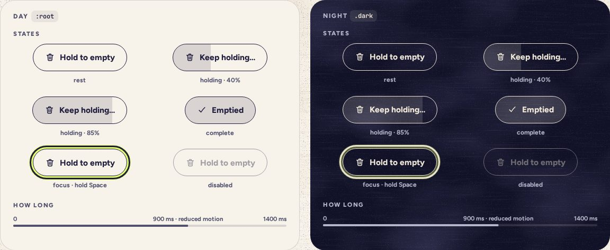

# HoldButton

> 07 · Actions · Threefold · custom, on Button · `src/components/threefold/hold-button.tsx`

For the two things in Threefold that can’t be undone and take every star with them: emptying the whole jar, and deleting everything. A plain outline button that only acts when held. Ink fills it from the left for 1.4 seconds; let go early and the fill runs back. It always sits beside a safe default that has the focus.

**Used on:** Settings · Empty the jar, Delete everything

**Built from:** `Button`, `motion/react (useReducedMotion)`, `pointer capture`

## States (Day and Night)



## API

### `<HoldButton>`

| Prop | Type | Default | Notes |
|---|---|---|---|
| `onComplete` | `() => void` |  | Fires once, when the hold reaches the end. Not on release. |
| `duration` | `number` | `1400` | Milliseconds. Reduced motion shortens it to 900: less waiting, same deliberate act. |
| `holdingLabel` | `ReactNode` | `"Keep holding…"` | Replaces the label while held, so the change is heard as well as seen. |
| `children` | `ReactNode` |  | The resting label: icon plus “Hold to empty” or “Hold to delete everything”. |
| `…props` | `ButtonProps` |  | Everything but `onClick`. `variant` stays `outline`: holding is never the primary action. |

## Usage

`src/screens/settings/empty-jar-dialog.tsx`

```tsx
import { HoldButton } from "@/components/threefold/hold-button"

<HoldButton
  aria-describedby="empty-desc"
  onComplete={() => {
    emptyJar()
    sound.pop({ note: "D4", soft: true })
  }}
>
  <Icon name="trash" /> Hold to empty
</HoldButton>
```

## Implementation

A sketch, correct in intent but not compiled: check it against the current library APIs.

`src/components/threefold/hold-button.tsx`

```tsx
import * as React from "react"
import { useReducedMotion } from "motion/react"
import { Button } from "@/components/ui/button"
import { cn } from "@/lib/utils"

type HoldButtonProps = Omit<React.ComponentProps<typeof Button>, "onClick"> & {
  onComplete: () => void
  duration?: number          // ms; 900 with reduced motion
  holdingLabel?: React.ReactNode
}

export function HoldButton({ onComplete, duration = 1400, holdingLabel = "Keep holding…", children, className, ...props }: HoldButtonProps) {
  const ms = useReducedMotion() ? 900 : duration
  const [holding, setHolding] = React.useState(false)
  const timer = React.useRef<number | undefined>(undefined)
  const start = () => {
    if (timer.current) return
    setHolding(true)
    timer.current = window.setTimeout(() => { timer.current = undefined; setHolding(false); onComplete() }, ms)
  }
  const stop = () => { window.clearTimeout(timer.current); timer.current = undefined; setHolding(false) }
  const isKey = (e: React.KeyboardEvent) => e.key === " " || e.key === "Enter"

  return (
    <Button
      variant="outline"
      data-slot="hold-button"
      data-holding={holding || undefined}
      className={cn("group relative touch-none overflow-hidden select-none", className)}
      onPointerDown={(e) => { if (e.button !== 0) return; e.currentTarget.setPointerCapture(e.pointerId); start() }}
      onPointerUp={stop} onPointerCancel={stop} onLostPointerCapture={stop}
      onKeyDown={(e) => { if (isKey(e) && !e.repeat) { e.preventDefault(); start() } }}
      onKeyUp={(e) => { if (isKey(e)) stop() }}
      {...props}
    >
      <span aria-hidden className="absolute inset-0 origin-left scale-x-0 bg-ink/14 transition-transform duration-200 ease-linear group-data-holding:scale-x-100 group-data-holding:duration-(--hold)" style={{ ["--hold" as string]: `${ms}ms` }} />
      <span className="relative inline-flex items-center gap-2">{holding ? holdingLabel : children}</span>
    </Button>
  )
}
```

## Classes and tokens

| Part | Classes |
|---|---|
| Fill | `absolute inset-0 origin-left scale-x-0 bg-ink/14  →  group-data-holding:scale-x-100` |
| Timing | `duration-(--hold) ease-linear while held; duration-200 back` |
| Frame | `variant="outline"  ·  touch-none select-none overflow-hidden` |

## Accessibility

- Keyboard: hold Space or Enter; key repeat is ignored, releasing stops it.
- Screen readers hear the label change to “Keep holding…”. VoiceOver’s double-tap-and-hold passes the press straight through.
- Never the only way out: the dialog’s first button, “Keep my stars” or “Keep everything”, has the focus.
- Its `aria-describedby` points at the dialog text that says there is no undo.

## Motion

- The fill scales on X, linear, 1400 ms. It is a clock, so no spring.
- Released early: the fill runs back in 200 ms.
- Reduced motion: 900 ms, same fill.

## Sound

- Silent while held.
- On complete, when emptying the jar: a soft cork pop on D4. The jar is empty.
