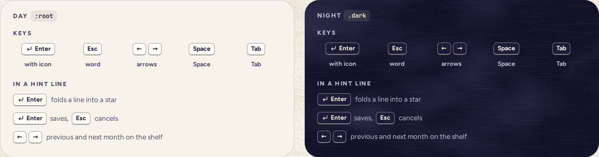

# Kbd

> 08 · Actions · shadcn/ui · Kbd · `src/components/ui/kbd.tsx`

Install the primitive: `pnpm dlx shadcn@latest add kbd`

A key, drawn like the physical one: card stock, a heavier bottom edge, 24 px tall. It lives inside hint lines that say what a key does, never as a control itself. Enter carries the return arrow, because on a phone the soft keyboard labels that key “next” or “done”.

**Used on:** Today, Review, Shelf · editing a star, Desktop hints

**Built from:** `<kbd>`, `tailwind-merge · cn()`

## States (Day and Night)



## API

### `<Kbd>`

| Prop | Type | Default | Notes |
|---|---|---|---|
| `children` | `ReactNode` |  | The key’s name as printed on it, optionally after an `Icon`. |
| `…props` | `React.ComponentProps<"kbd">` |  | `data-slot="kbd"` is set. |

### `<KbdGroup>`

| Prop | Type | Default | Notes |
|---|---|---|---|
| `…props` | `React.ComponentProps<"kbd">` |  | Keys that go together (← →). Give it an `aria-label` when the glyphs alone would be read oddly. |

## Usage

`src/screens/today/fold-hint.tsx`

```tsx
import { Kbd, KbdGroup } from "@/components/ui/kbd"

<p className="flex items-center gap-2 text-[13.5px] text-ink-2">
  <Kbd><Icon name="enter" /> Enter</Kbd>
  <span>folds a line into a star</span>
</p>

<p className="text-[12.5px] text-ink-2">
  <Kbd>Enter</Kbd> saves, <Kbd>Esc</Kbd> cancels
</p>

<KbdGroup aria-label="Left and right arrow keys">
  <Kbd>←</Kbd><Kbd>→</Kbd>
</KbdGroup>
```

## Implementation

A sketch, correct in intent but not compiled: check it against the current library APIs.

`src/components/ui/kbd.tsx`

```tsx
// src/components/ui/kbd.tsx: the generated file, with Threefold's classes
function Kbd({ className, ...props }: React.ComponentProps<"kbd">) {
  return (
    <kbd
      data-slot="kbd"
      className={cn(
        "pointer-events-none inline-flex h-6 w-fit min-w-6 items-center justify-center gap-1 rounded-[6px] border-[1.3px] border-b-[2.5px] border-ink/40 bg-card px-[7px] font-sans text-xs font-bold text-ink select-none [&_svg:not([class*='size-'])]:size-3.5",
        className
      )}
      {...props}
    />
  )
}

function KbdGroup({ className, ...props }: React.ComponentProps<"kbd">) {
  return <kbd data-slot="kbd-group" className={cn("inline-flex items-center gap-1", className)} {...props} />
}
```

## Classes and tokens

| Part | Classes |
|---|---|
| Key | `h-6 rounded-[6px] border-[1.3px] border-b-[2.5px] border-ink/40 bg-card px-[7px] text-xs font-bold` |
| Icon | `[&_svg]:size-3.5  (the enter glyph, stroke 2.2)` |

## Accessibility

- Semantic `<kbd>`, read as text: “Enter folds a line into a star”.
- Arrow glyphs get words: `aria-label="Left and right arrow keys"` on the group.
- Hints are help, never the only way: every key action also has a button.

## Where it shows

- Under Today’s lines until the day is folded, on every platform: soft keyboards have Enter too.
- Desktop adds the shelf’s ← → and Space on the jar.
