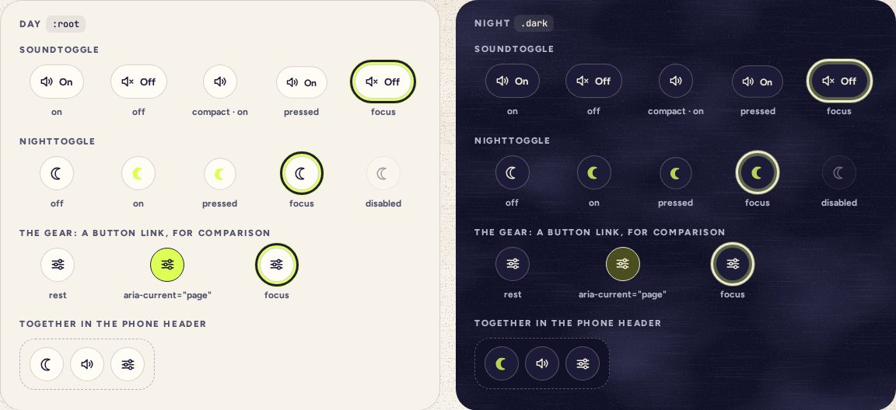

# Toggle

> 06 · Actions · shadcn/ui · Toggle · `src/components/ui/toggle.tsx`

Install the primitive: `pnpm dlx shadcn@latest add toggle`

Two switches that never leave the header: sound, which says On or Off beside its icon when there is room, and the moon, which fills with the highlighter at night. Both are pressed buttons (`aria-pressed`), not links. The gear next to them is a link to Settings, so it wears `buttonVariants()` instead, drawn here for comparison.

**Used on:** Every header: phone, tablet, desktop, Tablet rail

**Built from:** `@base-ui/react (Toggle)`, `class-variance-authority`, `ThemeProvider (useTheme)`, `@/lib/sound`

## States (Day and Night)



## API

### `<Toggle>`

| Prop | Type | Default | Notes |
|---|---|---|---|
| `pressed` | `boolean` |  | Controlled state. Base UI sets `aria-pressed`, and `data-pressed` while on. |
| `onPressedChange` | `(pressed: boolean, eventDetails: TogglePrimitive.ChangeEventDetails) => void` |  | Flip it and play its tick, before the change lands. |
| `variant` | `"default" \| "fill"` | `"default"` | `fill` paints the icon in `highlight-pop` while on: the moon. |
| `size` | `"default" \| "label"` | `"default"` | `default` is a 44 px circle; `label` leaves room for On or Off. |

### `<SoundToggle>` (reads and writes the sound setting)

| Prop | Type | Default | Notes |
|---|---|---|---|
| `compact` | `boolean` | `false` | Icon only. The phone header, where the gear needs the room. |

### `<NightToggle>` (no props: the ThemeProvider holds the theme)

## Usage

`src/components/threefold/header-toggles.tsx`

```tsx
// src/components/threefold/header-toggles.tsx
import { useTheme } from "@/components/theme-provider"
import { Toggle } from "@/components/ui/toggle"
import { Icon } from "@/components/threefold/icon"
import { useSound } from "@/lib/sound"

export function SoundToggle({ compact = false }) {
  const { enabled, setEnabled, tick } = useSound()
  return (
    <Toggle
      aria-label="Sound"
      size={compact ? "default" : "label"}
      pressed={enabled}
      onPressedChange={(on) => {
        setEnabled(on)
        if (on) tick("A5", { gain: -30 })
      }}
    >
      <Icon name={enabled ? "sound" : "mute"} />
      {!compact && <span aria-hidden>{enabled ? "On" : "Off"}</span>}
    </Toggle>
  )
}

export function NightToggle() {
  const { resolvedTheme, setTheme } = useTheme()
  const { tick } = useSound()
  return (
    <Toggle
      aria-label="Night mode"
      variant="fill"
      pressed={resolvedTheme === "dark"}
      onPressedChange={(on) => {
        tick(on ? "D4" : "D5", { gain: -33 })
        setTheme(on ? "dark" : "light")
      }}
    >
      <Icon name="moon" />
    </Toggle>
  )
}
```

## Implementation

A sketch, correct in intent but not compiled: check it against the current library APIs.

`src/components/ui/toggle.tsx`

```tsx
// src/components/ui/toggle.tsx: keep the generated Toggle, swap toggleVariants
const toggleVariants = cva(
  "squish inline-flex shrink-0 items-center justify-center gap-1.5 rounded-full border-[1.5px] border-ink/18 bg-card text-[13px] font-bold text-ink hover:bg-paper-2 disabled:pointer-events-none disabled:opacity-40 [&_svg]:pointer-events-none [&_svg]:shrink-0 [&_svg:not([class*='size-'])]:size-5",
  {
    variants: {
      variant: {
        default: "",
        fill: "data-pressed:[&_svg]:fill-highlight-pop data-pressed:[&_svg]:stroke-highlight-pop",
      },
      size: {
        default: "size-11",
        label: "h-11 min-w-11 pr-3.5 pl-[11px]",
      },
    },
    defaultVariants: { variant: "default", size: "default" },
  }
)
```

## Classes and tokens

| Part | Classes |
|---|---|
| Chip | `size-11 rounded-full border-[1.5px] border-ink/18 bg-card` |
| With a word | `h-11 min-w-11 pr-3.5 pl-[11px] text-[13px] font-bold` |
| The moon, on | `data-pressed:[&_svg]:fill-highlight-pop  →  #B9D256 at night` |
| The gear, current | `aria-[current=page]:bg-highlight aria-[current=page]:border-ink` |

## Accessibility

- Names stay put: “Sound” and “Night mode”. The state is `aria-pressed`, so a screen reader says “Sound, toggle button, pressed”.
- The visible On or Off is `aria-hidden`: it would repeat the pressed state.
- The moon is a quick override. Settings keeps Match device, Day and Night (`setTheme("system")`).

## Motion

- Press: `squish`.
- Night flips under a veil: the screen dims to the destination paper at 94% in 160 ms, `.dark` swaps beneath it, and the veil lifts in 280 ms (Motion spec J).
- Reduced motion: no veil, the colors just change.

## Sound

- Sound on: one tick, A5 at −30 dBFS, as confirmation. Sound off: silence, obviously.
- Night on: a quiet D4 tick; day: D5. Both at −33 dBFS, 170 ms in, as the theme flips.
