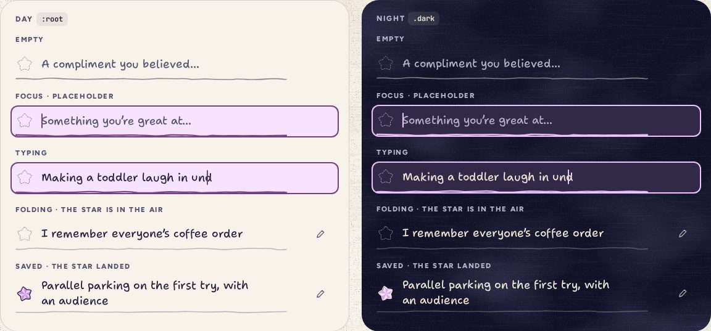
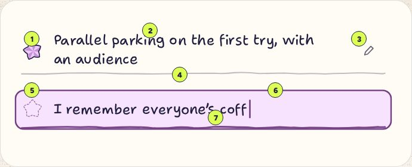

# EntryLine

> 09 · Inputs · Threefold · custom, on Input · `src/components/threefold/entry-line.tsx`

Install the primitive: `pnpm dlx shadcn@latest add input`

One of the day’s three lines, and the heart of the app. You write in your own hand on a wobbly rule; Enter folds the line into a paper star that flies from its slot into the jar. The row itself is the focus indicator, tinted in the day’s category. Once landed, the words stay, with a pencil to open them again.

**Used on:** Today, Review · writing card

**Built from:** `Input`, `Button`, `PaperStar`, `WobbleRule`, `useJar()`

## States (Day and Night)



## Anatomy



Two lines drawn at 130%: one folded and saved, one being written.

1. **Slot.** The folded star once it lands; before that, a dashed outline in ink, or in the day’s deep ink while focused.
2. **Words, in your hand.** Shantell Sans, 18 px on phone, `INFM 70, BNCE 22`.
3. **Edit.** A ghost `icon-sm` button with the pencil; opens the same line again.
4. **Wobbly rule.** A seeded SVG path, 1.6 px, ink at 28% once saved, 50% while empty.
5. **Focus tint.** The whole row takes `--cat-light` and a 2 px inset ring in `--cat-deep`: the row is the focus indicator.
6. **Caret and placeholder.** The caret is the day’s deep ink; placeholders are ink 2, one per line and category.
7. **Rule while focused.** 2.4 px in `--cat-deep`.

## API

### `<EntryLine>`

| Prop | Type | Default | Notes |
|---|---|---|---|
| `index` | `0 \| 1 \| 2` |  | Which line. Sets the landed star’s tilt (−12°, 8°, −4°), its note (D5, A5, E6) and `enterKeyHint` (next, next, done). |
| `category` | `CategoryKey` |  | Sets `data-cat`: the focus tint, the ring, the slot and the star’s ink all follow. |
| `value` | `string` |  | Controlled text. 120 characters at most; a line is a line. |
| `onValueChange` | `(text: string) => void` |  |  |
| `onFold` | `(text: string, from: DOMRect) => void` |  | Enter with words in it. `from` is the slot’s rect, where the flying star starts. |
| `saved` | `boolean` | `false` | The star has landed: words become text, the pencil appears. |
| `onEdit` | `() => void` |  | The pencil. Reopens the line with its words, still one line of 120 characters at most; saving again is silent. |
| `placeholder` | `string` |  | Three per category, one per line: “Something you’re great at…”. |
| `label` | `string` | `"{Category}, line {n} of 3"` | The input’s accessible name, visually hidden. |
| `size` | `"default" \| "compact"` | `"default"` | 18 px words and 58 px rows on Today; 17.5 px in the Review’s writing card. |

## Usage

`src/screens/today/lines.tsx`

```tsx
import { EntryLine } from "@/components/threefold/entry-line"
import { useJar } from "@/components/threefold/jar"

const { fold } = useJar()

<div role="group" aria-label={`Three for ${category.name}`}>
  {lines.map((line, i) => (
    <EntryLine
      key={i}
      index={i as 0 | 1 | 2}
      category={category.key}
      value={line.text}
      saved={line.saved}
      placeholder={category.placeholders[i]}
      onValueChange={(text) => setLine(i, text)}
      onFold={(text, from) => {
        fold({ category: category.key, text, from, line: i })
        focusLine(i + 1)
      }}
    />
  ))}
</div>
```

## Implementation

A sketch, correct in intent but not compiled: check it against the current library APIs.

`src/components/threefold/entry-line.tsx`

```tsx
import * as React from "react"
import { Input } from "@/components/ui/input"
import { Button } from "@/components/ui/button"
import { PaperStar } from "@/components/threefold/paper-star"
import { WobbleRule } from "@/components/threefold/wobble-rule"
import { cn } from "@/lib/utils"

const ROT = [-12, 8, -4] as const

export function EntryLine({ index, category, value, saved, placeholder, onValueChange, onFold, onEdit, label }: EntryLineProps) {
  const id = React.useId()
  const slot = React.useRef<HTMLSpanElement>(null)
  const [wiggle, setWiggle] = React.useState(false)

  return (
    <div
      data-slot="entry-line"
      data-cat={category}
      data-saved={saved || undefined}
      className={cn(
        "group/line relative flex min-h-[58px] items-center gap-3",
        "before:absolute before:-inset-x-2 before:top-1 before:bottom-0.5 before:rounded-[12px] before:bg-(--cat-light) before:opacity-0 before:ring-2 before:ring-(--cat-deep) before:ring-inset focus-within:before:opacity-100",
        wiggle && "animate-wiggle motion-reduce:animate-none"
      )}
      onAnimationEnd={() => setWiggle(false)}
    >
      <span ref={slot} className="relative size-[30px] shrink-0">
        {saved ? (
          <PaperStar category={category} size={30} rotate={ROT[index]} />
        ) : (
          <PaperStar variant="empty" size={30} className="text-ink/45 group-focus-within/line:text-(--cat-deep)" />
        )}
      </span>
      {saved ? (
        <>
          <p className="relative min-w-0 flex-1 py-2 font-hand text-[17.5px] leading-[1.38] text-pretty">{value}</p>
          <Button variant="ghost" size="icon-sm" aria-label={`Edit line ${index + 1}`} onClick={onEdit} className="opacity-70">
            <Icon name="pencil" />
          </Button>
        </>
      ) : (
        <>
          <label htmlFor={id} className="sr-only">{label}</label>
          <Input
            id={id}
            value={value}
            placeholder={placeholder}
            enterKeyHint={index === 2 ? "done" : "next"}
            autoComplete="off"
            maxLength={120}
            onChange={(e) => onValueChange(e.target.value)}
            onKeyDown={(e) => {
              if (e.key !== "Enter" || e.shiftKey || e.nativeEvent.isComposing) return
              e.preventDefault()
              if (!value.trim()) return setWiggle(true)
              onFold(value.trim(), slot.current!.getBoundingClientRect())
            }}
            // The last three cancel base-nova Input's focus ring, its smaller text at md, and its night tint: the row is the focus indicator.
            className="relative h-[46px] flex-1 border-0 bg-transparent px-0 font-hand text-[18px] text-ink caret-(--cat-deep) shadow-none placeholder:text-ink-2 focus-visible:shadow-none focus-visible:outline-none focus-visible:ring-0 md:text-[18px] dark:bg-transparent"
          />
        </>
      )}
      <WobbleRule
        seed={`line-${index}`}
        className="absolute inset-x-0 bottom-0 text-ink/50 group-focus-within/line:text-(--cat-deep) group-focus-within/line:[stroke-width:2.4] group-data-saved/line:text-ink/28"
      />
    </div>
  )
}
```

## Classes and tokens

| Part | Classes |
|---|---|
| Row, focused | `before:bg-(--cat-light) before:ring-2 before:ring-inset before:ring-(--cat-deep) before:rounded-[12px]` |
| Words | `font-hand text-[18px] leading-[1.38]  ·  INFM 70, BNCE 22` |
| Slot | `size-[30px]  ·  PaperStar variant="empty" text-ink/45  →  text-(--cat-deep) focused` |
| Rule | `WobbleRule text-ink/50  →  2.4px text-(--cat-deep) focused  →  text-ink/28 saved` |
| Empty Enter | `animate-wiggle  (−5, 4, −2 px in 360 ms)` |
| Caret | `caret-(--cat-deep)` |

## Accessibility

- Each line is a real input with a hidden label: “Talents, line 1 of 3”. The three sit in a group named “Three for Talents”.
- Enter folds, Tab moves on without folding, Shift+Tab goes back. Composition input (IME) is never cut off: `isComposing` is checked.
- The row’s tint and ring are the focus indicator: the deep ring is 6.1:1 or better against paper. The input’s own outline is removed on purpose.
- After a fold, focus moves to the next empty line; after the third, to the status line that says the day is kept.

## Motion

- Fold & drop (Motion spec A): lift 120 ms, wind 240 ms, puff, then a 600 ms arc into the jar and a squash on landing.
- Empty Enter: `animate-wiggle`, a small wiggle that means no.
- Reduced motion: the words stay put and gain their star in a 160 ms fade; a star fades in at its jar slot.

## Sound

- Enter: a crinkle straight away, resonating on the line’s note.
- Landing: a glass tick on D5, A5 or E6. The third also pops the cork (D4, +80 ms) and rings the chord (+140 ms).
- Editing a saved line is quiet on purpose.
