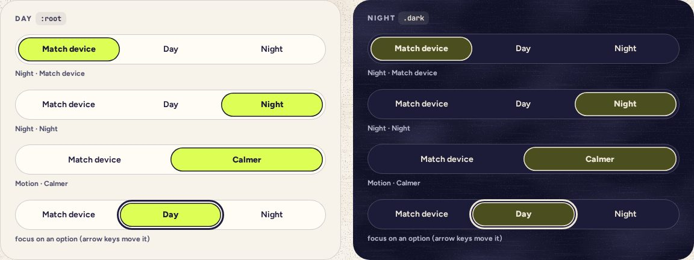

# Segmented

> 11 · Inputs · shadcn/ui · Toggle Group · `src/components/threefold/segmented.tsx`

Install the primitive: `pnpm dlx shadcn@latest add toggle-group`

Two or three words in a pill, one of them highlighted. For settings with named choices that apply at once: Night (Match device, Day, Night) and Motion (Match device, Calmer). Built on the Toggle Group primitive in single mode, with one rule added: it can never be emptied.

**Used on:** Settings · Night and motion

**Built from:** `@base-ui/react (ToggleGroup, Toggle)`, `ThemeProvider (useTheme)`

## States (Day and Night)



## API

### `<Segmented>`

| Prop | Type | Default | Notes |
|---|---|---|---|
| `value` | `T` |  | The chosen option. Always one of `options`. |
| `onValueChange` | `(value: T) => void` |  | Called with the new value only; a click on the chosen one does nothing. |
| `options` | `{ value: T; label: string }[]` |  | Two or three. Short words: they share one line even at 320 px. |
| `aria-label` | `string` |  | Names the group: “Night”, “Motion”. |

## Usage

`src/screens/settings/look-card.tsx`

```tsx
import { useTheme } from "@/components/theme-provider"
import { Segmented } from "@/components/threefold/segmented"

const { theme, setTheme } = useTheme()

<Segmented
  aria-label="Night"
  value={theme ?? "system"}
  onValueChange={(v) => { setTheme(v); tick(v === "system" ? "D5" : "F#5", { quiet: true }) }}
  options={[
    { value: "system", label: "Match device" },
    { value: "light", label: "Day" },
    { value: "dark", label: "Night" },
  ]}
/>
```

## Implementation

A sketch, correct in intent but not compiled: check it against the current library APIs.

`src/components/threefold/segmented.tsx`

```tsx
// src/components/threefold/segmented.tsx: a single-choice ToggleGroup that can’t be emptied
import { Toggle as TogglePrimitive } from "@base-ui/react/toggle"
import { ToggleGroup as ToggleGroupPrimitive } from "@base-ui/react/toggle-group"

// Single choice is the default (no `multiple`), but the value is still an array. Clicking the
// chosen option again sends [], which is ignored, so the group is never emptied.
export function Segmented<T extends string>({ value, onValueChange, options, ...props }: SegmentedProps<T>) {
  return (
    <ToggleGroupPrimitive
      value={[value]}
      onValueChange={(next) => next[0] && onValueChange(next[0] as T)}
      data-slot="segmented"
      className="flex rounded-full border-[1.5px] border-ink/22 bg-card p-1"
      {...props}
    >
      {options.map((o) => (
        <TogglePrimitive
          key={o.value}
          value={o.value}
          className="squish flex min-h-10 flex-1 items-center justify-center rounded-full px-3 text-sm font-[650] whitespace-nowrap transition-colors duration-250 data-pressed:bg-highlight data-pressed:font-extrabold data-pressed:shadow-[inset_0_0_0_1.5px_var(--foreground)] focus-visible:outline-3 focus-visible:outline-offset-2 focus-visible:outline-ring focus-visible:shadow-none"
        >
          {o.label}
        </TogglePrimitive>
      ))}
    </ToggleGroupPrimitive>
  )
}
```

## Classes and tokens

| Part | Classes |
|---|---|
| Frame | `rounded-full border-[1.5px] border-ink/22 bg-card p-1` |
| Option | `min-h-10 rounded-full px-3 text-sm font-[650]` |
| Chosen | `bg-highlight font-extrabold shadow-[inset_0_0_0_1.5px_var(--foreground)]` |
| Focus | `outline-3 outline-offset-2 outline-ring (no halo: the pill is tight)` |

## Accessibility

- Base UI gives it roving focus: arrow keys move between the options, and Space or Enter picks. Tab lands on the option that last had focus, which starts as the first one, not the chosen one.
- Chosen is shown three ways: highlighter fill, an inset ink ring and a heavier weight.
- The group has a name; each option’s word is its name.

## Motion

- Fill: 250 ms color change. No sliding thumb: it would travel under words.
- Press: `squish`.

## Sound

- A quiet tick: D5 for Match device, F♯5 for the others.
