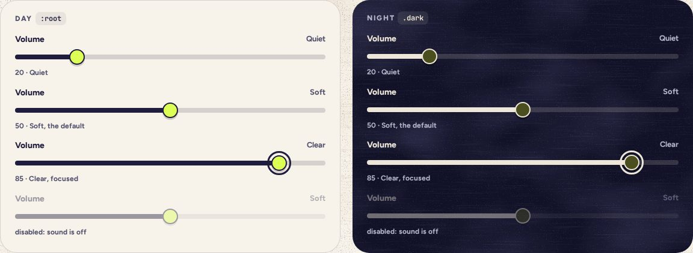

# Slider

> 14 · Inputs · shadcn/ui · Slider · `src/components/ui/slider.tsx`

Install the primitive: `pnpm dlx shadcn@latest add slider`

Volume, and only volume: the header toggle is on or off, this sets how loud. An ink range on a faint track and a highlighter thumb with a printed lip. It speaks in words, Quiet, Soft or Clear, rather than percentages, and plays one tick at the new level when you let go.

**Used on:** Settings · Sound

**Built from:** `@base-ui/react (Slider)`, `Label`, `@/lib/sound`

## States (Day and Night)



## API

### `<Slider>`

| Prop | Type | Default | Notes |
|---|---|---|---|
| `value` | `number[]` |  | One value, 0–100, in steps of 5. |
| `onValueChange` | `(value: number[], eventDetails: SliderPrimitive.Root.ChangeEventDetails) => void` |  | While dragging: set the gain live, silently. |
| `onValueCommitted` | `(value: number[], eventDetails: SliderPrimitive.Root.CommitEventDetails) => void` |  | On release: store it and tick once, so you hear the new level. |
| `disabled` | `boolean` | `false` | While sound is off. The row fades to 42% with it. |
| `getAriaValueText` | `(formattedValue: string, value: number, index: number) => string` |  | Quiet, Soft or Clear, instead of a bare number. Handed to the thumb, whose range input carries it as `aria-valuetext`. |
| `aria-labelledby` | `string` |  | Points at the visible “Volume” label. Base UI hands it to the thumb’s range input, which a label’s `htmlFor` can’t reach. |

## Usage

`src/screens/settings/sound-card.tsx`

```tsx
const word = (v: number) => (v < 34 ? "Quiet" : v < 67 ? "Soft" : "Clear")

<div className="flex items-baseline justify-between">
  <Label id="volume-label">Volume</Label>
  <span aria-hidden className="text-[13px] font-bold text-ink-2">{word(volume)}</span>
</div>
<Slider
  aria-labelledby="volume-label"
  min={0} max={100} step={5}
  value={[volume]}
  disabled={!soundOn}
  getAriaValueText={(_, v) => word(v)}
  onValueChange={([v]) => sound.setVolume(v / 100)}
  onValueCommitted={([v]) => { setVolume(v); tick("A5") }}
/>
```

## Implementation

A sketch, correct in intent but not compiled: check it against the current library APIs.

`src/components/ui/slider.tsx`

```tsx
// src/components/ui/slider.tsx: the generated Slider, restyled (one thumb, which also takes the words)
function Slider({ className, getAriaValueText, ...props }: SliderPrimitive.Root.Props & Pick<SliderPrimitive.Thumb.Props, "getAriaValueText">) {
  return (
    <SliderPrimitive.Root data-slot="slider" thumbAlignment="edge" className={cn("w-full", className)} {...props}>
      <SliderPrimitive.Control className="relative flex w-full touch-none items-center select-none data-disabled:opacity-40">
        <SliderPrimitive.Track data-slot="slider-track" className="relative h-2 grow overflow-hidden rounded-full bg-ink/16">
          <SliderPrimitive.Indicator data-slot="slider-range" className="h-full bg-ink" />
        </SliderPrimitive.Track>
        {/* Focus lands on the range input inside the thumb, so the ring keys off has-[:focus-visible] */}
        <SliderPrimitive.Thumb
          data-slot="slider-thumb"
          getAriaValueText={getAriaValueText}
          className="block size-[26px] shrink-0 rounded-full border-2 border-ink bg-highlight shadow-[0_3px_0_color-mix(in_oklab,var(--shadow-color)_18%,transparent)] transition-transform hover:scale-105 has-[:focus-visible]:outline-3 has-[:focus-visible]:outline-offset-4 has-[:focus-visible]:outline-ring has-[:focus-visible]:shadow-none"
        />
      </SliderPrimitive.Control>
    </SliderPrimitive.Root>
  )
}
```

## Classes and tokens

| Part | Classes |
|---|---|
| Track | `h-2 rounded-full bg-ink/16` |
| Range | `bg-ink` |
| Thumb | `size-[26px] rounded-full border-2 border-ink bg-highlight + 3 px printed lip` |
| Night | `range moon, thumb #4B4E1E with a moon border` |

## Accessibility

- Base UI puts a native `<input type="range">` inside the thumb; arrow keys move 5, Page Up/Down 10, Home/End to the ends.
- The value is spoken as a word through `aria-valuetext`.
- Thumb vs track 3:1 or better in both themes; the focus ring sits 4 px out.

## Motion

- None beyond the drag. Hover grows the thumb 5%, pointer: fine only.

## Sound

- Silent while dragging. One A5 tick on release, at the new volume.
