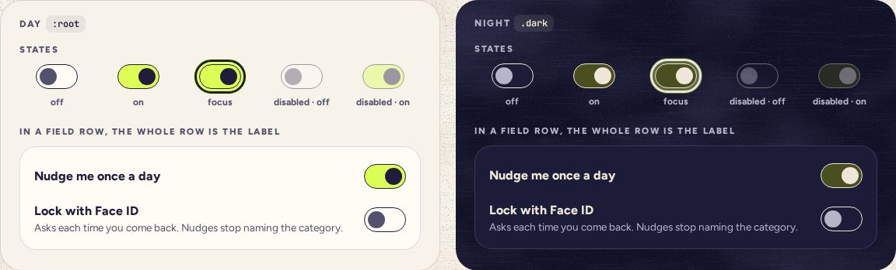

# Switch

> 10 · Inputs · shadcn/ui · Switch · `src/components/ui/switch.tsx`

Install the primitive: `pnpm dlx shadcn@latest add switch`

On or off for a setting that takes effect at once: sound. 54 by 32, an ink outline and a highlighter track when on, so it reads without color too: the thumb moves and turns from ink 2 to ink. Always inside a Field row whose label names the setting.

**Used on:** Settings · Sound

**Built from:** `@base-ui/react (Switch)`, `Field`

## States (Day and Night)



## API

### `<Switch>`

| Prop | Type | Default | Notes |
|---|---|---|---|
| `checked` | `boolean` |  | Controlled. Base UI sets `role="switch"`, `aria-checked` and `data-checked` or `data-unchecked`. |
| `onCheckedChange` | `(checked: boolean, eventDetails: SwitchPrimitive.Root.ChangeEventDetails) => void` |  | Apply the setting now and say so in a toast; there is no Save. |
| `disabled` | `boolean` | `false` | Sound off disables its volume, not this. |
| `id` | `string` |  | Pairs with the `FieldLabel htmlFor`, so the whole row toggles it. Base UI puts it on the hidden checkbox and names the switch from that label. |

## Usage

`src/screens/settings/sound-card.tsx`

```tsx
import { Field, FieldContent, FieldDescription, FieldLabel } from "@/components/ui/field"
import { Switch } from "@/components/ui/switch"
import { useSound } from "@/lib/sound"

const { enabled, setEnabled, tick } = useSound()

<Field orientation="horizontal">
  <FieldContent>
    <FieldLabel htmlFor="sound">Sound</FieldLabel>
    <FieldDescription>
      Paper, glass and one small chime, all in one key.
    </FieldDescription>
  </FieldContent>
  <Switch
    id="sound"
    checked={enabled}
    onCheckedChange={(on) => {
      setEnabled(on)
      if (on) tick("A5", { gain: -30 })
    }}
  />
</Field>
```

## Implementation

A sketch, correct in intent but not compiled: check it against the current library APIs.

`src/components/ui/switch.tsx`

```tsx
// src/components/ui/switch.tsx: the generated Switch, restyled
function Switch({ className, ...props }: SwitchPrimitive.Root.Props) {
  return (
    <SwitchPrimitive.Root
      data-slot="switch"
      className={cn(
        "peer inline-flex h-8 w-[54px] shrink-0 items-center rounded-full border-[1.6px] border-ink bg-card transition-colors duration-200 outline-none data-disabled:cursor-not-allowed data-disabled:opacity-40 data-checked:bg-highlight",
        className
      )}
      {...props}
    >
      <SwitchPrimitive.Thumb
        data-slot="switch-thumb"
        className="pointer-events-none block size-[22px] translate-x-[3.4px] rounded-full bg-ink-2 transition-[translate,background-color] duration-[420ms] ease-spring-snappy data-checked:translate-x-[25.4px] data-checked:bg-ink motion-reduce:transition-none"
      />
    </SwitchPrimitive.Root>
  )
}
```

## Classes and tokens

| Part | Classes |
|---|---|
| Track | `h-8 w-[54px] rounded-full border-[1.6px] border-ink bg-card  →  data-checked:bg-highlight` |
| Thumb | `size-[22px] bg-ink-2 translate-x-[3.4px]  →  bg-ink translate-x-[25.4px]` |
| Night | `track #4B4E1E when on, thumb moon; the outline stays moon at 15.1:1` |

## Accessibility

- Base UI renders a `span` with `role="switch"`, and a hidden checkbox beside it; Space toggles. The label is the row: “Sound, switch, off”.
- On is more than a color: the thumb travels 22 px and darkens (thumb vs track 3.4:1 or better, both themes).
- Its effect is announced by the toast, politely.

## Motion

- Thumb: 420 ms on spring.snappy. Track color: 200 ms ease.
- Reduced motion: both change at once.

## Sound

- Sound itself: a tick on A5 when it turns on (−30 dBFS).
