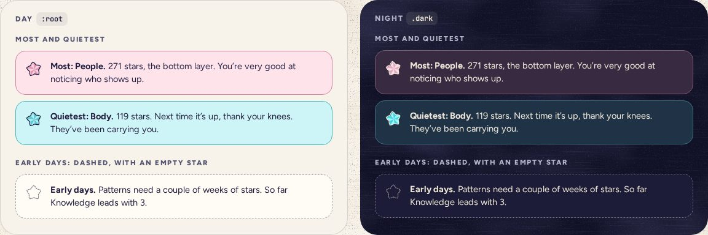

# Callout

> 30 · Insights · shadcn/ui · Alert · `src/components/threefold/callout.tsx`

Install the primitive: `pnpm dlx shadcn@latest add alert`

A short, kind observation with a star beside it, on the category’s tint: the most-written category, the quietest, or, in the first two weeks, that it is early days. Built on Alert for its layout, but it is a note, never an alarm: the role is changed to `note`.

**Used on:** Insights, Early days

**Built from:** `Alert`, `PaperStar`

## States (Day and Night)



## API

### `<Callout>`

| Prop | Type | Default | Notes |
|---|---|---|---|
| `category` | `CategoryKey` |  | Tint, border and star. |
| `lead` | `ReactNode` |  | The bold first words: “Most: People.” |
| `early` | `boolean` | `false` | Dashed card stock and an empty star, for when there isn’t enough to say yet: fewer than 14 days since the first star. |
| `children` | `ReactNode` |  | One or two sentences. A number, then a warm line. |

## Usage

`src/routes/_app/insights.tsx`

```tsx
<Callout category="people" lead="Most: People.">
  {totals.people} stars, the bottom layer. You’re very good at noticing who shows up.
</Callout>

{/* early days, fewer than 14 days since the first star: this one instead of the two */}
<Callout category={leader} early lead="Early days.">
  Patterns need a couple of weeks of stars. So far {name(leader)} leads with {totals[leader]}.
</Callout>
```

## Implementation

A sketch, correct in intent but not compiled: check it against the current library APIs.

`alert.tsx · callout.tsx`

```tsx
// src/components/ui/alert.tsx: two variants added to alertVariants
category: "rounded-[16px] border-[1.5px] border-(--cat-shade) bg-(--cat-light) text-ink [&>svg]:size-[30px]",
early: "rounded-[16px] border-[1.5px] border-dashed border-ink/40 bg-card text-ink [&>svg]:size-[30px]",

// src/components/threefold/callout.tsx
export function Callout({ category, early, lead, children }: CalloutProps) {
  return (
    <Alert role="note" variant={early ? "early" : "category"} data-cat={category} className="gap-3 p-3.5">
      {early ? <PaperStar variant="empty" size={30} className="text-ink" /> : <PaperStar category={category} size={30} rotate={-8} />}
      <AlertDescription className="text-[14.5px] leading-[1.45] text-ink">
        <strong>{lead}</strong> {children}
      </AlertDescription>
    </Alert>
  )
}
```

## Classes and tokens

| Part | Classes |
|---|---|
| Category | `rounded-[16px] border-[1.5px] border-(--cat-shade) bg-(--cat-light) p-3.5` |
| Early | `border-dashed border-ink/40 bg-card` |
| Text | `text-[14.5px] leading-[1.45] text-ink · lead <strong>` |

## Accessibility

- shadcn’s Alert says `role="alert"`, which would interrupt a screen reader on arrival. These pass `role="note"`.
- Ink on every category tint: 13.4:1 or better by day; moon on the night tints, 10.5:1.
- The star is decoration; the lead names the category.

## Motion

- Fades in with the screen’s stagger; nothing else.

## Words

- Always a number first, then something kind. Quietest is never “weakest”, and never a to-do.
