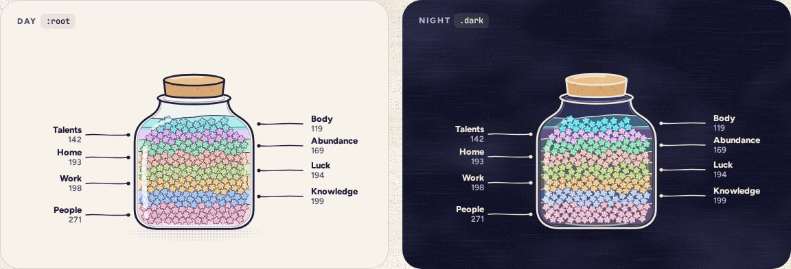

# SandJar

> 32 · Insights · Threefold · custom, a Jar mode · `src/components/threefold/sand-jar.tsx`

The year, poured into the traveling jar as sand art: every category a layer, the most-written at the bottom, each layer drawn from its own stars packed into wavy bands, with its name and count on a leader line. In the early days (fewer than 14 days since the first star), with only a few layers, a small legend replaces the lines.

**Used on:** Insights, all platforms

**Built from:** `Jar (mode “sand”)`, `PaperStar`, `packSand()`, `leader labels`

## States (Day and Night)



## API

### `<SandJar>`

| Prop | Type | Default | Notes |
|---|---|---|---|
| `totals` | `Record<CategoryKey, number>` |  | Stars per category, today’s included. Order and thickness both come from these. |

### `packSand(layers, options)` (src/lib/sand.ts)

| Prop | Type | Default | Notes |
|---|---|---|---|
| `per` | `number` | `6` | Stars per grain, chosen so the jar holds about 250 grains, which keeps it light: 6 for a year of stars. |
| `seed` | `string` | `"sand"` | Same seed, same sand, every visit. |

## Usage

`src/routes/_app/insights.tsx`

```tsx
<h1 className="font-display text-[46px]">Insights</h1>
<p className="text-ink-2">What your jar says about you (lovingly).<br />Since Sep 23, 2025.</p>
<SandJar totals={insights.totals} />
```

## Implementation

A sketch, correct in intent but not compiled: check it against the current library APIs.

`src/components/threefold/sand-jar.tsx`

```tsx
// src/components/threefold/sand-jar.tsx: the traveling jar, in "sand" mode
export function SandJar({ totals }: { totals: Record<CategoryKey, number> }) {
  const slot = useJarSlot("insights", { mode: "sand", dock: "hidden" })
  const layers = React.useMemo(() => layerOrder(totals), [totals])          // most-written at the bottom; ties go to the category first in the cycle
  const per = Math.max(1, Math.round(sum(Object.values(totals)) / 250))     // about 250 grains, however many stars: 6 for a year
  const grains = React.useMemo(() => packSand(layers, { per }), [layers, per])  // one grain per `per` stars, packed once
  return (
    <figure data-slot="sand-jar" className="relative mx-auto h-[309px] w-[350px]">
      <div
        ref={slot}
        role="img"
        aria-label={`Your year of stars, sorted into layers. ${layers.map((k) => `${name(k)} ${totals[k]}`).join(", ")}. Most-written at the bottom.`}
        className="absolute inset-y-0 left-1/2 w-[247px] -translate-x-1/2"
      >
        <SandLayers layers={layers} grains={grains} />                    {/* bands fade to 55% (30% at night); grains drop 150 px, 4 ms apart */}
      </div>
      <LeaderLabels layers={layers} totals={totals} />                     {/* alternate sides; lines draw with stroke-dashoffset */}
    </figure>
  )
}
```

## Classes and tokens

| Part | Classes |
|---|---|
| Bands | `fill --{cat} at 55% (30% at night) · wavy top edge stroke-ink 1.4` |
| Grains | `PaperStar 16 px via <use>` |
| Labels | `name text-[13px] font-extrabold · count text-xs font-semibold text-ink-2` |
| Leaders | `stroke-ink 1.4, a 2.6 px dot at the glass` |

## Accessibility

- One image, one sentence: “Your year of stars, sorted into layers. People 271, Knowledge 199 …”.
- The same totals are in the tiles and the callouts as text, so nothing lives only in the picture.
- Labels are text, not part of the drawing, and wrap rather than shrink.

## Motion

- Sand-art settle (Motion spec H): the jar arrives, its own stars fade (320 ms), grains drop 150 px bottom layer first, 4 ms apart, on spring.soft; bands fade in; leader lines draw.
- Reduced motion: the layered jar, settled.

## Sound

- None. The quietest screen in the app, on purpose.
