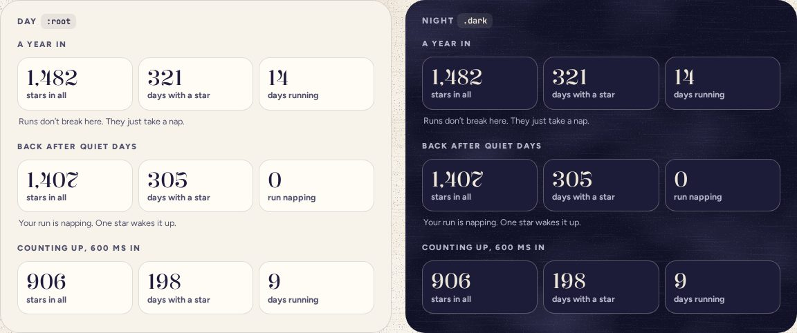

# StatTile

> 29 · Insights · Threefold · custom · `src/components/threefold/stat-tile.tsx`

A number on card stock with a few words under it. Three sit in a row on Insights: every star, every day with a star, and the jars on the shelf. Numbers count up once, when the jar arrives. No tile ever goes down because of a quiet day; only taking stars out, or emptying the jar, lowers one.

**Used on:** Insights, all platforms

**Built from:** `useCountUp`, `font-display tabular-nums`

## States (Day and Night)



## API

### `<StatTile>`

| Prop | Type | Default | Notes |
|---|---|---|---|
| `value` | `number` |  | The real number; the tile counts up to it. |
| `label` | `string` |  | Plain words: “days with a star”. |
| `className` | `string` |  |  |

## Usage

`src/routes/_app/insights.tsx`

```tsx
<div className="flex gap-2">
  <StatTile value={stats.stars} label="stars in all" />
  <StatTile value={stats.days} label="days with a star" />
  <StatTile value={stats.jars} label={stats.jars === 1 ? "jar on the shelf" : "jars on the shelf"} />   {/* months with at least one star */}
</div>
```

## Implementation

A sketch, correct in intent but not compiled: check it against the current library APIs.

`src/components/threefold/stat-tile.tsx`

```tsx
// src/components/threefold/stat-tile.tsx
export function StatTile({ value, label, className }: StatTileProps) {
  const shown = useCountUp(value, { duration: 1100 })             // final at once with reduced motion
  return (
    <div data-slot="stat-tile" className={cn("flex min-w-0 flex-1 flex-col gap-1 rounded-[16px] border-[1.5px] border-border bg-card px-3 pt-3.5 pb-3", className)}>
      <span className="sr-only">{`${value.toLocaleString("en-US")} ${label}`}</span>
      <span aria-hidden className="font-display text-3xl leading-[.95] font-[420] whitespace-nowrap tabular-nums">{shown.toLocaleString("en-US")}</span>
      <span aria-hidden className="text-[12.5px] leading-[1.3] font-bold text-ink-2">{label}</span>
    </div>
  )
}
```

## Classes and tokens

| Part | Classes |
|---|---|
| Tile | `rounded-[16px] border-[1.5px] border-border bg-card px-3 pt-3.5 pb-3` |
| Figure | `font-display text-3xl font-[420] tabular-nums leading-[.95]` |
| Label | `text-[12.5px] font-bold text-ink-2` |

## Accessibility

- The counting digits are hidden; a visually hidden sentence holds the final value: “1,482 stars in all”.
- Tabular numerals, so a counting figure never jitters.
- Ink 2 labels on card: 7.3:1 by day, 8.2:1 at night.

## Motion

- Totals count up over 1.1 s as the sand settles (Motion spec H).
- Reduced motion: final numbers, straight away.

## Sound

- None. Insights is silent by design.
