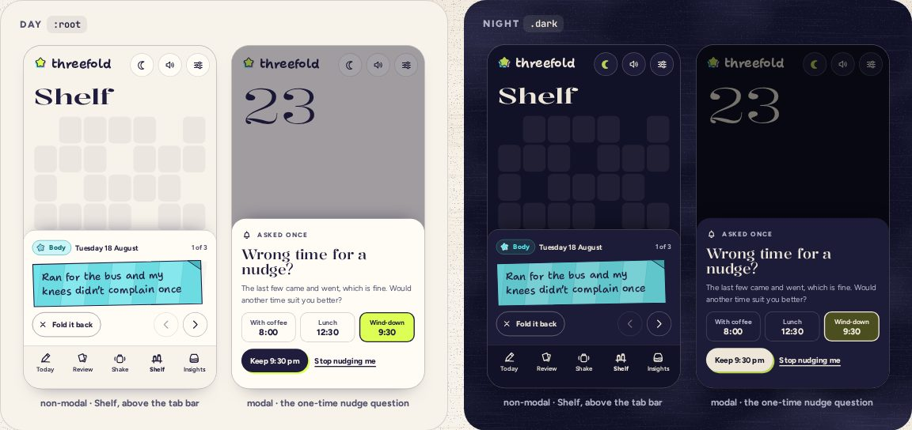

# BottomSheet

> 33 · Overlays · shadcn/ui · Drawer · `src/components/threefold/bottom-sheet.tsx`

Install the primitive: `pnpm dlx shadcn@latest add drawer`

Card stock that rises from the bottom of a phone screen. On the Shelf it is non-modal and stops above the tab bar, so the calendar behind stays live and another day can be tapped; for a question that needs an answer, it is modal with a scrim. Tablets and desktop show the same content in place, not in a sheet.

**Used on:** Shelf · a day’s stars (phone), Shake · the memory (phone)

**Built from:** `Drawer (Base UI)`, `StarPanel`

## States (Day and Night)



## API

### `<BottomSheet>`

| Prop | Type | Default | Notes |
|---|---|---|---|
| `open / onOpenChange` | `boolean · (open: boolean, eventDetails) => void` |  | Controlled. Swipe down, Esc, or the sheet’s own close button close it. |
| `modal` | `boolean` | `true` | `false` keeps the page behind usable (no scrim, no focus trap, and neither a tap outside nor focus leaving closes it): the Shelf. |
| `aboveTabBar` | `boolean` | `false` | Stops 80 px up so the tab bar stays visible. |
| `label` | `string` |  | The dialog’s name, given to a visually hidden `DrawerTitle`. |

## Usage

`src/screens/shelf/poured.tsx`

```tsx
{/* the Shelf: calendar stays live behind it */}
<BottomSheet open={!!openDay} onOpenChange={(o) => !o && closeDay()} modal={false} aboveTabBar label="Unfolded star">
  <StarPanel day={openDay} … />
</BottomSheet>
```

## Implementation

A sketch, correct in intent but not compiled: check it against the current library APIs.

`src/components/threefold/bottom-sheet.tsx`

```tsx
// src/components/threefold/bottom-sheet.tsx: shadcn Drawer (Base UI) with Threefold's paper
export function BottomSheet({ open, onOpenChange, modal = true, aboveTabBar = false, label, children }: BottomSheetProps) {
  return (
    <Drawer open={open} onOpenChange={onOpenChange} modal={modal} disablePointerDismissal={!modal} swipeDirection="down">
      {/* disablePointerDismissal: on the Shelf, tapping another day or tabbing out leaves the sheet up; Esc still closes it */}
      <DrawerContent
        aria-label={label}
        className={cn(
          "rounded-t-[22px] border-t-[1.5px] border-ink/18 bg-card px-4 pt-[18px] pb-4 shadow-sheet",
          "data-[swipe-direction=down]:max-h-[82dvh] motion-reduce:transition-none",
          aboveTabBar && "bottom-20"                       // Shelf: the tab bar stays visible and usable
        )}
      >
        <DrawerTitle className="sr-only">{label}</DrawerTitle>
        {children}
      </DrawerContent>
    </Drawer>
  )
}
```

## Classes and tokens

| Part | Classes |
|---|---|
| Sheet | `rounded-t-[22px] border-t-[1.5px] border-ink/18 bg-card px-4 pt-[18px] pb-4` |
| Lift | `shadow-sheet  (0 −18 30 −24 in shadow-color)` |
| Scrim, modal | `bg-[#111127]/38 by day, black/50 at night` |
| Enter | `rise: translateY(110%) → 0 on spring.soft, 570 ms` |

## Accessibility

- Modal: focus moves in and is trapped; Esc closes; focus returns to what opened it. Base UI’s Drawer does this.
- Non-modal: focus moves in, but Tab can leave; the sheet is a labeled region, and Esc still closes it.
- Content that uses Esc to step back, like StarPanel leaving edit or confirm, stops the key there, so each Esc is one step.
- Every sheet has a named way out besides swiping (Fold it back).

## Motion

- Rises on spring.soft (k 170, c 20). Swipe-down follows the finger and springs back or closes on release.
- Reduced motion: a 200 ms fade, no travel.

## Sound

- None of its own; its content plays (the strip’s crinkle).
