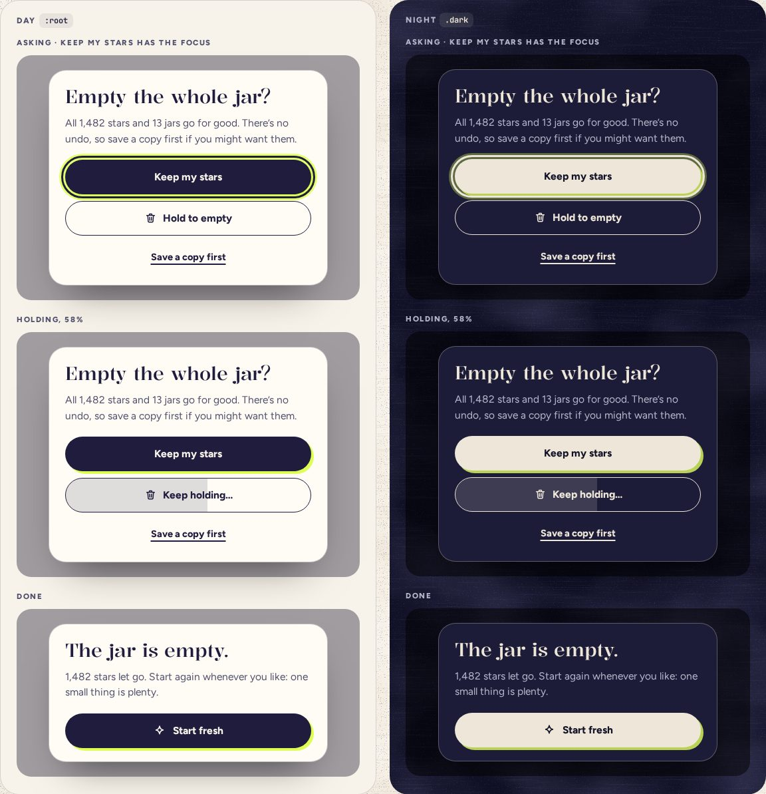

# ConfirmDialog

> 34 · Overlays · shadcn/ui · Alert Dialog · `src/screens/settings/empty-jar-dialog.tsx`

Install the primitive: `pnpm dlx shadcn@latest add alert-dialog`

For the one question that can’t be taken back: emptying the jar. A centered card on a dimmed screen, the safe answer first and focused, and the destructive one a HoldButton rather than a click. Smaller, reversible-feeling choices (taking one star out) ask in place instead, without a dialog.

**Used on:** Settings · Empty the jar

**Built from:** `AlertDialog (Base UI)`, `HoldButton`, `Button`

## States (Day and Night)



## API

### `<EmptyJarDialog>`

| Prop | Type | Default | Notes |
|---|---|---|---|
| `total` | `number` |  | Stars that would go. |
| `jars` | `number` |  | Jars that would go. |
| `onEmpty` | `() => void` |  | After the hold completes. Then the card turns to “The jar is empty.” |
| `onSaveCopy` | `() => void` |  | Exports the text file and toasts; the dialog stays. |

### `AlertDialogContent` (from shadcn, restyled)

| Prop | Type | Default | Notes |
|---|---|---|---|
| `className` | `string` |  | Card stock: `rounded-[26px] bg-card border-[1.5px] p-6`. |
| `initialFocus` | `RefObject<HTMLElement \| null>` |  | Base UI’s Popup prop, passed through: a ref to “Keep my stars”, so the safe answer has the focus on open. |

## Usage

`src/routes/_app/settings.tsx`

```tsx
<SettingsCard title="Your jar" icon="insights">
  …
  <EmptyJarDialog total={stats.stars} jars={stats.jars} onEmpty={emptyJar} onSaveCopy={saveCopy} />
</SettingsCard>
```

## Implementation

A sketch, correct in intent but not compiled: check it against the current library APIs.

`src/screens/settings/empty-jar-dialog.tsx`

```tsx
// src/screens/settings/empty-jar-dialog.tsx: AlertDialog, with the hold instead of an Action
export function EmptyJarDialog({ total, jars, onEmpty, onSaveCopy }: EmptyJarDialogProps) {
  const [emptied, setEmptied] = React.useState(false)
  const keep = React.useRef<HTMLButtonElement>(null)
  return (
    <AlertDialog>
      <AlertDialogTrigger render={<Button variant="link" />}>
        <Icon name="trash" /> Empty the jar…
      </AlertDialogTrigger>
      <AlertDialogContent initialFocus={keep} className="max-w-[440px] gap-3.5 rounded-[26px] border-[1.5px] border-ink/18 bg-card p-6 pb-5 shadow-float">
        {!emptied ? (
          <>
            <AlertDialogHeader className="text-left">
              <AlertDialogTitle className="font-display text-[28px] leading-[1.05] font-[480]">Empty the whole jar?</AlertDialogTitle>
              <AlertDialogDescription id="empty-desc" className="text-[15.5px] leading-[1.5] text-ink-2">
                All {total.toLocaleString("en-US")} stars and {jars} jars go for good, on every device. Your keys stay. There’s no undo, so save a copy first if you might want them.
              </AlertDialogDescription>
            </AlertDialogHeader>
            <div className="mt-1.5 flex flex-col gap-2.5">
              <AlertDialogCancel ref={keep} variant="default" className="w-full">Keep my stars</AlertDialogCancel>   {/* focused on open, through initialFocus */}
              <HoldButton aria-describedby="empty-desc" className="w-full" onComplete={() => { onEmpty(); setEmptied(true) }}>
                <Icon name="trash" /> Hold to empty
              </HoldButton>
              <Button variant="link" className="self-center" onClick={onSaveCopy}>Save a copy first</Button>
            </div>
          </>
        ) : (
          <EmptiedCard total={total} />                                   {/* “The jar is empty.” + Start fresh, which gets the focus */}
        )}
      </AlertDialogContent>
    </AlertDialog>
  )
}
```

## Classes and tokens

| Part | Classes |
|---|---|
| Card | `max-w-[440px] rounded-[26px] border-[1.5px] border-ink/18 bg-card p-6 pb-5 shadow-float` |
| Scrim | `bg-[#111127]/38 (black/50 at night)` |
| Title | `font-display text-[28px] font-[480]` |
| Order | `Keep (default, focused) · Hold to empty (outline) · Save a copy (link)` |

## Accessibility

- `role="alertdialog"`, labeled by its title and described by its text, which says there is no undo.
- The Popup’s `initialFocus` puts the focus on “Keep my stars” on open; Esc keeps the stars. A tap on the scrim does nothing: Base UI’s alert dialog never closes from outside.
- The hold works from the keyboard (hold Space) and says “Keep holding…” as it goes.

## Motion

- Scrim fades in 200 ms; the card rises 12 px on spring.soft.
- Reduced motion: fades only.

## Sound

- Silent until the hold completes: a soft cork pop on D4.
