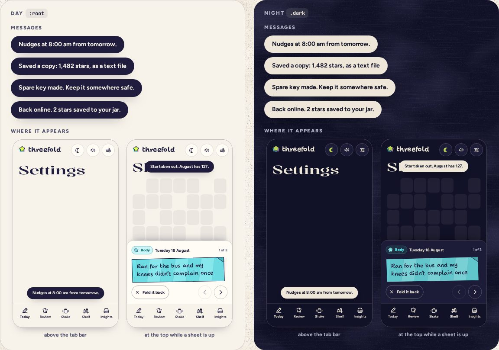

# Toast

> 35 · Overlays · shadcn/ui · Sonner · `src/components/ui/sonner.tsx`

Install the primitive: `pnpm dlx shadcn@latest add sonner`

A one-line confirmation in an ink pill, for settings that take effect at once and for things done out of sight, like saving a copy. One at a time, gone after 2.8 seconds, never with an action to catch. It sits above the tab bar, and moves to the top while a sheet is up so it never covers the sheet’s buttons.

**Used on:** Settings, Shelf · edits, Hello

**Built from:** `Sonner`, `ThemeProvider (useTheme)`

## States (Day and Night)



## API

### `toast(message)` (from sonner)

| Prop | Type | Default | Notes |
|---|---|---|---|
| `message` | `string` |  | One sentence, no exclamation marks, says what is now true. |

### `<Toaster>` (mounted once in the app shell)

| Prop | Type | Default | Notes |
|---|---|---|---|
| `position` | `"bottom-center" \| "top-center"` |  | Chosen for you from whether a sheet is open. |
| `duration` | `number` | `2800` | Milliseconds. |
| `visibleToasts` | `number` | `1` | A new one replaces the last. |

## Usage

`src/screens/settings/*.tsx`

```ts
import { toast } from "sonner"

toast(calmer ? "Calmer: quick fades instead of flights" : "Motion follows your device")
toast(n ? `Back online. ${n} ${n === 1 ? "star" : "stars"} saved to your jar.` : "Back online. Everything’s in your jar.")
toast(`Saved a copy: ${n.toLocaleString("en-US")} stars, as a text file`)
```

## Implementation

A sketch, correct in intent but not compiled: check it against the current library APIs.

`src/components/ui/sonner.tsx`

```tsx
// src/components/ui/sonner.tsx: the generated Toaster, styled as an ink pill
// useTheme comes from @/components/theme-provider: the generated file imports next-themes
export function Toaster(props: ToasterProps) {
  const { resolvedTheme } = useTheme()
  const sheetOpen = useSheetOpen()                                     // any BottomSheet up on a phone
  return (
    <Sonner
      theme={resolvedTheme}
      position={sheetOpen ? "top-center" : "bottom-center"}
      offset={{ bottom: 96, top: 72 }}                                  // clears the tab bar and the header
      duration={2800}
      visibleToasts={1}
      toastOptions={{
        unstyled: true,
        classNames: {
          toast: "rounded-full bg-primary px-[18px] py-[11px] text-sm leading-[1.3] font-bold text-primary-foreground shadow-float",
        },
      }}
      {...props}
    />
  )
}
```

## Classes and tokens

| Part | Classes |
|---|---|
| Pill | `rounded-full bg-primary text-primary-foreground px-[18px] py-[11px] text-sm font-bold` |
| Lift | `shadow-float` |
| Night | `moon pill, night text: primary flips with .dark` |
| Place | `bottom 96 px · top 72 px while a sheet is open` |

## Accessibility

- Sonner announces through a polite live region; nothing steals focus.
- No actions in toasts: anything that matters is a button on the screen, where there is time to find it.
- 2.8 s is for the eye; the announcement doesn’t depend on it.

## Motion

- In: up 16 px and fade on spring.soft (450 ms). Out: fade.
- Reduced motion: fade only.

## Sound

- None; the action that caused it may have one (Save a copy: a short crinkle).
