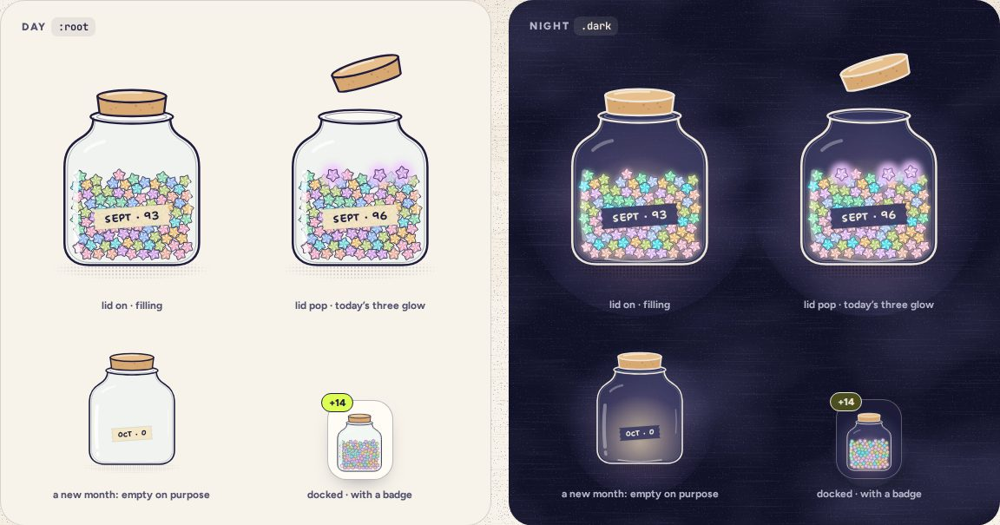
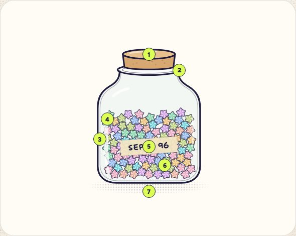

# Jar

> 16 · Paper objects · Threefold · custom SVG + context · `src/components/threefold/jar.tsx`

A glass jar with a cork, a tape label and the month’s stars in it. The same drawing is the static month on a shelf and the one traveling jar that follows you between screens: `JarLayer` keeps a single instance above the routes and flies it to whichever slot the current screen marks. At night it lights from inside.

**Used on:** Today, Review dock, Shake, Shelf, Insights, A new month · the seal

**Built from:** `<svg>`, `PaperStar paths`, `motion/react`, `React context`

## States (Day and Night)



## Anatomy



1. **Cork.** Its own group, so it can pop (up 34 px, −16°) or come off. Cork and wood keep their colors at night.
2. **Rim.** An ellipse over the mouth; a lighter fill by day, `#3A3D6E` at night.
3. **Glass.** A double contour: 3.2 px outline plus a 1.3 px inner line at 32%, which reads as thickness. Back wall `--glass` at 55%.
4. **Highlights.** Five hand-drawn strokes in white; 35% at night, when the light comes from inside.
5. **Tape label.** Torn ends, `--tape`, the month and its count in the hand face.
6. **The pile.** A greedy drop seeded by the month key: computed, never stored, and the same every time (system design §3.3). It holds about 130 stars (F-10); past that, new stars land on the surface and the tape keeps the true count. Clipped to the body, drawn with `<use>`.
7. **Halftone shadow.** A 5 px dot pattern under a radial mask. At night a warm night-light glows behind the glass and breathes.

## One jar, many slots

The jar is never re-rendered per screen. `JarLayer` draws one `Jar` above the routes; each screen marks where it should sit with `useJarSlot`, and the layer flies it there on a spring (k 118, c 17) that can be retargeted mid-flight. Screens without a slot dock it in the header.

## API

### `<Jar>`

| Prop | Type | Default | Notes |
|---|---|---|---|
| `stars` | `JarStar[]` |  | `{ x, y, category, rotate }` in the jar’s 240 × 300 box, placed by the domain layer: seeded by the month key, computed, never stored, so a jar never reshuffles. About 130 at most (F-10). |
| `label` | `string` |  | The tape: “SEP · 96”, always the true count. Omit for the docked jar. |
| `lid` | `"on" \| "pop" \| "off"` | `"on"` | `pop` after the day’s third star; `off` while pouring. |
| `size` | `number` | `192` | Width in px; the drawing is 1.25 × as tall plus the cork. |
| `tilt` | `number` | `0` | Degrees about the base. Pouring tips it −104°. |
| `glow` | `number[]` | `[]` | Indices of stars that glow: today’s three, after the lid pops. |
| `celebrate` | `boolean` | `false` | Dotted rings and sparks above the cork (Motion spec B). |

### `<JarProvider>`

| Prop | Type | Default | Notes |
|---|---|---|---|
| `month` | `MonthKey` |  | The jar being filled: “2026-09”. |
| `stars` | `JarStar[]` |  | Its stars so far. |

### `useJarSlot(key, options)` (returns a ref callback)

| Prop | Type | Default | Notes |
|---|---|---|---|
| `key` | `"today" \| "shake" \| "shelf" \| "insights" \| …` |  | Which slot this is. |
| `options.dock` | `"never" \| "always" \| "hidden"` | `"never"` | Whether the header dock shows while this screen is up. |
| `options.mode` | `"tipped" \| "sand"` |  | Shelf pours it; Insights turns it to sand. |

### `useJar()`

| Prop | Type | Default | Notes |
|---|---|---|---|
| `count` | `number` |  | Stars in the live jar. |
| `fold` | `(input: FoldInput) => Promise<void>` |  | Fly a star from `input.from` into the pile; resolves on landing. |

## Usage

`src/routes/_app.tsx · src/routes/_app/index.tsx`

```tsx
// src/routes/_app.tsx: once, around every screen
<JarProvider month={month} stars={stars}>
  <AppHeader />
  <Outlet />
  <JarLayer />
</JarProvider>

// src/routes/_app/index.tsx: Today marks the slot; the jar flies in
export const Route = createFileRoute("/_app/")({ component: Today })

function Today() {
  const slot = useJarSlot("today")
  const { count } = useJar()
  return (
    <div ref={slot} role="img" aria-label={`September jar, ${count} stars`} className="size-[210px]" />
  )
}

// a static jar: shelf, seal, previews
<Jar stars={month.stars} label="AUG · 128" lid="on" size={120} />
```

## Implementation

A sketch, correct in intent but not compiled: check it against the current library APIs.

`src/components/threefold/jar-layer.tsx`

```tsx
// src/components/threefold/jar-layer.tsx (sketch)
import { motion, useReducedMotion } from "motion/react"

const TRAVEL = { type: "spring", stiffness: 118, damping: 17, mass: 1 } as const   // ~700 ms, interruptible

export function JarLayer() {
  const { stars, label, lid, target } = useJarState()          // target: the mounted slot, or the header dock
  const rect = useSlotRect(target)                               // ResizeObserver + scroll, in viewport px
  const reduce = useReducedMotion()
  return (
    <motion.div
      aria-hidden
      className="pointer-events-none fixed top-0 left-0 z-40 origin-top-left"
      initial={false}
      animate={{ x: rect.x, y: rect.y, scale: rect.width / JAR_W, rotate: rect.rotate ?? 0 }}
      transition={reduce ? { duration: 0 } : TRAVEL}
    >
      <Slosh disabled={reduce}>                                  {/* the pile's own spring: k 118, c 8.5 */}
        <Jar stars={stars} label={label} lid={lid} size={JAR_W} />
      </Slosh>
    </motion.div>
  )
}

export function useJarSlot(key: SlotKey, options: SlotOptions = {}) {
  const register = useJarRegistry()
  return React.useCallback((el: HTMLElement | null) => register(key, el, options), [register, key])
}
```

## Classes and tokens

| Part | Classes |
|---|---|
| Glass | `fill-glass/55 · outline stroke-ink 3.2 + inner 1.3 at 32%` |
| Label | `fill-tape · font-hand 15px font-bold tracking-[.04em]` |
| Cork | `fill-cork stroke-ink · specks fill-cork-dark` |
| Night light | `radial --nightlight → transparent, animate-breathe` |
| Shadow | `5 px dot pattern in paper-ink, radial mask, 32% (50% at night)` |
| Travel | `spring k 118 · c 17 · mass 1 (JS, retargetable)` |

## Accessibility

- The traveling jar is `aria-hidden`: it is one element that moves. Each slot carries the words: `role="img"` and “September jar, 96 stars”.
- Counts change politely: a live region says “Star added. 97 in the jar.” after a fold lands.
- Its glass, label and outline are drawn on paper, not relied on for contrast; the label repeats in text wherever it matters.

## Motion

- Travel (spec C): one spring, retargeted mid-flight; the pile sloshes on its own spring from the jar’s acceleration.
- Lid pop (spec B), shelf pour (E), shake (G), sand (H) all act on this one jar.
- Reduced motion: it appears at its new place with a 200 ms fade; no slosh, no tilt response.

## Sound

- Arrives somewhere new: three tiny high ticks, at most once per 900 ms.
- Lid: cork pop on D4. Pour: cascading ticks. Shake: a rattle.
