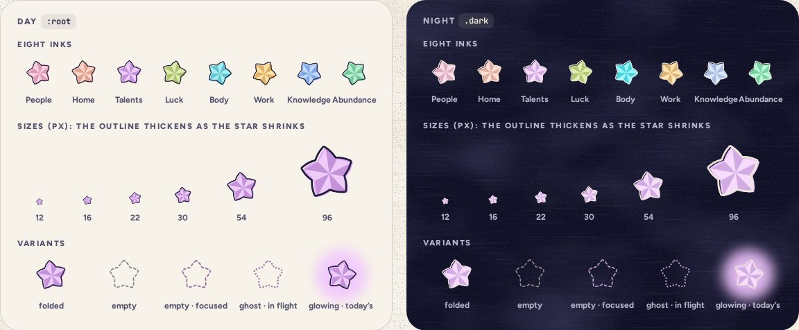

# PaperStar

> 15 · Paper objects · Threefold · custom SVG · `src/components/threefold/paper-star.tsx`

The lucky star folded from a strip of paper: a puffed pentagon with ten facets, alternately lit and shaded, and an ink outline. Above 30 px the fill prints 3 px off register, like the rest of the riso work. It is the unit of everything: one line, one star.

**Used on:** Everywhere: tags, lines, jars, calendar cells, legends, cycle dots

**Built from:** `<svg>`, `@/lib/star-path`, `data-cat`

## States (Day and Night)



## API

### `<PaperStar>`

| Prop | Type | Default | Notes |
|---|---|---|---|
| `category` | `CategoryKey` |  | Sets `data-cat`, so the fill is `--cat-star`: the base ink by day, the brighter glow at night. |
| `size` | `number` | `24` | Pixels, square. 12 in calendar cells, 18–22 in tags, 30 in lines, 54 on cards, 96+ as illustration. |
| `rotate` | `number` | `0` | Degrees. Stars are never quite straight: lines use −12, 8, −4; piles are random but seeded. |
| `variant` | `"folded" \| "empty" \| "ghost"` | `"folded"` | `empty` is the dashed slot waiting for a star, `ghost` the dotted place a star just left. Both take `currentColor`. |
| `…props` | `React.ComponentProps<"svg">` |  | `aria-hidden` by default: the thing it stands for carries the words. |

## Usage

`anywhere.tsx`

```tsx
import { PaperStar } from "@/components/threefold/paper-star"

<PaperStar category="talents" size={30} rotate={-12} />

{/* a slot waiting for its star: inherits the text color */}
<PaperStar variant="empty" size={30} className="text-ink/45" />

{/* in a tag, a legend, a calendar cell: small and tilted */}
<PaperStar category={cat} size={18} rotate={-8} />
```

## Implementation

A sketch, correct in intent but not compiled: check it against the current library APIs.

`src/components/threefold/paper-star.tsx`

```tsx
// src/components/threefold/paper-star.tsx
import { STAR_D, STAR_LIT, STAR_SHADE } from "@/lib/star-path"   // generated once: a puffed pentagon star, R 46, r 29

type PaperStarProps = React.ComponentProps<"svg"> & {
  category?: CategoryKey
  size?: number
  rotate?: number
  variant?: "folded" | "empty" | "ghost"
}

export function PaperStar({ category, size = 24, rotate = 0, variant = "folded", className, ...props }: PaperStarProps) {
  const stroke = size >= 40 ? 3.2 : size >= 22 ? 4.6 : 6          // ~1.2 px on screen at every size
  return (
    <svg
      data-slot="paper-star"
      data-cat={category}
      viewBox="-56 -56 112 112"
      width={size}
      height={size}
      aria-hidden
      className={cn("shrink-0 overflow-visible", className)}
      style={{ rotate: `${rotate}deg` }}
      {...props}
    >
      {variant === "folded" ? (
        <>
          <g transform={size >= 30 ? "translate(3 2.2)" : undefined}>
            <path d={STAR_D} className="fill-(--cat-star)" />
            <path d={STAR_LIT} className="fill-white/42" />
            <path d={STAR_SHADE} className="fill-paper-ink/15" />
          </g>
          <path d={STAR_D} fill="none" className="stroke-ink" strokeWidth={stroke} strokeLinejoin="round" />
        </>
      ) : (
        <path
          d={STAR_D}
          fill="none"
          stroke="currentColor"
          strokeLinecap="round"
          strokeLinejoin="round"
          strokeWidth={variant === "empty" ? 3.4 : 5}
          strokeDasharray={variant === "empty" ? "7 7" : "0.1 9"}
          opacity={variant === "empty" ? 0.55 : 0.7}
        />
      )}
    </svg>
  )
}
```

## Classes and tokens

| Part | Classes |
|---|---|
| Fill | `fill-(--cat-star)  ·  base by day, glow by night` |
| Facets | `lit fill-white/42  ·  shaded fill-paper-ink/15` |
| Outline | `stroke-ink, 3.2 / 4.6 / 6 in its 112-unit box` |
| Off register | `translate(3 2.2) on the fill, 30 px and up` |
| Empty slot | `variant="empty" · dash 7 7 · 55%` |
| Ghost | `variant="ghost" · dash 0.1 9 · 70%` |

## Accessibility

- Decorative on its own: `aria-hidden`. The line, the tag or the jar around it says what it means.
- Color is never the only carrier: the category name always sits beside a star that stands for it.
- Night fills are the brighter glow inks, 12.5:1 or better against night.

## Motion

- Stars move as part of bigger things: Fold & drop (A), the lid (B), the slosh (D), the unfold (F).
- `animate-slot-pop` lands a star in a small slot: from ×0.2 and −90° on spring.bouncy.

## Details

- The path is generated once (`R 46, r 29`, rounded tips, edges bulging 3.2) and shared by every star, SVG sprite or inline.
- Jars reference it with `<use>`, so even a full jar, about 130 stars (F-10), stays light.
