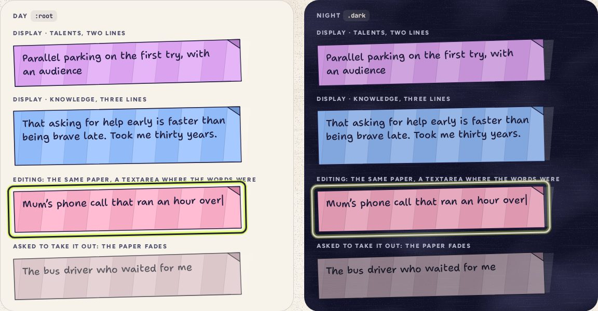

# PaperStrip

> 17 · Paper objects · Threefold · custom · `src/components/threefold/paper-strip.tsx`

A star unfolded: the strip of colored paper it was made from, with your words on it in your hand. Creases every 44 px, a folded corner, a slight tilt. It unrolls when a star opens, becomes a textarea when you rewrite it, and fades when you are asked about taking it out. Paper keeps its ink at night.

**Used on:** Shelf · a day’s stars, Shake · the memory, Shake · the year card, Review · last week

**Built from:** `CSS gradients`, `font-hand`, `data-cat`

## States (Day and Night)



## API

### `<PaperStrip>`

| Prop | Type | Default | Notes |
|---|---|---|---|
| `category` | `CategoryKey` |  | The paper color, `--cat`, with `--cat-shade` on the folded corner. |
| `lines` | `2 \| 3` | `2` | Room for two lines on a phone sheet, three for the memory. |
| `size` | `number` | `19` | Font size in px; 18.5 in the year card, 20 on desktop. |
| `rotate` | `number` | `-1.5` | Degrees. Paper is never laid down straight. |
| `unroll` | `boolean` | `false` | Play `animate-unroll` on mount: the strip opens from the left (Motion spec F). |
| `state` | `"editing" \| "doomed" \| "crumple"` |  | `editing` rings it for focus; `doomed` desaturates while the take-out question is open; `crumple` drops it away. |
| `children` | `ReactNode` |  | The words, or a textarea while editing. |

## Usage

`src/screens/shelf/star-panel.tsx`

```tsx
import { PaperStrip } from "@/components/threefold/paper-strip"

<PaperStrip category={star.category} unroll>
  {star.text}
</PaperStrip>

{/* rewriting it: same paper, a textarea where the words were, still one line of at most 120 characters */}
<PaperStrip category={star.category} state={editing ? "editing" : undefined}>
  <textarea
    aria-label="The words on this star"
    rows={2}
    maxLength={120}
    enterKeyHint="done"
    value={draft}
    onChange={(e) => setDraft(e.target.value.replace(/\n/g, " "))}   // a pasted line break becomes a space
    onKeyDown={(e) => {
      if (e.key === "Escape") return cancel()
      if (e.key !== "Enter" || e.nativeEvent.isComposing) return      // composition input is never cut off
      e.preventDefault()                                              // one line: no Enter breaks it, Shift or not
      if (!e.shiftKey) save()
    }}
    className="w-full resize-none bg-transparent outline-none"
  />
</PaperStrip>
```

## Implementation

A sketch, correct in intent but not compiled: check it against the current library APIs.

`src/components/threefold/paper-strip.tsx`

```tsx
// src/components/threefold/paper-strip.tsx
export function PaperStrip({ category, lines = 2, size = 19, rotate = -1.5, unroll = false, state, className, children, ...props }: PaperStripProps) {
  return (
    <div
      data-slot="paper-strip"
      data-cat={category}
      data-state={state}
      style={{ rotate: `${rotate}deg`, ["--lines" as string]: lines }}
      className={cn(
        "relative min-h-[calc(30px+var(--lines)*1.38em)] rounded-[2px] border-[1.6px] border-paper-ink bg-(--cat) pt-3.5 pr-[22px] pl-[18px] font-hand leading-[1.38] text-paper-ink [font-variation-settings:'INFM'_70,'BNCE'_22] text-pretty",
        "bg-[repeating-linear-gradient(100deg,transparent_0_44px,rgb(255_255_255/.16)_44px_88px)]",
        "after:absolute after:-top-px after:-right-px after:size-6 after:bg-(--cat-shade) after:[clip-path:polygon(0_0,100%_0,100%_100%)]",
        "dark:brightness-90",
        unroll && "animate-unroll motion-reduce:animate-none",
        "transition-[filter,opacity,translate,rotate,scale] data-[state=doomed]:opacity-72 data-[state=doomed]:saturate-35",
        "data-[state=crumple]:animate-crumple",
        className
      )}
      {...props}
    >
      <p className="relative m-0" style={{ fontSize: size }}>{children}</p>
    </div>
  )
}
```

## Classes and tokens

`text-paper-ink` is the indigo that never flips: paper objects keep their ink at night.

| Part | Classes |
|---|---|
| Paper | `bg-(--cat) border-[1.6px] border-paper-ink rounded-[2px]` |
| Creases | `repeating-linear-gradient(100deg, …44px…) white at 16%` |
| Corner | `after: bg-(--cat-shade) triangle, 24 px` |
| Words | `font-hand leading-[1.38] text-paper-ink · INFM 70, BNCE 22` |
| Night | `dark:brightness-90; words stay paper-ink` |
| Doomed | `saturate-35 opacity-72  ·  crumple: animate-crumple` |

## Accessibility

- The words are real text, so they can be read, selected and zoomed; nothing is drawn as an image.
- While editing, the textarea is named “The words on this star”; Enter saves, Esc cancels. The words stay one line of at most 120 characters: Shift+Enter does nothing, a pasted line break becomes a space, and composition input (IME) is never cut off.
- Paper-ink words on the eight papers: 8.6:1 to 11.3:1 by day, 7.8:1 or better at 90% brightness at night.

## Motion

- Unroll: clip-path from 92% inset to 0 on spring.soft, 600 ms, 120 ms after the star unwinds; the words fade in after (140 ms), so they never slide.
- Crumple: down 34 px, 16°, to 35% and gone in 380 ms, ease-in (Motion spec L).
- Reduced motion: fades only.

## Sound

- Unroll: the crinkle, reversed, on the star’s note.
- Saved after a rewrite: a short crinkle.
- Taken out: crinkle, then a D4 tick 220 ms later.
