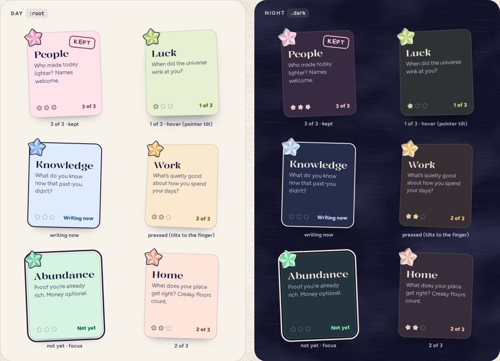

# SpreadCard

> 23 · Review · Base UI · Button · `src/components/threefold/spread-card.tsx`

No shadcn primitive to add: it's Base UI's unstyled Button, a native `<button>` with a card's look.

One category on the Review’s spread of eight: a tinted card, laid down a little crooked, its star hanging over the corner. It says how many of its three are in, and once all three are, it gets stamped “kept” in the category’s deep ink. Tap it to write in it; it tilts toward your pointer or finger.

**Used on:** Review, all platforms

**Built from:** `Button (Base UI, a native button with a card’s look)`, `PaperStar`, `FoldProgress`, `KeptStamp`, `usePointerTilt`

## States (Day and Night)



## API

### `<SpreadCard>`

| Prop | Type | Default | Notes |
|---|---|---|---|
| `category` | `CategoryKey` |  |  |
| `count` | `0 \| 1 \| 2 \| 3` |  | Stars in for this category this week. 3 stamps it. |
| `writing` | `boolean` | `false` | The one open in the WritingCard: a 2.5 px ink border and “Writing now”. |
| `tilt` | `number` |  | How crooked it lies, in degrees. Fixed per category so the spread always looks the same. |
| `onOpen` | `() => void` |  | Makes it the writing card. |

### `<KeptStamp>`

| Prop | Type | Default | Notes |
|---|---|---|---|
| `fresh` | `boolean` | `false` | Stamp it now: `animate-stamp` from ×2.4 and −14°. |

## Usage

`src/screens/review/spread.tsx`

```tsx
<div className="grid grid-cols-2 gap-2.5 md:grid-cols-4">
  {ORDER.map((k, i) => (
    <SpreadCard
      key={k}
      category={k}
      count={week.byCategory[k]}
      writing={k === writingNow}
      tilt={TILTS[i]}                    // −2.2, 1.8, 1.2, −1.6, −1.3, 2.1, 1.5, −2.4
      onOpen={() => setWritingNow(k)}
    />
  ))}
</div>
```

## Implementation

A sketch, correct in intent but not compiled: check it against the current library APIs.

`src/components/threefold/spread-card.tsx`

```tsx
// src/components/threefold/spread-card.tsx
// A native <button> with a card's look. shadcn's Card is a plain div, and this is a button.
// Base UI's unstyled Button, not shadcn's, whose classes would restyle the card and shrink its stars.
import { Button as ButtonPrimitive } from "@base-ui/react/button"

export function SpreadCard({ category, count, writing, tilt, onOpen }: SpreadCardProps) {
  const c = CATEGORIES[category]
  const { ref, style, handlers } = usePointerTilt({ max: 7, perspective: 700 })      // spring.soft; off with reduced motion
  return (
    <ButtonPrimitive
      ref={ref}
      data-cat={category}
      data-writing={writing || undefined}
      className="relative flex min-h-[196px] w-[168px] flex-col items-start gap-1.5 rounded-[16px] border-[1.5px] border-ink/20 bg-(--cat-light) px-3.5 pt-[38px] pb-3.5 text-left shadow-paper transition-[box-shadow] data-writing:border-[2.5px] data-writing:border-ink pointer-fine:hover:shadow-float"
      style={{ ...style, rotate: `${tilt}deg` }}
      onClick={onOpen}
      aria-label={`${c.name}, ${writing ? "writing now" : count === 3 ? "done" : count ? `${count} of 3` : "not yet"}`}
      {...handlers}
    >
      <PaperStar aria-hidden category={category} size={54} rotate={tilt * 4} className="absolute -top-4 -left-3" />
      {count === 3 && <KeptStamp />}
      <span className="font-display text-[21px] leading-[1.05] font-medium [font-stretch:104%]">{c.name}</span>
      <span className="flex-1 text-[13px] leading-[1.38] text-ink-2">{c.prompt}</span>
      <span className="mt-1 flex w-full items-center justify-between">
        <FoldProgress count={count} category={category} size={15} />
        <span className="text-xs font-extrabold text-(--cat-deep)">{writing ? "Writing now" : count ? `${count} of 3` : "Not yet"}</span>
      </span>
    </ButtonPrimitive>
  )
}

export function KeptStamp({ fresh }: { fresh?: boolean }) {
  return (
    <span aria-hidden className={cn("absolute top-3 right-2.5 rotate-8 rounded-[8px] border-2 border-(--cat-deep) px-2 py-0.5 font-hand text-sm font-bold tracking-[.06em] text-(--cat-deep) uppercase", fresh && "animate-stamp")}>
      kept
    </span>
  )
}
```

## Classes and tokens

| Part | Classes |
|---|---|
| Card | `w-[168px] min-h-[196px] rounded-[16px] bg-(--cat-light) border-[1.5px] border-ink/20 shadow-paper` |
| Writing | `border-[2.5px] border-ink` |
| Name | `font-display text-[21px] font-medium [font-stretch:104%]` |
| Status | `text-xs font-extrabold text-(--cat-deep)` |
| Stamp | `font-hand text-sm font-bold uppercase border-2 border-(--cat-deep) rotate-8 · INFM 90` |
| Tilt | `perspective(700px), max 7°, spring.soft` |

## Accessibility

- Each card is one button whose name has everything: “Luck, 1 of 3”, “People, done”.
- The stamp and the big star are decoration; the name already says done.
- Pointer tilt never moves the hit area enough to matter, and it is off with reduced motion.

## Motion

- Deal: the eight fall in 60 ms apart, from −60 px, ×0.72, on spring.bouncy (740 ms).
- Stamp: 500 ms, cubic-bezier(.2, 1.4, .4, 1), from ×2.4 and −14° to 8°.
- Hover/touch tilt: up to 7° toward the pointer on spring.soft (Motion spec I).

## Sound

- Switching to another card: a short reversed crinkle as it flips.
- A card reaching 3 of 3: a soft chord, 90 ms after the third tick.
