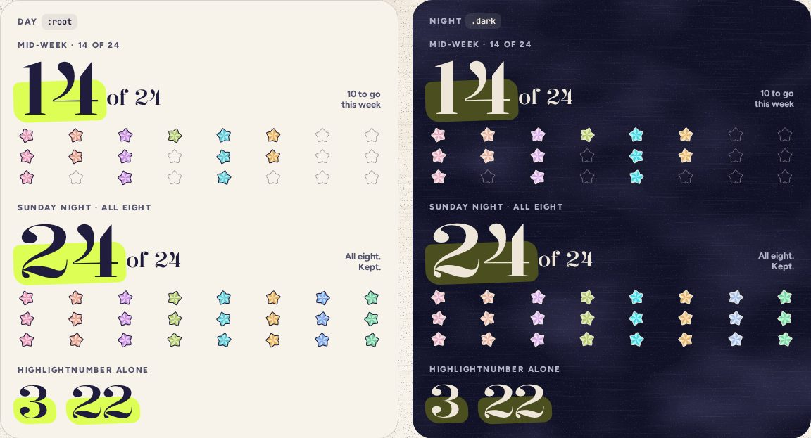

# WeekTally

> 22 · Review · Threefold · custom · `src/components/threefold/week-tally.tsx`

How the week’s full review is going, at a glance: a big number on a stroke of highlighter, “of 24”, and a grid of eight columns, one per category, three stars tall. Empty places are dashed, never red. It counts up when Review opens, and a new star pops into its place when one is folded.

**Used on:** Review, all platforms, A new week · last week, kept

**Built from:** `HighlightNumber`, `StarGrid`, `PaperStar`, `useCountUp`

## States (Day and Night)



## API

### `<WeekTally>`

| Prop | Type | Default | Notes |
|---|---|---|---|
| `byCategory` | `Record<CategoryKey, 0 \| 1 \| 2 \| 3>` |  | Stars folded this week per category, Monday to Sunday, today’s included. |

### `<HighlightNumber>` (also on Insights and the last-week card)

| Prop | Type | Default | Notes |
|---|---|---|---|
| `children` | `ReactNode` |  | The figure. Size it with a text class. |
| `…props` | `React.ComponentProps<"span">` |  |  |

### `<StarGrid>`

| Prop | Type | Default | Notes |
|---|---|---|---|
| `byCategory` | `Record<CategoryKey, number>` |  |  |
| `size` | `number` | `26` | 19 in the phone’s compact header. |

## Usage

`src/routes/_app/review.tsx`

```tsx
<p className="text-kicker font-extrabold text-ink-2 uppercase">Weekly full review · Sep 21–27</p>
<h1 className="font-display text-[33px]">All eight,<br />if you’re up for it.</h1>
<WeekTally byCategory={week.byCategory} />
```

## Implementation

A sketch, correct in intent but not compiled: check it against the current library APIs.

`src/components/threefold/week-tally.tsx`

```tsx
// src/components/threefold/week-tally.tsx
export function WeekTally({ byCategory }: { byCategory: Record<CategoryKey, number> }) {
  const done = ORDER.reduce((n, k) => n + byCategory[k], 0)
  const shown = useCountUp(done, { duration: 700 })                // 0 → 14 on open; instant with reduced motion
  return (
    <div data-slot="week-tally">
      <div className="flex items-end justify-between gap-3">
        <p className="flex items-end gap-2.5" aria-label={`${done} of 24 folded`}>
          <HighlightNumber aria-hidden className="text-[104px]">{shown}</HighlightNumber>
          <span aria-hidden className="pb-2 font-display text-3xl font-[470]">of 24</span>
        </p>
        <p className="mb-2.5 text-right text-[13px] font-bold text-ink-2">
          {done === 24 ? <>All eight.<br />Kept.</> : <>{24 - done} to go<br />this week</>}
        </p>
      </div>
      <StarGrid className="mt-3.5" byCategory={byCategory} />
    </div>
  )
}

export function HighlightNumber({ className, children, ...props }: React.ComponentProps<"span">) {
  return (
    <span className={cn("relative inline-block font-display leading-[.8] font-[470] tracking-[-.02em] [font-stretch:104%]", className)} {...props}>
      <span aria-hidden className="absolute -right-2.5 -bottom-1.5 -left-1.5 top-[38%] -rotate-2 rounded-[10px_18px_12px_20px] bg-highlight" />
      <span className="relative">{children}</span>
    </span>
  )
}

export function StarGrid({ byCategory, className }: StarGridProps) {
  const total = ORDER.reduce((n, k) => n + byCategory[k], 0)
  return (
    <div role="img" aria-label={`${total} of 24 stars folded this week`} className={cn("flex justify-between", className)}>
      {ORDER.map((k, i) => (
        <div key={k} className="flex flex-col gap-1">
          {[0, 1, 2].map((j) =>
            j < byCategory[k]
              ? <PaperStar key={j} category={k} size={26} rotate={((i * 13 + j * 29) % 40) - 20} className="animate-slot-pop" />
              : <PaperStar key={j} variant="empty" size={26} className="text-ink/40" />)}
        </div>
      ))}
    </div>
  )
}
```

## Classes and tokens

| Part | Classes |
|---|---|
| Figure | `font-display text-[104px] font-[470] [font-stretch:104%] leading-[.8]` |
| Swash | `bg-highlight -rotate-2 rounded-[10px_18px_12px_20px], from 38% down` |
| Grid | `8 × 3 PaperStar 26 px · empty text-ink/40 dash 5 6` |
| Night | `swash #4B4E1E under moon figures` |

## Accessibility

- Read as one sentence: “14 of 24 folded”; the big digits and the grid are hidden or summarized.
- The grid is one image with words, not 24 separate stars.
- No failure colors. Twenty-four is a nice week, not a target you missed.

## Motion

- Opening Review counts 0 → 14 over 700 ms and pops the grid in, 36 ms apart, from ×0.2 and −80° on spring.bouncy.
- A new star: only its cell pops; the figure bumps (×1.18 → 1, spring.bouncy, 500 ms).
- Reduced motion: final numbers, no pops.

## Sound

- 24 of 24: cork pop, then the six notes of the key rolled up, 40 ms apart.
