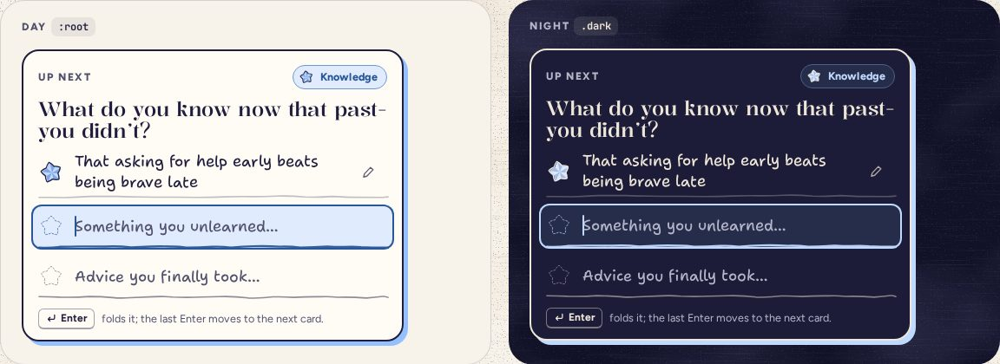

# WritingCard

> 24 · Review · shadcn/ui · Card · `src/components/threefold/writing-card.tsx`

The Review card you are writing in: white card stock with an ink border and a printed shadow in the category’s color, its prompt, and the same three EntryLines as Today. The last Enter flips it over to the next category that still has room, so you can go around all eight without lifting your hands.

**Used on:** Review, all platforms

**Built from:** `Card`, `CategoryTag`, `EntryLine`, `Kbd`

## States (Day and Night)



## API

### `<WritingCard>`

| Prop | Type | Default | Notes |
|---|---|---|---|
| `category` | `CategoryKey` |  | Changing it flips the card (380 ms). |
| `lines` | `EntryLineState[]` |  | Three, with what is already folded this week shown as saved. |
| `onFold` | `(line: number, text: string, from: DOMRect) => void` |  | Same flight as Today: the star goes to the docked jar in the header. |
| `onDone` | `() => void` |  | After the third: move on to the next category with room. |

## Usage

`src/routes/_app/review.tsx`

```tsx
<WritingCard
  category={writingNow}
  lines={week.lines[writingNow]}
  onFold={(i, text, from) => fold({ category: writingNow, text, from, line: i })}
  onDone={() => setWritingNow(nextUnfinished(week))}
/>
```

## Implementation

A sketch, correct in intent but not compiled: check it against the current library APIs.

`src/components/threefold/writing-card.tsx`

```tsx
// src/components/threefold/writing-card.tsx
export function WritingCard({ category, lines, onFold, onDone }: WritingCardProps) {
  const [flip, setFlip] = React.useState(0)
  React.useEffect(() => setFlip((f) => f + 1), [category])          // a new category flips the card
  return (
    <Card
      key={flip}
      data-cat={category}
      aria-labelledby="up-next"
      className="animate-card-flip rounded-[20px] border-2 border-ink bg-card px-[17px] pt-4 pb-3 shadow-card-cat motion-reduce:animate-none"
    >
      <CardHeader className="flex-row items-center justify-between p-0">
        <span className="text-kicker font-extrabold text-ink-2 uppercase">Up next</span>
        <CategoryTag category={category} size="s" />
      </CardHeader>
      <CardTitle id="up-next" className="mt-2.5 mb-0.5 font-display text-[23px] leading-[1.1] font-[480]">
        {CATEGORIES[category].prompt}
      </CardTitle>
      <div role="group" aria-labelledby="up-next">
        {lines.map((line, i) => (
          <EntryLine key={i} index={i as 0 | 1 | 2} category={category} {...line} size="compact"
            onFold={(text, from) => { onFold(i, text, from); if (i === 2) onDone() }} />
        ))}
      </div>
      <p className="mt-2 flex items-center gap-2 text-[12.5px] text-ink-2">
        <Kbd><Icon name="enter" /> Enter</Kbd> folds it; the last Enter moves to the next card.
      </p>
    </Card>
  )
}
```

## Classes and tokens

`shadow-card-cat` and `animate-card-flip` are added to styles.css with this frame.

| Part | Classes |
|---|---|
| Card | `rounded-[20px] border-2 border-ink bg-card px-[17px] pt-4 pb-3` |
| Print | `shadow-card-cat → 5px 5px 0 var(--cat-star)  (6 px on desktop)` |
| Prompt | `font-display text-[23px] font-[480]` |
| Flip | `animate-card-flip: rotateY 0 → 88°, −88° → 0, 380 ms` |

## Accessibility

- A region named by its prompt; its three lines are a group with the same name.
- When it flips to a new category, focus goes to that card’s first open line and the prompt is announced.
- The printed shadow is decoration; the ink border carries the edge (14.7:1).

## Motion

- Flip: 380 ms, cubic-bezier(.4, 0, .2, 1), swapping contents at the edge-on moment.
- Stars fly to the header dock, which bumps its +n badge on spring.bouncy.
- Reduced motion: the contents cross-fade.

## Sound

- Lines: crinkle and ticks as on Today.
- The flip: a short reversed crinkle.
