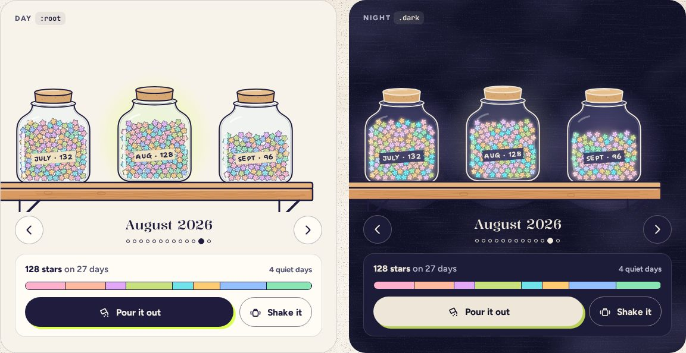

# JarShelf

> 25 · Shelf and Shake · shadcn/ui · Carousel · `src/components/threefold/jar-shelf.tsx`

Install the primitive: `pnpm dlx shadcn@latest add carousel`

Every month’s jar on a wooden plank, oldest on the left. Drag it and it snaps to the nearest jar; the one in the middle lifts a little under a soft highlighter spotlight. The live month is the traveling jar itself, riding the plank. Below it, a switcher for anyone who would rather not drag, and the month’s card with its count, its color mix and Pour it out.

**Used on:** Shelf, all platforms, A new month · the sealed shelf

**Built from:** `Carousel (Embla)`, `Jar`, `Plank`, `Button`, `useJarSlot`

## States (Day and Night)



## API

### `<JarShelf>`

| Prop | Type | Default | Notes |
|---|---|---|---|
| `months` | `Month[]` |  | `{ key, long, tape, total, days, stars, live }`, oldest first. |
| `value` | `number` |  | The focused month. |
| `onValueChange` | `(index: number) => void` |  | After a drag settles or an arrow is used. |
| `onPour` | `(month: Month) => void` |  | Tapping the focused jar pours it (Motion spec E). |

### `<MonthSwitcher>`

| Prop | Type | Default | Notes |
|---|---|---|---|
| `value` | `number` |  |  |
| `onPrevious / onNext` | `() => void` |  | The ← → buttons, named “Previous month: July”; disabled at the ends with `aria-disabled` (Base UI’s `disabled` plus `focusableWhenDisabled`). |

### `<MonthCard>`

| Prop | Type | Default | Notes |
|---|---|---|---|
| `month` | `Month` |  | Total, days with a star, quiet days, and the category mix bar. |
| `onPour` | `() => void` |  |  |
| `onShake` | `() => void` |  |  |

## Usage

`src/routes/_app/shelf.tsx`

```tsx
const navigate = useNavigate()

<JarShelf months={months} value={focus} onValueChange={setFocus} />

<MonthSwitcher
  months={months}
  value={focus}
  onPrevious={() => setFocus((f) => f - 1)}
  onNext={() => setFocus((f) => f + 1)}
/>

<MonthCard month={months[focus]} onPour={pour} onShake={() => navigate({ to: "/shake" })} />
```

## Implementation

A sketch, correct in intent but not compiled: check it against the current library APIs.

`src/components/threefold/jar-shelf.tsx`

```tsx
// src/components/threefold/jar-shelf.tsx
export function JarShelf({ months, value, onValueChange }: JarShelfProps) {
  const [api, setApi] = React.useState<CarouselApi>()
  React.useEffect(() => {
    if (!api) return
    api.scrollTo(value, true)
    const onSelect = () => { onValueChange(api.selectedScrollSnap()); tick(noteForMonth(api.selectedScrollSnap())) }
    api.on("select", onSelect)
    return () => { api.off("select", onSelect) }
  }, [api])

  return (
    <Carousel setApi={setApi} opts={{ align: "center", startIndex: value, dragFree: false, duration: 32 }} aria-label="Shelf of monthly jars" className="relative">
      <CarouselContent className="-ml-0 items-end">
        {months.map((m, i) => (
          <CarouselItem key={m.key} className="basis-[214px] pl-0">
            <button
              type="button"
              aria-label={`${m.long}, ${m.total} stars`}
              aria-current={i === value || undefined}
              onClick={() => (i === value ? onPour(m) : api?.scrollTo(i))}
              className="group mx-auto block rounded-[26px] transition-transform duration-280 ease-spring-snappy aria-[current=true]:-translate-y-1"
            >
              {m.live ? <div ref={useJarSlot("shelf")} className="h-[285px] w-[228px]" /> : <Jar stars={m.stars} label={m.tape} size={196} />}
            </button>
          </CarouselItem>
        ))}
      </CarouselContent>
      <Plank className="pointer-events-none absolute inset-x-0 bottom-0" />
    </Carousel>
  )
}
```

## Classes and tokens

| Part | Classes |
|---|---|
| Item | `basis-[214px] · jar 196 px · focused -translate-y-1` |
| Spotlight | `radial-gradient(closest-side, highlight 55%, transparent)` |
| Plank | `fill-wood stroke-paper-ink · grain fill-wood-dark (keeps its color at night)` |
| Month card | `rounded-lg bg-card border-[1.5px] border-border p-4` |
| Mix bar | `h-3 rounded-full, one segment per category in --{cat}` |

## Accessibility

- Embla drag is a bonus: the switcher’s buttons and ← → on the focused shelf do the same, and each jar is a button named “August 2026, 128 stars”.
- The focused jar is `aria-current`; changing month announces “August 2026, 128 stars”.
- The color mix has words: “Category mix: mostly People and Luck”.

## Motion

- Drag 1:1 with a rubber band at the ends; release projects the flick 240 ms ahead and snaps on spring.soft.
- Focus lift: 4 px on spring.snappy. The live jar sways while focused.
- Reduced motion: jumps between jars, no sway.

## Sound

- Snapping to a jar: glass on wood, a tick on the month’s note (D, E, F♯, A, B, cycling).
- Taking a jar down: a soft cork pop.
