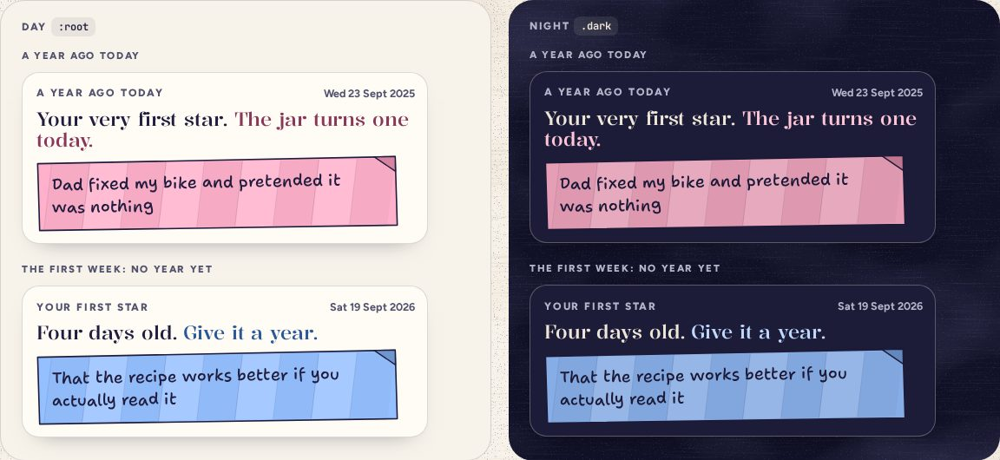

# MemoryCard

> 28 · Shelf and Shake · shadcn/ui · Card · `src/components/threefold/memory-card.tsx`

A star from the past, on card stock, under the Shake jar: what you wrote a year ago today, or the nearest day before it. While the jar is younger than a year, it shows your very first star instead. The headline is two short sentences, the second in the category’s deep ink.

**Used on:** Shake, all platforms

**Built from:** `Card`, `PaperStrip`, `yearCard()`

## States (Day and Night)



## API

### `<MemoryCard>`

| Prop | Type | Default | Notes |
|---|---|---|---|
| `kicker` | `string` |  | “A year ago today”, “About a year ago” or “Your first star”. |
| `date` | `string` |  | “Wed, Sep 23, 2025”. |
| `head / head2` | `string` |  | “Your very first star.” / “The jar turns one today.” |
| `star` | `Star` |  | Its words and category; the strip is drawn from it. |

## Usage

`src/routes/_app/shake.tsx`

```tsx
const card = yearCard(today, stars)     // a year ago today or the nearest day before it; the first star while the jar is younger than a year

<MemoryCard kicker={card.kicker} date={card.date} head={card.head} head2={card.head2} star={card.star} />
```

## Implementation

A sketch, correct in intent but not compiled: check it against the current library APIs.

`src/components/threefold/memory-card.tsx`

```tsx
// src/components/threefold/memory-card.tsx
export function MemoryCard({ kicker, date, head, head2, star }: MemoryCardProps) {
  return (
    <Card aria-label={kicker} data-cat={star.category} className="gap-2.5 rounded-[20px] border-[1.5px] bg-card px-4 py-4 shadow-paper">
      <CardHeader className="flex-row items-center justify-between p-0">
        <p className="text-kicker font-extrabold text-ink-2 uppercase">{kicker}</p>
        <p className="text-[12.5px] font-bold text-ink-2">{date}</p>
      </CardHeader>
      <CardTitle className="font-display text-[22px] leading-[1.1] font-[480]">
        {head} <span className="text-(--cat-deep)">{head2}</span>
      </CardTitle>
      <PaperStrip category={star.category} rotate={-1} size={18.5}>{star.text}</PaperStrip>
    </Card>
  )
}
```

## Classes and tokens

| Part | Classes |
|---|---|
| Card | `rounded-[20px] border-[1.5px] bg-card p-4 shadow-paper` |
| Headline | `font-display text-[22px] font-[480] · second half text-(--cat-deep)` |
| Strip | `PaperStrip rotate -1, 18.5 px` |

## Accessibility

- A region named by its kicker; the date is text, the strip is real words.
- The shaken-out memory opens in a Sheet with the same parts, and `role="status"` reads its one-line quip.

## Motion

- Arrives with the screen’s stagger. Nothing else: this one sits still.

## Words

- The quips after a shake are per category: “Maybe tell them. Again.”, “Still got it.”, “Past-you was on a roll.”
