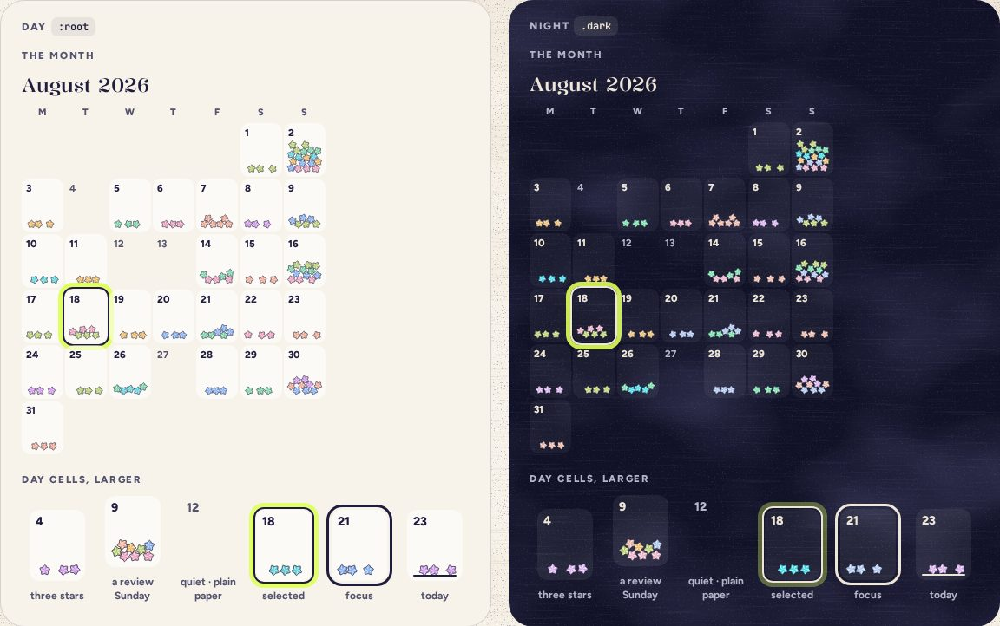

# MonthCalendar

> 26 · Shelf and Shake · shadcn/ui · Calendar · `src/components/threefold/month-calendar.tsx`

Install the primitive: `pnpm dlx shadcn@latest add calendar`

A month poured out: each day a small paper cell with that day’s stars piled in it, a review Sunday visibly fuller, and quiet days left as plain paper. Never a gap marked in red. It is shadcn’s Calendar underneath, so the grid, the arrow keys and the labels come for free; only the day button is drawn by us.

**Used on:** Shelf, poured, Desktop and tablet Shelf

**Built from:** `Calendar (react-day-picker 10)`, `PaperStar`, `packPile()`

## States (Day and Night)



## API

### `<MonthCalendar>`

| Prop | Type | Default | Notes |
|---|---|---|---|
| `month` | `Date` |  | Any date in the month to show. |
| `days` | `Record<number, CategoryKey[]>` |  | Each day’s stars in the order they were folded. A day with none is plain paper, and can’t be pressed. |
| `quiet` | `number[]` |  | The days that count as quiet, from the domain’s month view (system design §3.3). Other empty days, such as future days, aren’t quiet, and are named by their date only. |
| `selected` | `Date \| undefined` |  | The day whose stars are unfolded in the StarPanel. |
| `onSelect` | `(day: Date \| undefined) => void` |  |  |

## Usage

`src/screens/shelf/poured.tsx`

```tsx
<MonthCalendar
  month={new Date(2026, 7)}
  days={august.days}                    // { [day]: CategoryKey[] }
  quiet={august.quiet}                  // from the shelf view: which empty days count as quiet
  selected={openDay}
  onSelect={(d) => { setOpenDay(d); tick(noteForDay(d)) }}
/>
<StarPanel day={openDay} … />
```

## Implementation

A sketch, correct in intent but not compiled: check it against the current library APIs.

`src/components/threefold/month-calendar.tsx`

```tsx
// src/components/threefold/month-calendar.tsx: shadcn Calendar (react-day-picker), with a DayButton that draws the day's stars
// Needs checking against react-day-picker 10, which shadcn's calendar now installs: this sketch was written for v9.
export function MonthCalendar({ month, days, quiet, selected, onSelect }: MonthCalendarProps) {
  return (
    <Calendar
      mode="single"
      month={month}
      hideNavigation
      showOutsideDays={false}
      weekStartsOn={1}
      selected={selected}
      onSelect={onSelect}
      disabled={(d) => !days[d.getDate()]?.length}                       // empty days: plain paper, not buttons you can press
      formatters={{ formatWeekdayName: (d) => d.toLocaleDateString("en-US", { weekday: "narrow" }) }}
      labels={{ labelDayButton: (d) => dayLabel(d, days[d.getDate()], quiet.includes(d.getDate())) }}   // "Aug 18, 3 stars" · "Aug 12, a quiet day" · "Aug 30"
      classNames={{ day: "p-px", weekday: "text-[11px] font-extrabold tracking-[.08em] text-ink-2" }}
      components={{ DayButton: (props) => <PaperDayButton {...props} stars={days[props.day.date.getDate()] ?? []} /> }}
    />
  )
}

// Like calendar.tsx's CalendarDayButton, it reads `modifiers` and focuses itself when `modifiers.focused`,
// as react-day-picker's own DayButton does. Without that, the arrow keys stop moving focus.
function PaperDayButton({ day, modifiers, stars, ...props }: React.ComponentProps<typeof DayButton> & { stars: CategoryKey[] }) {
  const ref = React.useRef<HTMLButtonElement>(null)
  React.useEffect(() => { if (modifiers.focused) ref.current?.focus() }, [modifiers.focused])
  return (
    <button
      ref={ref}
      {...props}
      data-selected={modifiers.selected}                                 // react-day-picker marks the cell, not the button
      className="squish group relative h-[62px] w-12 rounded-sm bg-white/55 disabled:bg-transparent data-[selected=true]:ring-[2.5px] data-[selected=true]:ring-ink data-[selected=true]:shadow-[0_0_0_7.5px_var(--halo)] dark:bg-white/7"
    >
      <span className="absolute top-1 left-[5px] text-[11.5px] font-extrabold text-ink group-disabled:font-bold group-disabled:text-ink-2">{day.date.getDate()}</span>
      <DayPile stars={stars} />                                          {/* PaperStar 10.5 px, packed with the seeded drop */}
    </button>
  )
}
```

## Classes and tokens

| Part | Classes |
|---|---|
| Cell | `h-[62px] w-12 rounded-sm bg-white/55 (white/7 at night)` |
| Number | `text-[11.5px] font-extrabold · quiet: font-bold text-ink-2` |
| Selected | `ring-[2.5px] ring-ink + 7.5 px halo` |
| Pile | `PaperStar 10.5 px, seeded drop inside the cell` |
| Empty day, quiet or not | `bg-transparent, disabled, the number only` |

## Accessibility

- react-day-picker renders a real grid: arrow keys move by day and week, Home/End to the week’s ends, Page Up/Down by month.
- Each day is named with its count: “Aug 18, 3 stars”, “Aug 12, a quiet day”. An empty day that isn’t quiet, such as a future day, is named by its date only: “Aug 30”.
- Empty days are disabled, so they’re skipped by Tab but still read in the grid.

## Motion

- Pour (Motion spec E): stars stream from the tipped jar and land in their cells, 12 ms apart.
- Selecting a day: the ring appears at once; its stars unfold in the StarPanel.
- Reduced motion: the calendar fades in already full.

## Sound

- Pour: ticks cascading on random rungs of the scale, at most 24 voices.
- Opening a day: the reversed crinkle, on the star’s note.
