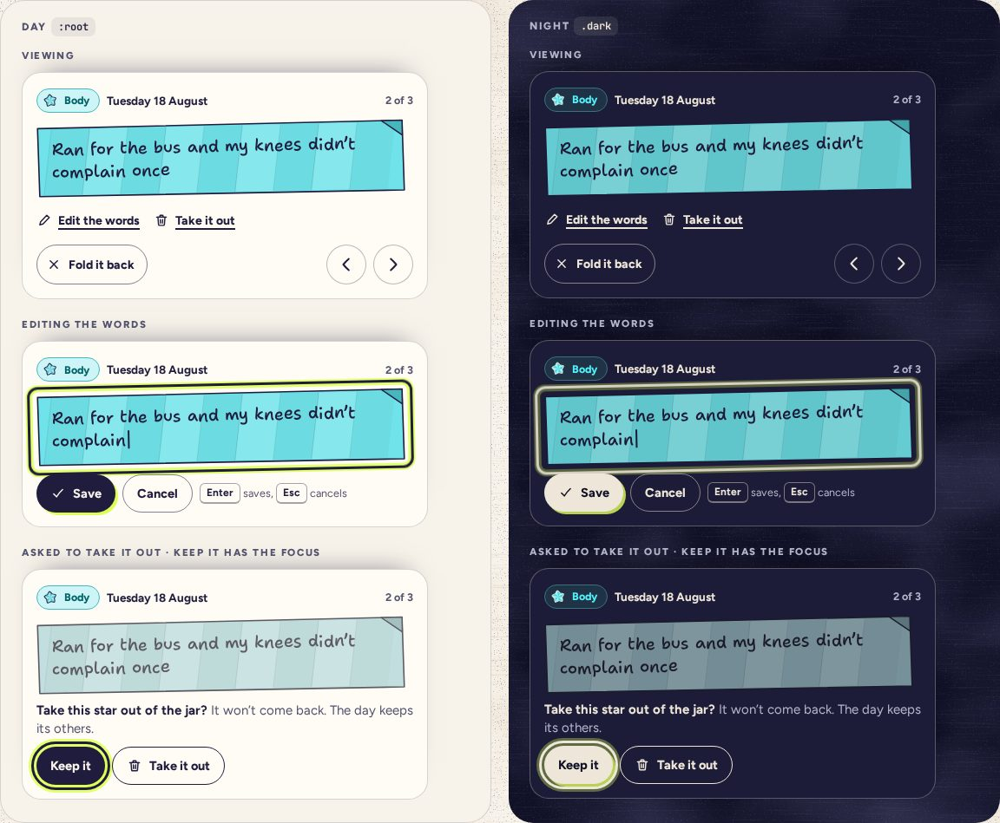

# StarPanel

> 27 · Shelf and Shake · Threefold · custom, in Sheet or aside · `src/components/threefold/star-panel.tsx`

A day’s stars, unfolded one at a time. It shows the strip with your words and lets you step through the day, rewrite a star, or take it out. Taking out asks first, in place, with Keep it holding the focus; the month’s count, the jar’s tape and Insights all drop by one when you confirm.

**Used on:** Shelf, all platforms

**Built from:** `PaperStrip`, `CategoryTag`, `Button`, `Kbd`, `BottomSheet (phone)`

## States (Day and Night)



## API

### `<StarPanel>`

| Prop | Type | Default | Notes |
|---|---|---|---|
| `day` | `Date` |  | Shown in the header as “Tue, Aug 18”. |
| `stars` | `Star[]` |  | The day’s stars: `{ id, category, text }`. |
| `index / onIndexChange` | `number · (i: number) => void` |  | Which star is unfolded; the arrows step through the day. |
| `onClose` | `() => void` |  | “Fold it back”, or Esc while viewing. |
| `onRewrite` | `(star: Star, text: string) => void` |  | Saves new words, one line of at most 120 characters; the star keeps its date and color. |
| `onTakeOut` | `(star: Star) => void` |  | After the in-place confirm. Crumple, then everything counts one fewer. |

## Usage

`src/screens/shelf/poured.tsx`

```tsx
// phone: a non-modal Drawer above the tab bar · tablet: under the calendar · desktop: the right column
const isPhone = useMediaQuery("(max-width: 767px)")

{isPhone ? (
  <BottomSheet open={!!openDay} onOpenChange={(o) => !o && setOpenDay(undefined)} modal={false} aboveTabBar label="Unfolded star">
    <StarPanel day={openDay} stars={starsOn(openDay)} … />
  </BottomSheet>
) : (
  <aside className="sticky top-6"><StarPanel day={openDay} stars={starsOn(openDay)} … /></aside>
)}
```

## Implementation

A sketch, correct in intent but not compiled: check it against the current library APIs.

`src/components/threefold/star-panel.tsx`

```tsx
// src/components/threefold/star-panel.tsx: one panel, three modes
export function StarPanel({ day, stars, index, onIndexChange, onClose, onRewrite, onTakeOut }: StarPanelProps) {
  const [mode, setMode] = React.useState<"view" | "edit" | "confirm">("view")
  const star = stars[index]
  const keep = React.useRef<HTMLButtonElement>(null)
  React.useEffect(() => { if (mode === "confirm") keep.current?.focus() }, [mode])

  return (
    <section aria-label="Unfolded star" data-cat={star.category} className="flex flex-col gap-3" onKeyDown={(e) => { if (e.key !== "Escape") return; if (mode === "view") return onClose(); e.stopPropagation(); setMode("view") }}>
      <header className="flex items-center justify-between">
        <span className="flex items-center gap-2"><CategoryTag category={star.category} size="s" /><span className="text-[13.5px] font-bold">{dayTitle(day)}</span></span>
        <span className="text-[12.5px] font-bold text-ink-2">{index + 1} of {stars.length}</span>
      </header>

      {/* a rewrite stays one line of 120 characters at most: Enter saves, and Shift+Enter adds no line break */}
      <PaperStrip category={star.category} unroll={mode === "view"} state={mode === "edit" ? "editing" : mode === "confirm" ? "doomed" : undefined}>
        {mode === "edit" ? <StripTextarea defaultValue={star.text} maxLength={120} onSave={(t) => { onRewrite(star, t); setMode("view") }} onCancel={() => setMode("view")} /> : star.text}
      </PaperStrip>

      {mode === "view" && (
        <>
          <div className="-my-1 -ml-1.5 flex gap-1">
            <Button variant="link" size="sm" onClick={() => setMode("edit")}><Icon name="pencil" /> Edit the words</Button>
            <Button variant="link" size="sm" onClick={() => setMode("confirm")}><Icon name="trash" /> Take it out</Button>
          </div>
          <div className="flex items-center gap-2">
            <Button variant="outline" size="sm" onClick={onClose}><Icon name="close" /> Fold it back</Button>
            <span className="flex-1" />
            <Button variant="secondary" size="icon" aria-label="Previous star from this day" disabled={index === 0} focusableWhenDisabled onClick={() => onIndexChange(index - 1)}><Icon name="left" /></Button>
            <Button variant="secondary" size="icon" aria-label="Next star from this day" disabled={index === stars.length - 1} focusableWhenDisabled onClick={() => onIndexChange(index + 1)}><Icon name="right" /></Button>
          </div>
        </>
      )}

      {mode === "confirm" && (
        <div role="group" aria-labelledby="take-out-q" className="flex flex-col gap-2.5">
          <p id="take-out-q"><strong>Take this star out of the jar?</strong> <span className="text-ink-2">It won’t come back. The day keeps its others.</span></p>
          <div className="flex gap-2">
            <Button ref={keep} size="sm" onClick={() => setMode("view")}>Keep it</Button>
            <Button variant="destructive" size="sm" onClick={() => onTakeOut(star)}><Icon name="trash" /> Take it out</Button>
          </div>
        </div>
      )}
    </section>
  )
}
```

## Classes and tokens

| Part | Classes |
|---|---|
| Panel | `bg-card rounded-t-xl (sheet) or rounded-lg (aside) · p-4 gap-3` |
| Actions | `Button variant="link" size="sm" with 18 px icons` |
| Confirm | `Keep it: default sm · Take it out: destructive (solid-ink outline)` |
| Doomed strip | `saturate-35 opacity-72 while asking` |

## Accessibility

- A region named “Unfolded star”. Opening moves focus to it; closing returns focus to the day cell.
- Esc steps back: confirm → view → closed. Enter saves while editing.
- When Esc steps back from editing or the question, the panel stops the key there, so the BottomSheet's own Esc doesn't close the whole sheet. Check it against Base UI's Drawer when this lands.
- The question is a group labeled by its own text, and Keep it is focused, so Enter never deletes by accident.
- The arrows at the day’s ends use `aria-disabled`, so they stay findable.

## Motion

- Opening: the sheet rises on spring.soft; the strip unrolls (Motion spec F).
- Take it out: crumple, counts drop, the next star unrolls (spec L).
- Reduced motion: fades.

## Sound

- Unfold: reversed crinkle. Fold it back: short crinkle.
- Rewrite saved: crinkle. Taken out: crinkle, then a D4 tick at 220 ms.
