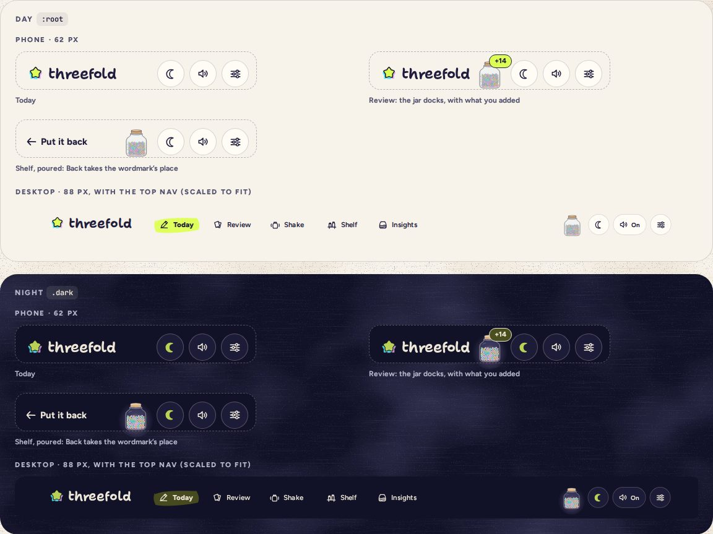

# AppHeader

> 38 · Shell · Threefold · custom · `src/components/threefold/app-header.tsx`

The top of every screen: the wordmark, which is also the way home, and the three things that never move: night, sound and Settings. When a screen has no place for the jar, it docks here as a small jar with a badge for what you just added. Where going back makes sense, a named Back takes the wordmark’s place. On desktop the top nav sits between them. It never imports the router: the wordmark’s and the gear’s links come in from the screens as elements, and Back as a callback.

**Used on:** Every screen: phone 62 px, tablet 84 px, desktop 88 px

**Built from:** `Wordmark`, `NightToggle`, `SoundToggle`, `Button (Back, and the gear’s look)`, `useRender (wordmark, gear)`, `JarDock`

## States (Day and Night)



## API

### `<AppHeader>`

| Prop | Type | Default | Notes |
|---|---|---|---|
| `homeLink` | `React.ReactElement` |  | The wordmark renders through it with `useRender`: `<Link to="/" />` in the app, `<a href="/" />` in a story. |
| `settingsLink` | `React.ReactElement` |  | The gear renders through it the same way, a real link with the secondary button’s look. On Settings it carries `aria-current="page"`: Router’s Link adds it, and a story sets it. |
| `back` | `{ label: string; onClick: () => void }` |  | Replaces the wordmark: “Put it back” on a poured shelf, “Back” in Settings. A real button; the screen implements `onClick`. |
| `nav` | `ReactNode` |  | Desktop only: `<AppNav variant="top" … />`. |

### `<JarDock>` (a JarLayer slot in the header)

| Prop | Type | Default | Notes |
|---|---|---|---|
| `hidden` | `boolean` |  | Shown while the screen has no slot of its own (Review, Settings) or asked for it. |
| `badge` | `string` |  | “+14”: stars added since you left Today; bumps on spring.bouncy when it changes. |

## Usage

`src/routes/_app.tsx`

```tsx
// src/routes/_app.tsx: a pathless layout route, the shell around every screen, and where the router meets the design system
export const Route = createFileRoute("/_app")({ component: AppShell })

function AppShell() {
  const pathname = useLocation({ select: (l) => l.pathname })
  const tab = tabFor(pathname)                        // the nav’s current tab; none on Settings
  return (
    <JarProvider month={month} stars={stars}>
      <AppHeader
        homeLink={<Link to="/" />}
        settingsLink={<Link to="/settings" />}
        back={backFor(pathname)}                      // e.g. { label: "Back", onClick: () => router.history.back() }
        nav={isDesktop ? <AppNav variant="top" links={navLinks} current={tab} /> : null}
      />
      <main id="main"><Outlet /></main>
      {!isDesktop && <AppNav variant={isTablet ? "bar-wide" : "bar"} links={navLinks} current={tab} />}   {/* navLinks: the five tabs’ <Link>s, see AppNav */}
      <JarLayer />
      <Toaster />
    </JarProvider>
  )
}
```

## Implementation

A sketch, correct in intent but not compiled: check it against the current library APIs.

`src/components/threefold/app-header.tsx`

```tsx
// src/components/threefold/app-header.tsx: no router here. The wordmark and the gear render the screens’ link elements
// through Base UI’s useRender, so they stay real links; on Settings, Router’s Link marks the gear aria-current="page" itself
import { useRender } from "@base-ui/react/use-render"

export function AppHeader({ homeLink, settingsLink, back, nav }: {
  homeLink: React.ReactElement
  settingsLink: React.ReactElement
  back?: { label: string; onClick: () => void }
  nav?: React.ReactNode
}) {
  const docked = useJarDocked()                       // the current screen has no jar slot, or asked for the dock
  const home = useRender({
    render: homeLink,                                 // <Link to="/" /> in the app, <a href="/" /> in a story
    props: { "aria-label": "Threefold, go to today", className: "squish flex min-h-11 items-center", children: <Wordmark /> },
  })
  const gear = useRender({
    render: settingsLink,                             // a link with the button’s look, not a Button: it keeps the link role
    props: {
      "aria-label": "Settings",
      className: buttonVariants({ variant: "secondary", size: "icon-sm", className: "border-ink/18 aria-[current=page]:border-ink aria-[current=page]:bg-highlight" }),
      children: <Icon name="tune" />,
    },
  })
  return (
    <header className="sticky top-0 z-30 flex h-[62px] items-center justify-between pt-2.5 pr-3 pl-[18px] md:h-[84px] md:pr-7 md:pl-9 xl:h-[88px] xl:pr-16 xl:pl-[72px]">
      <div className="flex items-center gap-9">
        {back ? (
          <Button variant="ghost" size="sm" className="-ml-2.5 gap-1 pr-3 pl-1.5 text-[15px]" onClick={back.onClick}>
            <Icon name="back" className="size-[22px]" /> {back.label}
          </Button>
        ) : (
          home
        )}
        {nav}                                             {/* desktop: <AppNav variant="top" … /> */}
      </div>
      <div className="flex items-center gap-2">
        <JarDock hidden={!docked} />                      {/* the traveling jar parks here; badge “+n” after Review folds */}
        <NightToggle />
        <SoundToggle compact={isPhone} />
        {gear}
      </div>
    </header>
  )
}
```

## Classes and tokens

| Part | Classes |
|---|---|
| Phone | `h-[62px] pt-2.5 pr-3 pl-[18px]` |
| Tablet | `md:h-[84px] md:pr-7 md:pl-9` |
| Desktop | `xl:h-[88px] xl:pr-16 xl:pl-[72px] · nav gap-9` |
| Tools | `gap-2 · every control 44 px` |
| Dock | `52 × 58 · badge bg-highlight border-[1.5px] border-ink text-[11.5px] font-extrabold` |

## Accessibility

- A skip link comes first (“Skip to today”), then the wordmark link, the dock, the toggles and Settings, in that order.
- The wordmark’s name is “Threefold, go to today”; the dock’s is “September jar, back to Today”.
- Headers never hide on scroll: the tools are always one tap away.

## Motion

- The jar flies into the dock on the travel spring; the badge bumps.
- Back and the wordmark cross-fade (150 ms).

## Sound

- The toggles’ ticks (see Toggle). The dock is silent.
