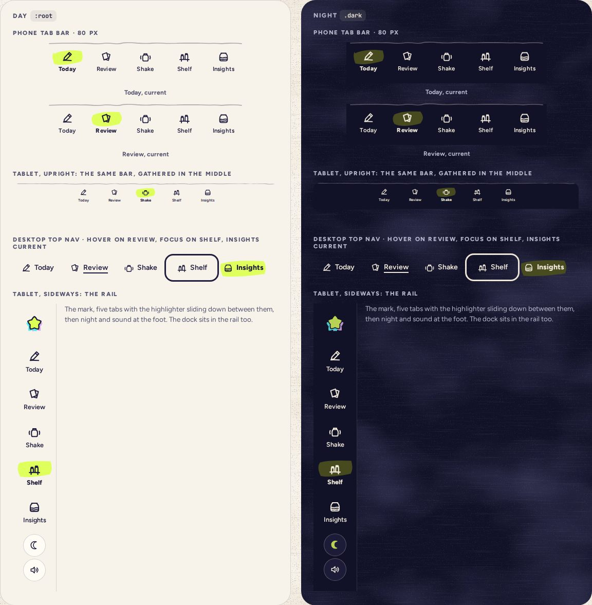

# AppNav

> 39 · Shell · Threefold · custom, on the screens’ links · `src/components/threefold/app-nav.tsx`

Five places: Today, Review, Shake, Shelf, Insights. Hand-drawn icons, words always shown, and the current one marked with a stroke of highlighter that slides between tabs. The same five as a bottom bar on phones, a gathered bar on an upright tablet, a rail on a sideways one, and a top nav on desktop. It never imports the router: the screens pass in each tab’s link as an element, and say which tab is current.

**Used on:** Every screen

**Built from:** `@base-ui/react (useRender)`, `motion (layoutId)`, `Swash`, `Icon`, `WobbleRule`

## States (Day and Night)



## API

### `<AppNav>`

| Prop | Type | Default | Notes |
|---|---|---|---|
| `variant` | `"bar" \| "bar-wide" \| "rail" \| "top"` |  | Pick by breakpoint: bar < 768 ≤ bar-wide (upright) · rail (sideways tablet) · top ≥ 1280. |
| `links` | `Record<NavTab, React.ReactElement>` |  | One link per tab (`today`, `review`, `shake`, `shelf`, `insights`), from the screens: `<Link to="/review" />` in the app, `<a href="/review" />` in a story. Each tab renders its link with `useRender`, so it stays a real link. |
| `current` | `NavTab` |  | The tab on show: it gets `aria-current="page"`, the bold and the swash. None on Settings. |

### `<Swash>`

| Prop | Type | Default | Notes |
|---|---|---|---|
| `className` | `string` |  | A hand-painted highlighter blob, `fill-current`; seeded so it looks the same every time. |

## Usage

`src/routes/_app.tsx`

```tsx
// src/routes/_app.tsx: the router stays in the routes; AppNav gets plain elements and the current tab
const navLinks: Record<NavTab, React.ReactElement> = {
  today: <Link to="/" activeOptions={{ exact: true }} />,       // exact, so Link’s own active state agrees with current
  review: <Link to="/review" />,
  shake: <Link to="/shake" />,
  shelf: <Link to="/shelf" />,
  insights: <Link to="/insights" />,
}
const tab = tabFor(pathname)                                    // "/" → "today", "/shelf" → "shelf", "/settings" → undefined

<AppNav variant="bar" links={navLinks} current={tab} />          {/* phone: fixed bottom, 80 px, safe-area padding below */}
<AppNav variant="bar-wide" links={navLinks} current={tab} />     {/* tablet upright: tabs 84 px wide, gathered in the middle */}
<AppNav variant="rail" links={navLinks} current={tab} />         {/* tablet sideways: 100 px rail on the left */}
<AppHeader nav={<AppNav variant="top" links={navLinks} current={tab} />} … />   {/* desktop: in the header */}
```

## Implementation

A sketch, correct in intent but not compiled: check it against the current library APIs.

`src/components/threefold/app-nav.tsx`

```tsx
// src/components/threefold/app-nav.tsx: five tabs; the highlighter swash is one element that slides (motion layoutId)
// No router here: each tab renders the link element the screens pass in, through Base UI's useRender, and `current` marks one
import { useRender } from "@base-ui/react/use-render"

export const NAV_TABS = [
  { key: "today", label: "Today" },
  { key: "review", label: "Review" },
  { key: "shake", label: "Shake" },
  { key: "shelf", label: "Shelf" },
  { key: "insights", label: "Insights" },
] as const
export type NavTab = (typeof NAV_TABS)[number]["key"]

const navVariants = cva("relative z-30 bg-paper", {
  variants: {
    variant: {
      bar: "fixed inset-x-0 bottom-0 grid h-20 grid-cols-5 gap-0.5 px-1.5 pt-1.5 pb-4",
      "bar-wide": "fixed inset-x-0 bottom-0 flex h-[84px] justify-center gap-3 pt-1.5 pb-[18px]",
      rail: "fixed inset-y-0 left-0 flex w-[100px] flex-col items-center gap-1 py-6",
      top: "flex items-center bg-transparent",
    },
  },
})

const tabVariants = cva("squish group relative flex items-center justify-center text-ink", {
  variants: {
    variant: {
      bar: "min-h-[54px] flex-col gap-0.5 rounded-[14px]",
      "bar-wide": "min-h-[58px] w-[84px] flex-col gap-0.5 rounded-[14px]",
      rail: "h-[72px] w-[84px] flex-col gap-[5px] rounded-[16px]",
      top: "h-11 w-[116px] gap-2 rounded-[12px] pointer-fine:hover:underline pointer-fine:hover:decoration-[1.5px] pointer-fine:hover:underline-offset-[5px]",
    },
  },
})

type NavVariant = "bar" | "bar-wide" | "rail" | "top"

export function AppNav({ variant, links, current }: {
  variant: NavVariant
  links: Record<NavTab, React.ReactElement>           // the screens' links, one per tab
  current?: NavTab                                     // none on Settings
}) {
  return (
    <nav aria-label="Main" data-variant={variant} className={navVariants({ variant })}>
      {variant !== "top" && <WobbleRule seed="nav" className="absolute inset-x-0 -top-[3px] text-ink/35" />}
      {NAV_TABS.map((t) => (
        <TabLink key={t.key} tab={t} link={links[t.key]} current={t.key === current} variant={variant} />
      ))}
    </nav>
  )
}

function TabLink({ tab, link, current, variant }: { tab: (typeof NAV_TABS)[number]; link: React.ReactElement; current: boolean; variant: NavVariant }) {
  return useRender({
    render: link,                                      // <Link to="/review" /> in the app, <a href="/review" /> in a story
    props: {
      "aria-current": current ? "page" : undefined,    // what the bold and the swash show
      className: tabVariants({ variant }),
      children: (
        <>
          <span className="relative flex h-[30px] w-[46px] items-center justify-center">
            {current && (
              <motion.span layoutId="nav-swash" aria-hidden className="absolute inset-0 -rotate-3" transition={{ type: "spring", stiffness: 170, damping: 20 }}>
                <Swash className="size-full text-highlight" />
              </motion.span>
            )}
            <Icon name={tab.key} className="relative size-6 [stroke-width:1.8] group-aria-[current=page]:[stroke-width:2.1]" />
          </span>
          <span className="text-[11.5px] font-semibold tracking-[.02em] group-aria-[current=page]:font-extrabold">{tab.label}</span>
        </>
      ),
    },
  })
}
```

## Classes and tokens

| Part | Classes |
|---|---|
| Bar | `h-20 px-1.5 pt-1.5 pb-4 bg-paper · wobbly top rule ink/35` |
| Tab | `min-h-[54px] rounded-[14px] · icon 24 · label text-[11.5px]` |
| Current | `swash text-highlight 60 × 34, −3° · label font-extrabold · stroke 2.1` |
| Rail | `w-[100px] · tabs 84 × 72 · icon 26 · text-[12.5px]` |
| Top | `tabs 116 × 44 · icon 22 · text-[15px] · hover underline decoration-[1.5px]` |

## Accessibility

- A `nav` named “Main” with real links; the current one has `aria-current="page"`, which is what the bold and the swash show.
- Words are always visible, never icon-only; every tab is at least 54 × 64 on phones.
- On arrival, focus goes to the new screen’s heading, not the tab.

## Motion

- The swash slides to the new tab on spring.soft (k 170, c 20) via a shared `layoutId`; icons lift 1 px on hover.
- The jar travels at the same moment (Motion spec C).
- Reduced motion: the swash appears in place.

## Sound

- None. Navigation is silent; the jar’s arrival makes the only sound, and only sometimes.
