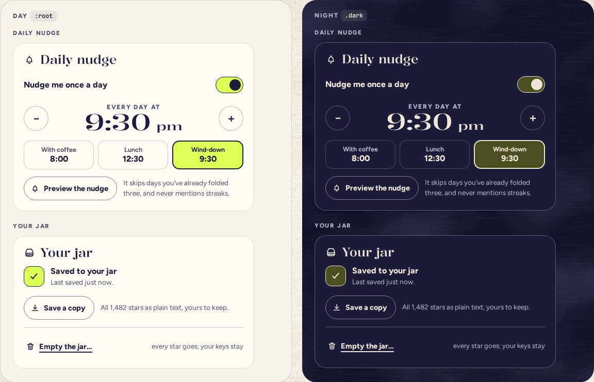

# SettingsCard

> 40 · Shell · shadcn/ui · Card + Field · `src/components/threefold/settings-card.tsx`

Install the primitive: `pnpm dlx shadcn@latest add card field`

One group of settings on card stock, with a small icon and a title in the display face: Sound, Night and motion, Keys, Your jar. Everything applies the moment it changes and a toast says so; there is no Save. Four cards stack on a phone, sit in two columns on an upright tablet and three on desktop.

**Used on:** Settings, all platforms

**Built from:** `Card`, `Field`, `Switch`, `Slider`, `Segmented`, `Button`

## States (Day and Night)



## API

### `<SettingsCard>`

| Prop | Type | Default | Notes |
|---|---|---|---|
| `title` | `string` |  | Names the card region too. |
| `icon` | `IconName` |  | sound, moon, key, insights. |
| `children` | `ReactNode` |  |  |

### `<SettingsSwitch>`

| Prop | Type | Default | Notes |
|---|---|---|---|
| `id / label / description` | `string` |  | The whole row is the label. |
| `checked / onCheckedChange` | `boolean · (on: boolean, eventDetails) => void` |  |  |

## Usage

`src/screens/settings/sound-card.tsx`

```tsx
<SettingsCard title="Sound" icon="sound">
  <SettingsSwitch id="sound" label="Sound" description="Paper, glass and one small chime, all in one key." checked={sound.on} onCheckedChange={setSoundOn} />
  <fieldset disabled={!sound.on} className="flex flex-col gap-3.5 transition-opacity disabled:opacity-42">
    <Slider value={[sound.volume]} step={5} disabled={!sound.on} onValueCommitted={([v]) => setVolume(v)} />   {/* the Volume row, labeled and spoken as Quiet, Soft or Clear: see Slider */}
    <div className="flex items-center gap-3">
      <Button variant="outline" size="sm" onClick={() => tick("A5")}>Hear a tink</Button>
      <p className="text-[13.5px] text-ink-2">Quiet by default, and silent until you touch something.</p>
    </div>
  </fieldset>
</SettingsCard>
```

## Implementation

A sketch, correct in intent but not compiled: check it against the current library APIs.

`src/components/threefold/settings-card.tsx`

```tsx
// src/components/threefold/settings-card.tsx: shadcn Card + Field
export function SettingsCard({ title, icon, children, className }: SettingsCardProps) {
  const id = React.useId()
  return (
    <Card aria-labelledby={id} className={cn("gap-3.5 rounded-[22px] border-[1.5px] border-border bg-card px-5 pt-[18px] pb-5 shadow-none", className)}>
      <CardHeader className="p-0">
        <CardTitle id={id} className="flex items-center gap-2.5 font-display text-2xl leading-[1.1] font-[480]">
          <Icon name={icon} className="size-[22px]" /> {title}
        </CardTitle>
      </CardHeader>
      <CardContent className="flex flex-col gap-3.5 p-0">{children}</CardContent>
    </Card>
  )
}

export function SettingsSwitch({ id, label, description, checked, onCheckedChange }: SettingsSwitchProps) {
  return (
    <Field orientation="horizontal" className="min-h-11 justify-between gap-3.5">
      <FieldContent>
        <FieldLabel htmlFor={id} className="text-base font-[750]">{label}</FieldLabel>
        {description && <FieldDescription className="text-[13.5px] leading-[1.4] text-ink-2">{description}</FieldDescription>}
      </FieldContent>
      <Switch id={id} checked={checked} onCheckedChange={onCheckedChange} />
    </Field>
  )
}
```

## Classes and tokens

| Part | Classes |
|---|---|
| Card | `rounded-[22px] border-[1.5px] border-border bg-card px-5 pt-[18px] pb-5 gap-3.5` |
| Title | `font-display text-2xl font-[480] + 22 px icon` |
| Row | `Field horizontal · label text-base font-[750] · description text-[13.5px] text-ink-2` |
| Off block | `fieldset disabled → opacity-42` |
| Layout | `1 column · md: 2 · xl: 3, gap 16–18 px` |

## Accessibility

- Each card is a region named by its title; each setting is a real control with a real label.
- Turning sound off disables its block with a `fieldset`, so the controls inside are skipped and announced as dimmed.
- Changes are confirmed by toasts, politely; nothing needs saving.

## Motion

- Controls bring their own (the switch’s spring). Disabled blocks fade in 200 ms.

## Sound

- Controls bring their own quiet ticks; see each one.
