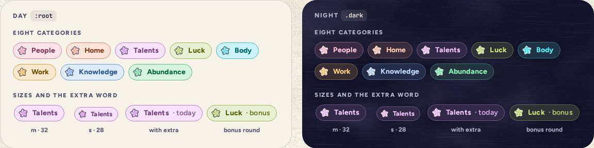

# CategoryTag

> 18 · Today · shadcn/ui · Badge · `src/components/threefold/category-tag.tsx`

Install the primitive: `pnpm dlx shadcn@latest add badge`

The category’s name on its own tint, with its star. It says which of the eight a thing belongs to, in words as well as color: on Today’s prompt, on a Shelf day, on a memory, on the Review’s next card. Text in the deep ink passes 5.8:1 on the tint in Day and in Night.

**Used on:** Today, Review, Shelf, Shake, Insights

**Built from:** `Badge (variant “category”)`, `PaperStar`, `src/lib/categories.ts`

## States (Day and Night)



## API

### `<CategoryTag>`

| Prop | Type | Default | Notes |
|---|---|---|---|
| `category` | `CategoryKey` |  | One of the eight. Sets `data-cat` for the tint, border, text and star. |
| `size` | `"m" \| "s"` | `"m"` | 32 px with a 22 px star, or 28 px with an 18 px star in sheets and cards. |
| `extra` | `ReactNode` |  | A lighter word after the name: “· today”, “· bonus”. |
| `className` | `string` |  |  |

## Usage

`src/screens/today/prompt.tsx`

```tsx
<CategoryTag category="talents" extra="· today" />
<CategoryTag category={star.category} size="s" />
```

## Implementation and the data

A sketch, correct in intent but not compiled: check it against the current library APIs.

`badge.tsx · category-tag.tsx`

```tsx
// src/components/ui/badge.tsx: one more variant in badgeVariants
// (base-nova's Badge sets [&>svg]:size-3!, so the variant sizes the star itself)
category: "h-8 gap-[7px] rounded-full border-[1.3px] border-(--cat-shade) bg-(--cat-light) pr-3 pl-1.5 text-sm font-[750] tracking-[.01em] text-(--cat-deep) [&>svg]:size-[22px]!",

// src/components/threefold/category-tag.tsx
export function CategoryTag({ category, size = "m", extra, className }: CategoryTagProps) {
  return (
    <Badge variant="category" data-cat={category} className={cn(size === "s" && "h-7 pr-2.5 text-[12.5px] [&>svg]:size-[18px]!", className)}>
      <PaperStar category={category} size={size === "m" ? 22 : 18} rotate={-8} />
      <span>{CATEGORIES[category].name}</span>
      {extra && <span className="font-semibold opacity-85">{extra}</span>}
    </Badge>
  )
}
```

`src/lib/categories.ts`

```ts
// src/lib/categories.ts: the eight, in cycle order (see categoryOf)
export const CATEGORIES = {
  people: {
    name: "People", ink: "Peony",
    ask: "People who make my life better",
    prompt: "Who made today lighter? Names welcome.",
    placeholders: ["Someone who showed up…", "A person who made you laugh…", "Someone you’d thank today…"],
  },
  home: {
    name: "Home", ink: "Apricot",
    ask: "What I value about my home and where I live",
    prompt: "What does your place get right? Creaky floors count.",
    placeholders: ["A corner you love…", "Something your street gets right…", "A small comfort at home…"],
  },
  talents: {
    name: "Talents", ink: "Lilac",
    ask: "Natural gifts and skills I have",
    prompt: "Brag a little. The jar won’t tell.",
    placeholders: ["Something you’re great at…", "A compliment you believed…", "A skill that saved the day…"],
  },
  luck: {
    name: "Luck", ink: "Clover",
    ask: "Moments when things broke my way",
    prompt: "When did the universe wink at you?",
    placeholders: ["A near miss that missed…", "Perfect timing, lately…", "A happy accident…"],
  },
  body: {
    name: "Body", ink: "Lagoon",
    ask: "Things my body does well",
    prompt: "Knees, lungs, that one good ear. What showed up for you?",
    placeholders: ["Something your body did well…", "A sense you’re glad to have…", "A way you moved today…"],
  },
  work: {
    name: "Work", ink: "Marigold",
    ask: "What I appreciate about my work",
    prompt: "What’s quietly good about how you spend your days?",
    placeholders: ["A good moment at work…", "Someone you work with…", "A problem you cracked…"],
  },
  knowledge: {
    name: "Knowledge", ink: "Cornflower",
    ask: "Lessons and experiences that shaped me",
    prompt: "What do you know now that past-you didn’t?",
    placeholders: ["A lesson that stuck…", "Something you unlearned…", "Advice you finally took…"],
  },
  abundance: {
    name: "Abundance", ink: "Jade",
    ask: "Ways my life is already rich",
    prompt: "Proof you’re already rich. Money optional.",
    placeholders: ["Something you have plenty of…", "A free thing you love…", "Proof you’re doing fine…"],
  },
} as const
export type CategoryKey = keyof typeof CATEGORIES
export const ORDER = Object.keys(CATEGORIES) as CategoryKey[]

// The cycle: one a day, forever, counted in days from Dec 31, 2025, so it never jumps at New Year.
// It takes a day key ("2026-09-23"), the device's local date, which the screen works out (system design §4.4).
// Sep 23, 2026 is 266 days on, and 266 % 8 = 2: Talents.
export function categoryOf(day: string): CategoryKey {
  const [y, m, d] = day.split("-").map(Number)
  const days = Math.round((Date.UTC(y, m - 1, d) - Date.UTC(2025, 11, 31)) / 86_400_000)
  return ORDER[((days % 8) + 8) % 8]
}
```

## Classes and tokens

| Part | Classes |
|---|---|
| Pill | `h-8 rounded-full border-[1.3px] pl-1.5 pr-3 gap-[7px]` |
| Colors | `bg-(--cat-light) border-(--cat-shade) text-(--cat-deep)` |
| Words | `text-sm font-[750] tracking-[.01em]  ·  extra font-semibold opacity-85` |
| Night | `light = base mixed 16% into night, shade 45%, deep = glow` |

## Accessibility

- It is text, not an image: “Talents · today”. The star beside it is `aria-hidden`.
- Deep on light: 5.8:1 or better for all eight, both themes. Never white text on a category ink.
- Not interactive. When a tag sits in a button, the button’s name includes it.

## Motion

- None of its own. It changes with the category, as part of the prompt’s entrance.
