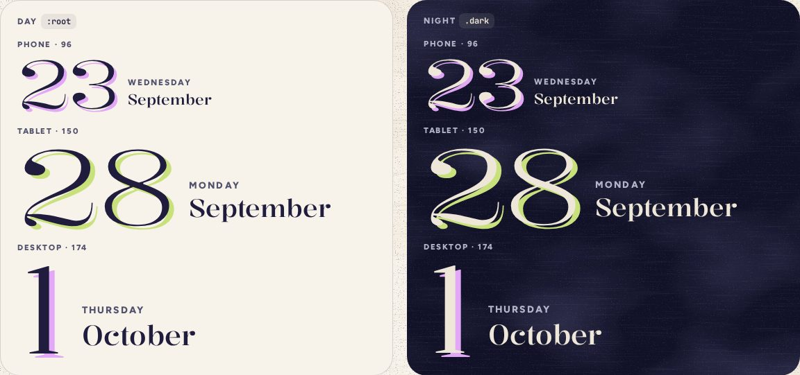

# DateHeading

> 19 · Today · Threefold · custom · `src/components/threefold/date-heading.tsx`

Today’s date as the page title: the day of the month huge, light and a little wide, printed twice a few pixels off register in the day’s ink, with the weekday and month stacked beside it. It is the screen’s `h1`, and focus lands on it when Today opens.

**Used on:** Today, all three platforms

**Built from:** `<h1> + <time>`, `riso utility`, `font-display`

## States (Day and Night)



## API

### `<DateHeading>`

| Prop | Type | Default | Notes |
|---|---|---|---|
| `date` | `Date` |  | Local date. The number, weekday and month come from it, always in `en-US`, never the device’s locale. |
| `category` | `CategoryKey` |  | The riso color: the misprint is the day’s ink. |
| `ref` | `Ref<HTMLHeadingElement>` |  | For focus on arrival (`tabIndex={-1}` is built in). |

## Usage

`src/routes/_app/index.tsx`

```tsx
const heading = React.useRef<HTMLHeadingElement>(null)
useFocusOnArrival(heading)          // screen readers hear the day when Today opens

<DateHeading ref={heading} date={today} category={categoryOf(dayKey(today))} />
```

## Implementation

A sketch, correct in intent but not compiled: check it against the current library APIs.

`src/components/threefold/date-heading.tsx`

```tsx
// src/components/threefold/date-heading.tsx
export function DateHeading({ date, category, ref, ...props }: DateHeadingProps) {
  const weekday = date.toLocaleDateString("en-US", { weekday: "long" })
  const month = date.toLocaleDateString("en-US", { month: "long" })
  const spoken = date.toLocaleDateString("en-US", { weekday: "long", month: "long", day: "numeric" })   // "Wednesday, September 23"
  return (
    <h1 ref={ref} tabIndex={-1} aria-label={spoken} data-cat={category} className="m-0 font-normal outline-none" {...props}>
      <time dateTime={toISODate(date)} className="flex items-end gap-3 md:gap-5 xl:gap-[22px]">
        <span className="riso font-display text-date leading-[.8] font-light tracking-[-.02em] [--riso:var(--cat)] [font-stretch:110%] md:text-[9.375rem] xl:text-[10.875rem]">
          {date.getDate()}
        </span>
        <span className="flex flex-col gap-[7px] pb-1.5 md:gap-[9px] md:pb-2.5">
          <span className="text-kicker font-extrabold text-ink-2 uppercase md:text-[13.5px]">{weekday}</span>
          <span className="font-display text-[21px] leading-none font-[480] md:text-4xl xl:text-[40px]">{month}</span>
        </span>
      </time>
    </h1>
  )
}
```

## Classes and tokens

| Part | Classes |
|---|---|
| Numeral | `font-display text-date (96) · md 150 · xl 174 · font-light [font-stretch:110%] leading-[.8]` |
| Misprint | `riso [--riso:var(--cat)]  →  text-shadow .045em .037em, 70% at night` |
| Weekday | `text-kicker font-extrabold uppercase text-ink-2` |
| Month | `font-display font-[480] 21 · 36 · 40 px` |

## Accessibility

- One `h1` per screen; this is Today’s. The `<time dateTime>` gives the machine date.
- Focus moves here on arrival (a route change), so VoiceOver reads “Wednesday, September 23, heading level 1”. The `aria-label` gives that order; on screen, the numeral comes first.
- The misprint is a text-shadow: the numeral stays one piece of text, 14.7:1 in ink.

## Motion

- It arrives with the screen’s stagger (38 ms per block). Nothing moves after that.
