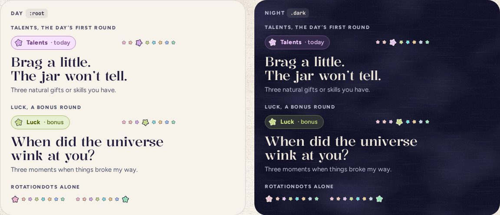

# DayPrompt

> 20 · Today · Threefold · custom · `src/components/threefold/day-prompt.tsx`

What today asks. The category tag and the cycle, eight tiny stars with today’s one bigger, then the prompt in the display face, split after its first sentence so each half gets its own line, and a plain line saying what three things to write.

**Used on:** Today, all three platforms

**Built from:** `CategoryTag`, `CycleDots`, `PaperStar`, `src/lib/categories.ts`

## States (Day and Night)



## API

### `<DayPrompt>`

| Prop | Type | Default | Notes |
|---|---|---|---|
| `category` | `CategoryKey` |  | Today’s, from `categoryOf(day)`, or the one picked for a bonus round. |
| `round` | `number` | `0` | 0 is the day’s three; 1 and up are bonus rounds (“· bonus”). |
| `className` | `string` |  |  |

### `<CycleDots>`

| Prop | Type | Default | Notes |
|---|---|---|---|
| `active` | `CategoryKey` |  | The one drawn at 20 px; the rest are 11 px, each tilted 11° more than the last. |

## Usage

`src/routes/_app/index.tsx`

```tsx
<DateHeading date={today} category={cat} />
<DayPrompt category={cat} round={round} className="mt-3.5" />
<EntryLines category={cat} … />
```

## Implementation

A sketch, correct in intent but not compiled: check it against the current library APIs.

`src/components/threefold/day-prompt.tsx`

```tsx
// src/components/threefold/day-prompt.tsx
export function DayPrompt({ category, round = 0, className }: DayPromptProps) {
  const c = CATEGORIES[category]
  const [first, second] = splitFirstSentence(c.prompt)          // "Brag a little." / "The jar won’t tell."
  return (
    <section data-slot="day-prompt" data-cat={category} aria-labelledby="day-prompt" className={className}>
      <div className="flex items-center justify-between gap-2.5">
        <CategoryTag category={category} extra={round ? "· bonus" : "· today"} />
        <CycleDots active={category} />
      </div>
      <h2 id="day-prompt" className="mt-3 font-display text-prompt font-[470] tracking-[-.01em] text-balance md:text-5xl xl:text-[54px] xl:font-[460]">
        <span className="block">{first}</span>
        <span className="block">{second}</span>
      </h2>
      <p className="mt-1.5 text-[15px] leading-[1.4] text-ink-2">Three {lowerFirst(c.ask)}.</p>
    </section>
  )
}

export function CycleDots({ active }: { active: CategoryKey }) {
  const i = ORDER.indexOf(active)
  return (
    <span role="img" aria-label={`Category ${i + 1} of 8 in the cycle`} className="flex items-center gap-1">
      {ORDER.map((k, n) => (
        <PaperStar key={k} category={k} size={k === active ? 20 : 11} rotate={n * 11} />
      ))}
    </span>
  )
}
```

## Classes and tokens

| Part | Classes |
|---|---|
| Prompt | `font-display text-prompt (30) · md 48 · xl 54 · font-[470] text-balance` |
| Sub | `text-[15px] leading-[1.4] text-ink-2` |
| Dots | `PaperStar 11 px, the active one 20 px, gap-1` |

## Accessibility

- The prompt is an `h2` under the date’s `h1`; the group of lines below is named after it.
- Cycle dots are one image with words: “Category 3 of 8 in the cycle”.
- Prompts are jokes with a job: the sub line always says plainly what to write.

## Motion

- Arrives in the screen’s stagger. On a bonus round, the new tag and prompt cross-fade (200 ms); the dots’ big star moves with a spring.soft scale.
