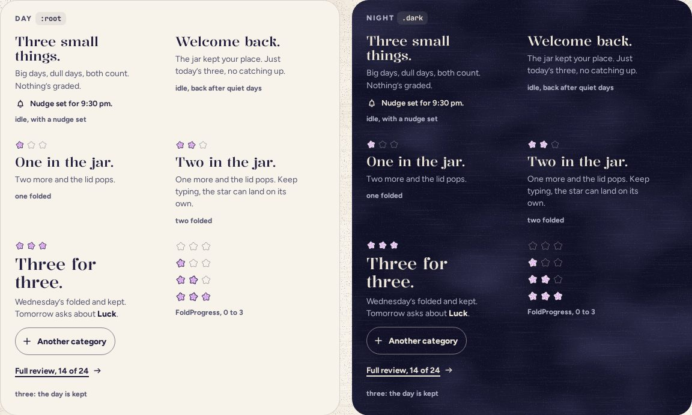

# DayStatus

> 21 · Today · Threefold · custom · `src/components/threefold/day-status.tsx`

The few words beside the jar that keep you company while you write: what to do, how far along you are, and, once the three are in, that the day is kept and what tomorrow asks. It is a polite live region, so each change is read out once, and it never counts streaks or misses.

**Used on:** Today, all three platforms

**Built from:** `FoldProgress`, `Button`, `PaperStar`, `src/lib/copy/today.ts`

## States (Day and Night)



## API

### `<DayStatus>`

| Prop | Type | Default | Notes |
|---|---|---|---|
| `folded` | `0 \| 1 \| 2 \| 3` |  | Stars landed this round. |
| `round` | `number` | `0` | Bonus rounds change the headline: Six. Show-off. |
| `category` | `CategoryKey` |  |  |
| `weekday` | `string` |  | For “Wednesday’s folded and kept.” |
| `tomorrow` | `CategoryKey` |  | Named in the done line. |
| `special` | `"firstDay" \| "welcomeBack" \| "newMonth"` |  | Replaces the idle words on those days. |
| `reviewCount` | `number` |  | For the Full review link. |
| `reviewLink` | `React.ReactElement` |  | The screen’s link to Review, such as `<Link to="/review" />`. DayStatus renders it with Base UI’s `useRender`, styled with `buttonVariants()`, so it stays a real link and this component never imports the router. |
| `onAnother` | `() => void` |  | Starts a bonus round in the next category. |

### `<FoldProgress>`

| Prop | Type | Default | Notes |
|---|---|---|---|
| `count` | `0 \| 1 \| 2 \| 3` |  |  |
| `category` | `CategoryKey` |  |  |
| `size` | `number` | `16` | 18 on desktop. |

## Usage

The words, all in one place.

`src/lib/copy/today.ts`

```ts
// src/lib/copy/today.ts
export const IDLE = ["Three small things.", "Big days, dull days, both count. Nothing’s graded."]
export const IDLE_SPECIAL = {
  firstDay: ["Your first three.", "One line each is plenty."],
  welcomeBack: ["Welcome back.", "The jar kept your place. Just today’s three, no catching up."],
  newMonth: ["A new jar.", "October starts empty, on purpose. First star?"],
}
export const FOLDING = {
  1: ["One in the jar.", "Two more and the lid pops."],
  2: ["Two in the jar.", "One more and the lid pops. Keep typing, the star can land on its own."],
  3: ["Folding the last one…", "Listen for it."],
}
export const DONE = ["Three for three.", "Six. Show-off.", "Nine! The jar is blushing.", "Twelve. Okay, legend."]   // by round
export const doneLine = (weekday: string, next: string) => `${weekday}’s folded and kept. Tomorrow asks about ${next}.`
export const bonusLine = (cat: string, next: string) => `${cat} is in the jar too. ${next} is next if you want it.`
```

## Implementation

A sketch, correct in intent but not compiled: check it against the current library APIs.

`src/components/threefold/day-status.tsx`

```tsx
// src/components/threefold/day-status.tsx
import { useRender } from "@base-ui/react/use-render"
import { Button, buttonVariants } from "@/components/ui/button"

export function DayStatus({ folded, round, category, weekday, tomorrow, special, reviewCount, reviewLink, onAnother }: DayStatusProps) {
  const done = folded === 3
  const [head, sub] =
    done ? [DONE[Math.min(round, 3)], round ? bonusLine(name(category), name(next(category))) : doneLine(weekday, name(tomorrow))]
    : folded ? FOLDING[folded]
    : special ? IDLE_SPECIAL[special] : IDLE

  // The screen's link, kept a real link and styled like a link button. Rendering it through Button would announce it as a button.
  const review = useRender({
    render: reviewLink,
    props: {
      className: buttonVariants({ variant: "link", size: "sm" }),
      children: <>Full review, {reviewCount} of 24 <Icon name="arrow" /></>,
    },
  })

  return (
    <div data-slot="day-status" className="flex flex-col gap-2">
      {folded > 0 && <FoldProgress count={folded} category={category} />}
      <p role="status" className="flex flex-col gap-2">
        <span className={cn("font-display leading-[1.1] font-[480]", done ? "text-[27px] leading-none" : "text-[22px]")}>{head}</span>
        <span className="text-sm leading-[1.45] text-ink-2">{sub}</span>
      </p>
      {done && (
        <div className="mt-1 flex flex-col items-start gap-1">
          <Button variant="outline" size="sm" onClick={onAnother}><Icon name="plus" /> Another category</Button>
          {review}
        </div>
      )}
    </div>
  )
}

export function FoldProgress({ count, category, size = 16 }: FoldProgressProps) {
  return (
    <span role="img" aria-label={`${count} of 3 folded`} className="flex gap-[3px]">
      {[0, 1, 2].map((k) =>
        k < count ? <PaperStar key={k} category={category} size={size} rotate={[-8, 10, -3][k]} />
                  : <PaperStar key={k} variant="empty" size={size} className="text-ink" />)}
    </span>
  )
}
```

## Classes and tokens

| Part | Classes |
|---|---|
| Headline | `font-display text-[22px] font-[480]; done text-[27px]` |
| Sub | `text-sm leading-[1.45] text-ink-2` |
| Progress | `PaperStar 16 · empty text-ink at 55%, dash 6 6` |

## Accessibility

- `role="status"`: “Two in the jar. One more and the lid pops.” is read once, politely, after each landing.
- After the third star, focus moves here, so the next Tab reaches Another category.
- Progress is an image with words: “2 of 3 folded”.

## Motion

- Headlines swap with a 200 ms cross-fade; the done block rises in on spring.soft (Motion spec B, “message”).
- Reduced motion: the words change in place.

## Words

- Never “streak”, never “missed”, never red. A quiet day is just a quiet day.
- Jokes are allowed in headlines, never in the line that says what to do.
