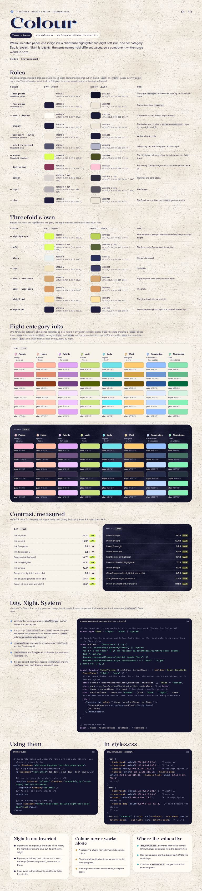

# Color

Warm uncoated paper, one indigo ink, a chartreuse highlighter and eight soft inks, one per category. Day is `:root`, Night is `.dark`: the same names hold different values, so a component written once works in both.



Day is `:root`, Night is `.dark` (the ThemeProvider sets it on `<html>`: see Day, Night, System below). Values below are the design’s hex; styles.css ships the same colors as OKLCH.

## Roles (shadcn names)

| Token | Threefold name | Day | Night | For |
|---|---|---|---|---|
| `--background` | `paper` | `#F8F3EA` | `#111127` | The page. `bg-paper` is the same color by its Threefold name. |
| `--foreground` | `ink` | `#1F1C3D` | `#EEE7D9` | Text and outlines. `text-ink`. |
| `--card` · `--popover` |  | `#FFFCF6` | `#1C1C38` | Card stock: cards, sheets, chips, dialogs. |
| `--primary` |  | `#1F1C3D` | `#EEE7D9` | The ink button. Its label is `primary-foreground`: paper by day, night at night. |
| `--secondary` · `--muted` | `paper-2` | `#F1E9DC` | `#1C1C38` | Wells and quiet cells. |
| `--muted-foreground` | `ink-2` | `#52526E` | `#B5B5CA` | Secondary text: 6.8:1 on paper, 9.2:1 on night. |
| `--accent` | `highlight` | `#DDFF55` | `#4B4E1E` | The highlighter: chosen chips, the tab swash, the Switch track. |
| `--destructive` |  | `#8A3658` | `#FEC5D7` | Errors only. Taking things out is a solid-ink outline, never red. |
| `--border` |  | `#1F1C3D at 14%` | `#EEE7D9 at 14%` | Hairlines and card edges. |
| `--input` |  | `#1F1C3D at 32%` | `#EEE7D9 at 32%` | Field edges. |
| `--ring` |  | `#1F1C3D` | `#EEE7D9` | The 3 px focus outline; the `--halo` goes around it. |

## Threefold’s own

| Token | Day | Night | For |
|---|---|---|---|
| `--highlight-pop` | `#DDFF55` | `#B9D256` | Print shadows. At night the fill darkens but the print stays bright. |
| `--halo` | `#DDFF55 at 85%` | `#DDFF55 at 35%` | The focus halo, 7 px around the outline. |
| `--glass` | `#E8F1F0` | `#2B2F5C` | The jar’s back wall. |
| `--tape` | `#F3E6C4` | `#3B3A63` | Jar labels. |
| `--cork` · `--cork-dark` | `#D8A873` | `#D8A873` | Paper objects keep their color at night. |
| `--wood` · `--wood-dark` | `#D89A62` | `#D89A62` | The shelf. |
| `--nightlight` | `#FFE3A6` | `#FFE3A6` | The glow inside the jar at night. |
| `--paper-ink` | `#1F1C3D` | `#1F1C3D` | Ink on paper objects: strips, star outlines. Never flips. |

## The eight category inks

Per category: `--{key}` (base: stars, strips), `-shade` (edges), `-deep` (text on `-light`), `-light` (tints), `-glow` (night stars), `-star` (base by day, glow by night). At night `-light` and `-shade` are the base mixed into night (16% and 45%) and `-deep` becomes the glow. A subtree takes one with `data-cat="talents"`, which sets `--cat`, `--cat-shade`, `--cat-deep`, `--cat-light`, `--cat-star`.

| Category | Ink | base | shade | deep | light | glow | night shade | night light |
|---|---|---|---|---|---|---|---|---|
| People (`people`) | Peony | `#FFB0CA` | `#D884A1` | `#8A3658` | `#FEE3EB` | `#FEC5D7` | `#7C5970` | `#372A41` |
| Home (`home`) | Apricot | `#FFB99F` | `#DD8B6C` | `#8D3C18` | `#FEE5DC` | `#FECAB6` | `#7C5D5D` | `#372C3A` |
| Talents (`talents`) | Lilac | `#E2A7F6` | `#B680C8` | `#733F83` | `#F7E3FD` | `#F0C5FF` | `#6F5484` | `#322948` |
| Luck (`luck`) | Clover | `#C9E17C` | `#A1B657` | `#516003` | `#E7F0D2` | `#CCE47F` | `#646F4D` | `#2E3235` |
| Body (`body`) | Lagoon | `#6FE3E9` | `#48B7BD` | `#016569` | `#CDF4F6` | `#52F1F9` | `#3B707E` | `#203346` |
| Work (`work`) | Marigold | `#FFCB70` | `#D3A145` | `#735103` | `#FAE9CE` | `#FECF7F` | `#7C6548` | `#372F33` |
| Knowledge (`knowledge`) | Cornflower | `#95C0FF` | `#6E97D2` | `#29579A` | `#E0ECFE` | `#C0D9FE` | `#4C6088` | `#262D4A` |
| Abundance (`abundance`) | Jade | `#89E5B1` | `#64B98A` | `#056940` | `#D6F4E1` | `#87F2B7` | `#477065` | `#24333D` |

## Contrast (WCAG 2)

- Ink on paper: 14.7:1
- Ink on card: 15.9:1
- Ink 2 on paper: 6.8:1
- Ink 2 on paper-2: 6.2:1
- Paper on ink: 14.7:1
- Ink on highlighter: 14.3:1
- Moon on night: 15.1:1
- Moon on night card: 13.4:1
- Moon 2 on night: 9.2:1
- Moon 2 on night card: 8.2:1
- Night on moon: 15.1:1
- Moon on the night highlighter: 7.1:1
- Deep on its light tint, worst of eight (Day): 5.8:1
- Glow on its night tint, worst of eight (Night): 8.9:1
- Paper-ink on a strip, worst of eight: 8.6:1

## Day, Night, System

shadcn’s TanStack Start recipe, plus two things the kit needs. Every component that asks about the theme uses `useTheme()` from here.

- Day, Night or System, saved in `localStorage`. System follows the device, live.
- A tiny script sets `.dark` before first paint and before React hydrates, so nothing flashes; `<html>` gets `suppressHydrationWarning`. The provider exports it as `themeScript`, and the root route renders it with `ScriptOnce` (see Type & shape), so nothing in `src/components/` imports the router.
- `resolvedTheme` says what’s showing now: NightToggle and the Toaster read it.
- `forcedTheme` lets Storybook’s toolbar decide, and turns `setTheme` off.
- It replaces next-themes: shadcn’s `sonner.tsx` imports `useTheme` from next-themes, so point it here.

```tsx
// src/components/theme-provider.tsx: shadcn's TanStack Start recipe, plus resolvedTheme and forcedTheme
import { createContext, use, useMemo, useSyncExternalStore } from "react"

export type Theme = "light" | "dark" | "system"
type ThemeState = { theme: Theme; resolvedTheme: "light" | "dark"; setTheme: (theme: Theme) => void }

const KEY = "theme"
const DARK = "(prefers-color-scheme: dark)"

// Runs before first paint and before hydration, so the right palette is there from the first frame.
// The root route renders it with <ScriptOnce>, so this file never imports the router.
export const themeScript = `(function () { try {
  var t = localStorage.getItem("${KEY}") || "system"
  var d = t === "dark" || (t === "system" && matchMedia("${DARK}").matches)
  document.documentElement.classList.toggle("dark", d)
  document.documentElement.style.colorScheme = d ? "dark" : "light"
} catch (e) {} })()`

const listeners = new Set<() => void>()
const systemDark = () => matchMedia(DARK).matches

function readTheme(): Theme {
  try {
    const t = localStorage.getItem(KEY)
    return t === "light" || t === "dark" ? t : "system"
  } catch {
    return "system"
  }
}

function apply(theme: Theme) {
  const dark = theme === "dark" || (theme === "system" && systemDark())
  document.documentElement.classList.toggle("dark", dark)
  document.documentElement.style.colorScheme = dark ? "dark" : "light"
}

function subscribe(onChange: () => void) {
  const sync = () => {
    apply(readTheme()) // the device flipped, or another tab chose
    onChange()
  }
  const mq = matchMedia(DARK)
  listeners.add(onChange)
  mq.addEventListener("change", sync)
  window.addEventListener("storage", sync)
  return () => {
    listeners.delete(onChange)
    mq.removeEventListener("change", sync)
    window.removeEventListener("storage", sync)
  }
}

const ThemeContext = createContext<ThemeState | null>(null)

export function ThemeProvider({ children, forcedTheme }: { children: React.ReactNode; forcedTheme?: "light" | "dark" }) {
  const stored = useSyncExternalStore(subscribe, readTheme, (): Theme => "system") // the server can't know
  const dark = useSyncExternalStore(subscribe, systemDark, () => false)
  const theme = forcedTheme ?? stored // forcedTheme: Storybook's toolbar decides
  const resolvedTheme = theme === "system" ? (dark ? "dark" : "light") : theme

  const value = useMemo<ThemeState>(
    () => ({
      theme,
      resolvedTheme,
      setTheme: (next) => {
        if (forcedTheme) return
        try {
          localStorage.setItem(KEY, next)
        } catch {}
        apply(next)
        listeners.forEach((l) => l())
      },
    }),
    [theme, resolvedTheme, forcedTheme],
  )

  return <ThemeContext value={value}>{children}</ThemeContext>
}

export function useTheme() {
  const ctx = use(ThemeContext)
  if (!ctx) throw new Error("useTheme needs a <ThemeProvider> above it")
  return ctx
}
```

## Using them

```tsx
// Threefold names and shadcn’s roles are the same colors: use whichever reads better
<main className="min-h-dvh bg-paper text-ink paper-grain">          {/* = bg-background text-foreground */}
  <p className="text-ink-2">Big days, dull days, both count.</p>

  {/* one category for a whole subtree */}
  <section data-cat="talents" className="rounded-lg bg-(--cat-light) text-(--cat-deep)">
    <PaperStar category="talents" />                                {/* fill-(--cat-star) inside */}
  </section>

  {/* or a category by name */}
  <span className="border-luck-shade bg-luck-light text-luck-deep">Luck</span>
</main>
```

## In styles.css (excerpt)

```css
:root {
  --background: oklch(0.966 0.013 82.4);   /* paper */
  --foreground: oklch(0.249 0.061 285.2);  /* ink */
  --accent: oklch(0.945 0.193 120.0);      /* the highlighter */
  --talents: oklch(0.810 0.125 317.4); --talents-deep: oklch(0.460 0.120 317.8); --talents-light: oklch(0.940 0.041 318.4);
  /* … */
}
.dark {
  --background: oklch(0.191 0.044 281.4);  /* night */
  --foreground: oklch(0.930 0.020 84.6);   /* moon */
  --accent: oklch(0.410 0.069 112.3);      /* the highlighter, dimmed */
  --talents-deep: oklch(0.879 0.091 317.3);  /* deep becomes the glow */
  /* … */
}
[data-cat="talents"] { --cat: var(--talents); --cat-deep: var(--talents-deep); --cat-light: var(--talents-light); /* … */ }
```

## Rules

- Night is not inverted: paper objects (cork, wood, strips at 90% brightness, the words on them) keep their colors; stars swap to glow inks.
- Color never works alone: a category is always named in words; chosen states add a border or weight; nothing is red, quiet days are plain paper.
