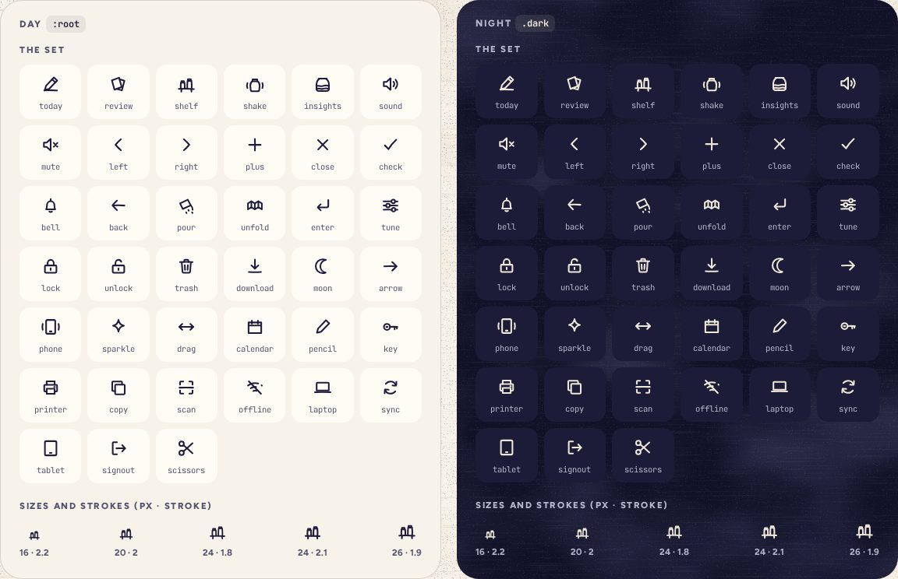

# Icon

> 04 · Foundations · Threefold · custom SVG · `src/components/threefold/icon.tsx`

Thirty-nine line icons, drawn by hand on a 24 px grid with slightly wobbly strokes, so they sit with the handwriting and the paper. One path each, round caps and joins, `currentColor`. They never appear without a word nearby, except inside a button whose name says it.

**Used on:** Nav, Buttons, Toggles, Settings, Hints

**Built from:** `<svg>`, `currentColor`

## States (Day and Night)



## API

### `<Icon>`

| Prop | Type | Default | Notes |
|---|---|---|---|
| `name` | `IconName` |  | One of the 39. |
| `strokeWidth` | `number` | `1.8` | 2.1 for the current tab, 2.2 at 14–16 px. |
| `className` | `string` | `"size-6"` | Size with `size-*`; color with `text-*`. |

## Usage

`anywhere.tsx`

```tsx
<Icon name="shelf" />                                    {/* 24 px, currentColor */}
<Icon name="enter" className="size-3.5" strokeWidth={2.2} />
<Button variant="secondary" size="icon" aria-label="Next month"><Icon name="right" /></Button>
```

## Implementation

A sketch, correct in intent but not compiled: check it against the current library APIs.

`src/components/threefold/icon.tsx`

```tsx
// src/components/threefold/icon.tsx: hand-drawn line icons on a 24 px grid; paths live in one record
export const ICONS = {
  today: "M4.5 19.5c3.2-.4 7.8-.3 15 .2 M15.8 4.2l3.9 3.6-9.6 9.9-4.9 1.3 1.2-4.8z M13.6 6.4l3.9 3.6",
  shelf: "M3 17.8c5.8-.3 12.2-.3 18 .2 M5.5 17.6c-.2-2.6-.1-5.3.1-7.3h4.3c.3 2.3.3 4.8.2 7.2 …",
  // … 39 in all: today review shake shelf insights sound mute left right plus close check bell back pour unfold
  //   enter tune lock unlock trash download moon arrow phone sparkle drag calendar pencil
  //   and for accounts: key printer copy scan offline laptop sync tablet signout scissors
} as const
export type IconName = keyof typeof ICONS

export function Icon({ name, className, strokeWidth = 1.8, ...props }: { name: IconName; strokeWidth?: number } & React.ComponentProps<"svg">) {
  return (
    <svg
      viewBox="0 0 24 24"
      fill="none"
      stroke="currentColor"
      strokeWidth={strokeWidth}
      strokeLinecap="round"
      strokeLinejoin="round"
      aria-hidden
      focusable="false"
      data-slot="icon"
      className={cn("size-6 shrink-0", className)}
      {...props}
    >
      <path d={ICONS[name]} />
    </svg>
  )
}
```

## Classes and tokens

| Part | Classes |
|---|---|
| Grid | `24 × 24 viewBox · round caps and joins` |
| Stroke | `1.8 rest · 2.1 current · 2.2 small · 2 inside buttons` |
| Color | `stroke-current: inherits text color` |

## Accessibility

- Always `aria-hidden`; the button, link or label beside it carries the name.
- Icon-only buttons get an `aria-label` (“Next month”).
- At 16 px and below the stroke thickens so it stays 3:1 against paper.

## Drawing

- New icons: 24 px grid, 2 px padding, strokes that wander by 0.1–0.3 px, one path, no fills (the moon fills only when on).

## Data

All 39 icons as path data: `../data/icons.json`. Draw each as `<path d="…">` segments, stroke only, `currentColor`.
