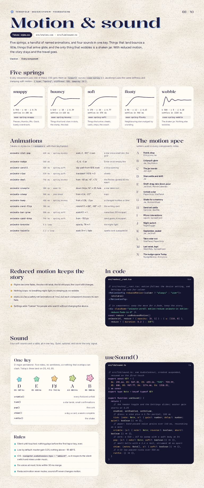

# Motion & sound

Five springs, a handful of named animations, and four sounds in one key. Things that land bounce a little, things that arrive glide, and the only thing that wobbles is a shaken jar. With reduced motion, the story stays and the travel goes.



## Five springs

CSS gets them as `linear()` curves (`ease-spring-*` in styles.css); JavaScript uses the same stiffness and damping with motion (`{ type: "spring", stiffness, damping }`). Exact values: `data/springs.json`.

| Spring | k | c | settles | Class | For |
|---|---|---|---|---|---|
| snappy | 700 | 40 | 280 ms | `ease-spring-snappy` | Presses, thumbs, lifts. Quick, barely overshoots. |
| bouncy | 520 | 18 | 620 ms | `ease-spring-bouncy` | Things that land: stars in slots, the stamp, the deal. |
| soft | 170 | 20 | 570 ms | `ease-spring-soft` | Things that arrive: sheets, cards, strips, the swash. |
| floaty | 90 | 12 | 960 ms | `ease-spring-floaty` | Neighboring stars jostled by a landing. |
| wobble | 500 | 8 | 1320 ms | `ease-spring-wobble` | The shaken jar. Nothing else wobbles. |

The traveling jar uses its own JS spring: k 118, c 17, mass 1 (about 700 ms, retargetable). The pile inside sloshes on k 118, c 8.5.

## Animations (styles.css)

| Class | Timing | Motion | Used by |
|---|---|---|---|
| `animate-slot-pop` | 620 ms · spring.bouncy | scale .2, −90° → rest | a star into a small slot, the grid |
| `animate-wiggle` | 360 ms | −5, 4, −2 px | Enter on an empty line |
| `animate-unroll` | 600 ms · spring.soft | clip-path from 92% inset | a strip opening |
| `animate-rise` | 570 ms · spring.soft | translateY 110% → 0 | sheets |
| `animate-deal` | 740 ms · spring.bouncy | from −60 px, −6°, ×.72 | the Review spread, 60 ms apart |
| `animate-crumple` | 380 ms · ease-in | down 34 px, 16°, ×.35, fade | a star taken out |
| `animate-stamp` | 500 ms · overshoot | from ×2.4, −22° | kept |
| `animate-bump` | 450 ms · spring.bouncy | from ×1.08, −2 px | a changed number |
| `animate-card-flip` | 380 ms | rotateY 0 → 88°, −88° → 0 | the writing card |
| `animate-bar-grow` | 900 ms · spring.soft | scaleX 0 → 1 | nothing in v1 |
| `animate-sand-drop` | 740 ms · spring.soft | from −150 px | sand grains, 4 ms apart |
| `animate-breathe` | 5 s loop | opacity .78 ↔ 1 | the night-light |
| `animate-twinkle` | 2.2 s loop | scale .8 ↔ 1, fade | sparks over a popped lid |

## The motion spec, A–M

Components refer to these letters. Full timelines (segments, sound marks) are in `data/motion.json`.

### A · Fold & drop

*Trigger:* Enter on a line (or tap Fold)

*Timeline (1500 ms):* lift 0–120; wind 120–360; puff 360–460; arc 460–1060; land + settle 1060–1420

*Easing:* lift: spring.snappy (y −6px, shadow 0→6px). wind: strip scaleX 1→0.08 from the left, spring.soft. puff: spring.bouncy 0.6→1. arc: ballistic, x linear, y gravity 2600 px/s², 1.5 turns. land: squash 1.25×0.8 then spring.bouncy; neighbors jostle 1–3px (spring.floaty).

*Reduced motion:* The line text stays put and gains its star icon (160ms fade). A star fades in at its jar slot (200ms). Crinkle and tick still play.

### B · Lid pop & glow

*Trigger:* The third star of the day lands

*Timeline (3000 ms):* beat 0–80; cork 80–700; glow in 120–360; breathe ×2 360–2800; message 300–870

*Easing:* cork: up 34px, −16°, settles ajar on spring.bouncy. glow: opacity ease-out 240ms, then 2.4s sine breathe ×2. Message card: spring.soft from x −24px.

*Reduced motion:* Cork lifts 4px without rotating; the glow is a 300ms fade and holds, no breathing. Chord plays.

### C · The jar travels

*Trigger:* Any navigation between screens

*Timeline (1000 ms):* jar: position + scale, k 118 c 17 0–700; pile slosh from its acceleration 0–900; old screen out 0–200; new screen in, 38ms stagger 40–600

*Easing:* Built: one jar element for the whole prototype, moved by a JS spring (k 118, c 17, mass 1, about 700ms) that can be interrupted: tap another tab mid-flight and it re-targets from where it is, velocity intact. The pile rides its own spring, pushed by the jar’s acceleration, so the stars slosh as it lands. Content crossfades with a 16px drift in the direction of travel. Nothing waits for the jar.

*Reduced motion:* The jar appears at its new spot with a 200ms fade. No travel, no slosh.

### D · Stars settle and shift

*Trigger:* Device tilt, scroll velocity

*Timeline (1000 ms):* pile follows gravity (tilt) 0–1000; scroll / travel impulse 0–400; landing bump 0–300

*Easing:* Built: the pile is three depth bands on one spring (k 118, c 8.5). The top band moves most (×1), the middle ×0.65, the bottom ×0.3. Inputs: device tilt (gamma ±35° to 5.5 units of lean), the jar’s own acceleration (travel, scrolling, the bump when a star lands) and, on desktop, the pointer near the jar. The glass leans 0.3° per unit against the slosh. The loop sleeps when everything is still.

*Reduced motion:* Pile is static. No tilt, scroll or pointer response.

### E · Shelf: drag, take down, pour

*Trigger:* Drag or arrow keys; tap a jar or Pour it out

*Timeline (2000 ms):* lift 12px 0–280; fly to calendar 120–690; tip 104° 500–920; stream (12ms stagger) 700–1600; land in day cells 1000–1900

*Easing:* Drag: 1:1 with the pointer, with a rubber band past the first and last jar. On release the flick velocity is projected 240ms ahead and the shelf snaps to the nearest jar with spring.soft. Lift: spring.snappy. September is the traveling jar itself: it rides the plank while you drag, and when poured it flies up, uncorks and tips 104° on the travel spring. Each star follows a gravity arc to its day cell, landing with spring.bouncy at 60% amplitude.

*Reduced motion:* The jar fades out on the shelf and the calendar fades in with stars already in their cells (240ms).

### F · Unfold a star

*Trigger:* Tap a star, or Enter on a focused day

*Timeline (1300 ms):* lift + turn 0–280; unwind 5 × 60ms 200–500; strip slides to width 500–1070; text in 1070–1210

*Easing:* lift: spring.snappy to ×1.6, −30°. unwind: five 60ms steps, each a pentagon face flipping open (rotateY). strip: spring.soft. text: 140ms fade after the strip settles, so words never slide.

*Reduced motion:* Star fades out, the strip fades in already open (200ms).

### G · Shake for a memory

*Trigger:* Phone shake, desktop drag side to side, or the Shake button

*Timeline (3000 ms):* jar wobble 0–1320; rattle 0–500; cork 420–900; tumble + bounces 700–1500; unfold (F) 1500–2800

*Easing:* Wobble: rotation on spring.wobble (k 500, c 8), stars get random impulses. Detection: devicemotion |a| > 14 m/s² twice within 600ms (iOS asks for motion permission on the first tap of Shake the jar); drag: two direction reversals of 30px or more within 900ms.

*Reduced motion:* No wobble. The star appears beside the jar and the strip fades in open.

### H · Sand-art settle

*Trigger:* The jar arrives on Insights

*Timeline (1800 ms):* its own stars fade 0–320; the year pours in, 4ms stagger 0–1700; bands fill 500–1400; leader lines draw 950–1600; numbers count up 0–1100

*Easing:* Built: when the jar lands in its spot its own stars fade (320ms) and about 250 stars (one per six) drop 150px into their layer slots, bottom layer first, 4ms stagger, spring.soft. Bands fade in under them, leader lines draw with stroke-dashoffset (300ms) and labels fade in. Totals count up over 1.1s, ease-out.

*Reduced motion:* The layered jar is shown settled. Numbers appear final.

### I · Micro-interactions

*Trigger:* Press, hover, focus

*Timeline (600 ms):* press ×0.94 0–90; release 90–370; tilt follow 0–570; swash draws 0–260

*Easing:* Buttons: scale 0.94 and +1px y over 90ms on press, spring.snappy back. Cards tilt toward the pointer (max 7°, perspective 700px), spring.soft; on touch they tilt toward the finger while pressed. The pencil cursor appears over writing lines (CSS cursor with a text fallback). Focus rings never animate.

*Reduced motion:* Squish becomes a 90ms darken; tilt is off; the swash appears without drawing.

### J · Night switch

*Trigger:* The moon in the header, on any screen

*Timeline (800 ms):* cover 0–160; theme flips 160–180; cover lifts 220–500; night-light fades up 170–770

*Easing:* Cover: the screen dims to night blue (opacity .94, 160ms, ease), and lights up in the other theme (280ms). The flip under it is one class on the app root, so every color changes in the same frame. The jar’s night-light fades up over 600ms, then breathes (5s, .78 to 1).

*Reduced motion:* No cover and no breathing. The theme swaps at once and the night-light is simply on. The tick and the announcement stay.

### K · September, sealed

*Trigger:* The first open in a new month, once per device

*Timeline (3500 ms):* the full jar, open 0–450; cork drops 450–950; tape slaps on 1250–1670; slide; new jar in 1900–2800; words 2900–3400

*Easing:* cork: from −120px, −8°, cubic-bezier(.3,1.45,.5,1) 500ms, so it overshoots and seats. tape: spring.bouncy from ×1.6, +8°. shelf: both old jars slide one place left on spring.soft (900ms); the new jar is the traveling jar, so it arrives on its own spring and then goes on to Today.

*Reduced motion:* The sealed shelf is there at once: corked, labeled, October in place, the words and buttons showing. One tick.

### L · Take a star out

*Trigger:* Take it out, then confirm (Keep it has the focus)

*Timeline (1000 ms):* strip drops, turns, shrinks 0–380; counts −1 380–420; next star unrolls (F) 380–980

*Easing:* Crumple: translateY 34px, rotate 16°, scale .35, fade, cubic-bezier(.5,0,.75,0) 380ms, so it falls away rather than bounces. Then the month card, the jar’s tape, the calendar cell and the Insights totals all drop by one; if it was the day’s last star the day turns to plain paper and the panel folds up.

*Reduced motion:* No crumple: the star is simply gone and the next one is shown. The tick stays.

### M · Last week, kept

*Trigger:* The first time Review opens in a new week, once per device

*Timeline (2200 ms):* veil blurs in 0–300; card rises, settles at −0.6° 0–620; card drops 1000–1340; new spread deals 1340–2100

*Easing:* Card in: spring.soft from 30px lower and −1.5°, resting at −0.6° with the highlighter shadow. Out: 340ms ease-in, down 40px and +2°. Behind it the Review re-deals its eight cards and counts from 0.

*Reduced motion:* Card and veil appear and leave without moving. The count shows 0 at once.

## Reduced motion keeps the story

- Flights become fades; the star still lands, the lid still pops, the count still changes.
- Nothing loops while reduced motion is on (no breathing night-light, no sway, no wobble).
- styles.css has a safety net (animations at 1 ms), but each component chooses its own fade.
- Settings adds “Calmer” to force it without changing the device.

```tsx
// src/routes/__root.tsx: motion follows the device setting, and Settings can ask for calmer
<MotionConfig reducedMotion={calmer ? "always" : "user"}>
  {children}
</MotionConfig>

// in components: swap the move for a fade, keep the story
<div className="animate-unroll motion-reduce:animate-in motion-reduce:fade-in-0" />
const reduce = useReducedMotion()
animate(el, reduce ? { opacity: [0, 1] } : { y: [110, 0] }, reduce ? { duration: 0.2 } : SOFT)
```

## Sound

Four soft sounds and a rattle, all in one key (D major pentatonic). Quiet, optional, never the only signal. Full palette, every event and the rules: `data/sound.json`.

```ts
// src/lib/sound.ts: one AudioContext, created suspended, resumed on the first touch
export const KEY = {
  D4: 293.66, D5: 587.33, E5: 659.26, "F#5": 739.99,
  A5: 880, B5: 987.77, D6: 1174.66, E6: 1318.51,
} as const
export type Note = keyof typeof KEY

export function useSound() {
  return {
    // the header toggle and the Settings slider; master gain starts at 0.25
    enabled, setEnabled, setVolume,
    // glass: a sine plus a 2.76× partial, 180 ms
    tick: (note: Note, o?: { gain?: number; delay?: number; quiet?: boolean }) => {},
    // paper: band-passed noise grains over 140 ms, resonating on a note
    crinkle: (o?: { note?: Note; reverse?: boolean; short?: boolean }) => {},
    // cork: a 520 → 147 Hz sweep with a soft body on D4
    pop: (o?: { note?: Note; soft?: boolean }) => {},
    // small bells with a 2.4 s tail, strummed 40 ms apart
    chime: (notes: Note[], o?: { soft?: boolean }) => {},
    // 6–10 low-passed ticks over 500 ms
    rattle: () => {},
  }
}
```

### Palette

- **Paper crinkle** (`fold`): Every fold and unfold. Band-passed noise (2.4kHz, Q 0.8) in 5–7 grains of 8–14ms over 140ms, with a short resonance on the line’s note. Unfold plays it reversed. 140ms, −28 dBFS, noise, resonates on the line’s note.
- **Glass tick** (`land`): A star lands in a jar. Sine on the note plus an inharmonic partial at 2.76× (glass), 1ms attack, 180ms decay; the partial decays in 60ms. 180ms, −24 dBFS, D5, A5, E6 by line; extras F♯5, B5, D6.
- **Cork pop** (`lid`): The day’s third star lands. Sine sweep 520→147 Hz in 70ms plus a 10ms low-passed click, then a soft body at D4. 220ms, −22 dBFS, lands on D4 (root).
- **Chime** (`done`): Day complete; review complete. The day’s three notes as small bells (partials 1, 2, 3.01), 4ms attack, 2.2s exponential decay. 2.4s tail, −20 dBFS peak, D5 + A5 + E6.

### Rules

- **Silent until touched.** The AudioContext is created suspended and resumed on the first pointerdown or keydown. Nothing autoplays, ever, including after a reload.
- **Low by default.** Master gain starts at 0.25 (about −12 dB). No sound peaks above −18 dBFS. Volume lives in Settings; the header toggle is on/off.
- **Plays nice with music.** On iPhone, navigator.audioSession.type = "ambient": respects the silent switch and mixes under whatever is already playing.
- **Never a pile-up.** At most 6 voices. Ticks within 30ms of each other merge; the pour cascade thins out after 24 voices.
- **Motion and sound are separate.** Reduced motion does not mute. Sound off does not change motion. Both settings persist.
- **Haptics as a quiet echo.** On Android, a 10ms vibration on landing and 20ms on the lid pop (navigator.vibrate), only while sound is on.
