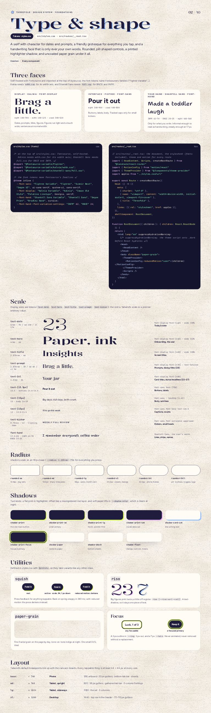

# Type & shape

A serif with character for dates and prompts, a friendly grotesque for everything you tap, and a handwriting face that is only ever your own words. Rounded, pill-shaped controls, a printed highlighter shadow, and uncoated paper grain under it all.



## Faces

- **Display: Kalnia** (`font-display`): wght 100–700, wdth 100–125, used 300–520. Dates, prompts, titles, figures.
- **Interface: Figtree** (`font-sans`): wght 300–900, used 400–800. Buttons, labels, body.
- **Your hand: Shantell Sans** (`font-hand`): INFM 62–70, BNCE 20–25, wght 460–560. Only for what the user writes.

Self-hosted with Fontsource and imported at the top of `src/styles.css`; the font tokens name Fontsource’s families (“Figtree Variable”…). Kalnia needs `wdth.css` for its width axis, and Shantell Sans needs `full.css` for BNCE and INFM. The root route links the stylesheet, renders the theme script before first paint, and wraps every route in the theme and motion providers.

```css
/* at the top of src/styles.css: Fontsource, self-hosted.
   Kalnia needs wdth.css for its width axis; Shantell Sans needs full.css for BNCE and INFM. */
@import "@fontsource-variable/figtree";
@import "@fontsource-variable/kalnia/wdth.css";
@import "@fontsource-variable/shantell-sans/full.css";

/* the font tokens name Fontsource's families */
@theme inline {
  --font-sans: "Figtree Variable", "Figtree", "Avenir Next", "Segoe UI", ui-sans-serif, system-ui, sans-serif;
  --font-display: "Kalnia Variable", "Kalnia", "Iowan Old Style", "Palatino Linotype", Georgia, serif;
  --font-hand: "Shantell Sans Variable", "Shantell Sans", "Segoe Print", "Bradley Hand", cursive;
  --font-hand--font-variation-settings: "INFM" 62, "BNCE" 24;
}
```

```tsx
// src/routes/__root.tsx: the document, the stylesheet (fonts included), theme and motion for every route
import { HeadContent, ScriptOnce, Scripts, createRootRoute } from "@tanstack/react-router"
import { MotionConfig } from "motion/react"
import { ThemeProvider, themeScript } from "@/components/theme-provider"
import appCss from "../styles.css?url"

export const Route = createRootRoute({
  head: () => ({
    meta: [
      { charSet: "utf-8" },
      { name: "viewport", content: "width=device-width, initial-scale=1, viewport-fit=cover" },
      { title: "Threefold" },
    ],
    links: [{ rel: "stylesheet", href: appCss }],
  }),
  shellComponent: RootDocument,
})

function RootDocument({ children }: { children: React.ReactNode }) {
  return (
    <html lang="en" suppressHydrationWarning>
      {/* suppressHydrationWarning: the theme script sets .dark before React hydrates */}
      <head>
        <HeadContent />
      </head>
      <body className="paper-grain">
        <ScriptOnce>{themeScript}</ScriptOnce>
        <ThemeProvider>
          <MotionConfig reducedMotion="user">{children}</MotionConfig>
        </ThemeProvider>
        <Scripts />
      </body>
    </html>
  )
}
```

## Scale

| Class | Size | Style | Sample | Use |
|---|---|---|---|---|
| `text-date` | 6rem · 96 / md 150 / xl 174 | `font-display font-light · wide 110%` | 23 | Today’s date |
| `text-hero` | 4rem · 64 | `font-display font-[440] · wide 112%` | Paper, ink | Hello, the seal |
| `text-title` | 2.875rem · 46 | `font-display font-[460] · wide 110%` | Insights | Screen titles |
| `text-prompt` | 1.875rem · 30 / md 48 / xl 54 | `font-display font-[470] · text-balance` | Brag a little. | Prompts, dialog titles (28) |
| `text-2xl` | 1.5rem · 24 | `font-display font-[480]` | Your jar | Card titles, status headlines (22–27) |
| `text-[15.5px]` | 15.5 · buttons 14.5–16.5 | `font-sans font-[750]` | Pour it out | Buttons, labels |
| `text-[15px]` | 15 · body 14–19 | `font-sans · leading-[1.45]` | Big days, dull days, both count. | Body, sub lines |
| `text-[13px]` | 13 · 12.5–13.5 | `font-sans font-bold text-ink-2` | 10 to go this week | Captions, counts |
| `text-kicker` | 0.75rem · 12 · tracking .16em | `font-sans font-extrabold uppercase` | Weekly full review | Kickers, small heads |
| `font-hand` | 17.5–20 · INFM 62–70 · BNCE 22–25 | `Shantell Sans, the user’s words` | I remember everyone’s coffee order | Lines, strips, names |

## Radius

| Class | px | Use |
|---|---|---|
| `rounded-sm` | 10.8 | day cells |
| `rounded-md` | 14.4 | chips |
| `rounded-lg` | 18 | cards, month card |
| `rounded-xl` | 25.2 | sheets, dialogs |
| `rounded-2xl` | 32.4 | phone frames |
| `rounded-full` | pill | buttons, toggles, tags |

## Shadows

| Class | Value (Day) | Use |
|---|---|---|
| `shadow-print` | `4px 4px 0 #DDFF55` | the one main button |
| `shadow-print-sm` | `3px 3px 0 #DDFF55` | small primary |
| `shadow-print-lg` | `5px 5px 0 #DDFF55` | hover, pointer: fine |
| `shadow-print-cat` | `4px 4px 0 #E2A7F6` | inside data-cat |
| `shadow-card-cat` | `5px 5px 0 #95C0FF` | the writing card |
| `shadow-print-focus` | `4px 4px 0 #DDFF55, 0 0 0 9px rgba(221,255,85,.85)` | focused primary |
| `shadow-paper` | `0 1px 0 rgba(31,28,61,.06), 0 12px 28px -18px rgba(31,28,61,.35)` | cards on paper |
| `shadow-sheet` | `0 -18px 30px -24px rgba(31,28,61,.5)` | bottom sheets |
| `shadow-float` | `0 20px 40px -24px rgba(31,28,61,.7)` | dialogs, toasts |

## Utilities

- `squish`: press feedback. Scale .94 and 1 px down in 90 ms, back on spring.snappy (280 ms); with reduced motion the press darkens (brightness .92) instead.
- `riso`: big figures print twice, a little off register: `riso [--riso:var(--cat)]` (a text-shadow at .045em .037em; 70% at night).
- `paper-grain`: fine fractal grain by day, tone-on-tone indigo at night.
- Focus: a 3 px `--ring` outline, 3 px out, plus a 7 px `--halo`. Never animated.

## Layout

| Breakpoint | Width | Layout | Notes |
|---|---|---|---|
| `base` | < 768 | Phone | 390 artboard · 20 px gutters · bottom tab bar · sheets |
| `md` | ≥ 768 | Tablet, upright | 820 · 56 px gutters · gathered tab bar · 2-column Settings |
| `lg` | ≥ 1024 | Tablet, sideways | 1180 · the rail · 3 columns |
| `xl` | ≥ 1280 | Desktop | 1440 · top nav in the header · 72–112 px gutters |

Every tappable thing is at least 44 × 44 px.
